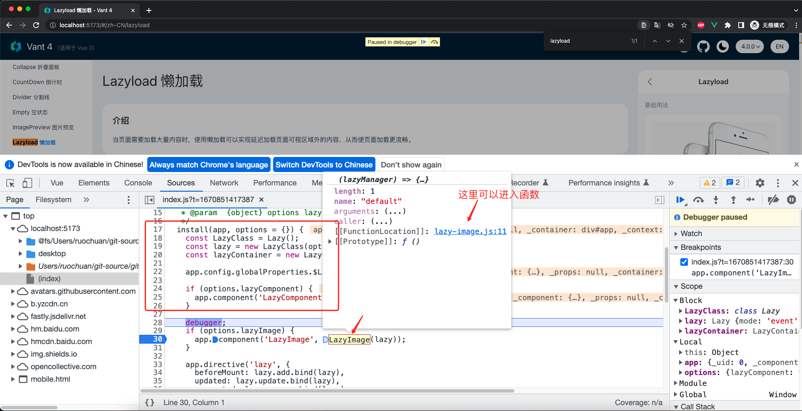
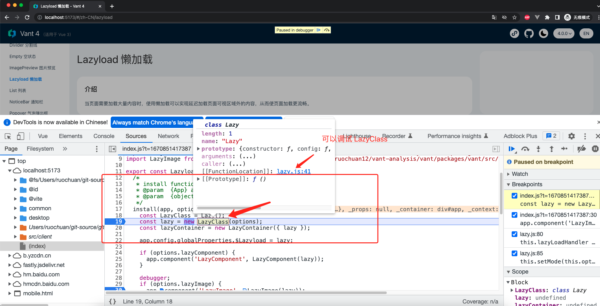

# vant4.0 正式发布了，跟着学会用 vue3 写一个图片懒加载组件！

本文为稀土掘金技术社区首发签约文章，14天内禁止转载，14天后未获授权禁止转载，侵权必究！

## 1. 前言

大家好，我是[若川](https://lxchuan12.gitee.io)。我倾力持续组织了一年[每周大家一起学习200行左右的源码共读活动](https://juejin.cn/post/7079706017579139102)，感兴趣的可以[点此扫码加我微信 `ruochuan02` 参与](https://juejin.cn/pin/7217386885793595453)。另外，想学源码，极力推荐关注我写的专栏[《学习源码整体架构系列》](https://juejin.cn/column/6960551178908205093)，目前是掘金关注人数（4.3k+人）第一的专栏，写有20余篇源码文章。

我们开发业务时经常会使用到组件库，一般来说，很多时候我们不需要关心内部实现。但是如果希望学习和深究里面的原理，这时我们可以分析自己使用的组件库实现。有哪些优雅实现、最佳实践、前沿技术等都可以值得我们借鉴。

相比于原生 `JS` 等源码。我们或许更应该学习，正在使用的组件库的源码，因为有助于帮助我们写业务和写自己的组件。

如果是 `Vue` 技术栈，开发移动端的项目，大多会选用 `vant` 组件库，目前（2022-11-29） `star` 多达 `20.5k`，[已经正式发布 4.0 了](https://vant-contrib.gitee.io/vant/#/zh-CN)。我们可以挑选 `vant` 组件库学习，我会写一个[组件库源码系列专栏](https://juejin.cn/column/7140264842954276871)，欢迎大家关注。

- [vant 4 即将正式发布，支持暗黑主题，那么是如何实现的呢](https://juejin.cn/post/7158239404484460574)
- [跟着 vant4 源码学习如何用 vue3+ts 开发一个 loading 组件，仅88行代码](https://juejin.cn/post/7160465286036979748)
- [分析 vant4 源码，如何用 vue3 + ts 开发一个瀑布流滚动加载的列表组件？](https://juejin.cn/post/7165661072785932296)
- [分析 vant4 源码，学会用 vue3 + ts 开发毫秒级渲染的倒计时组件，真是妙啊](https://juejin.cn/post/7169003604303413278)

这次我们来学习 `Lazyload` 懒加载组件，[可以点此查看 `lazyload` 文档体验](https://vant-contrib.gitee.io/vant/#/zh-CN/lazyload)。

学完本文，你将学到：

```bash
1. 学会如何用 vue3 + ts 开发一个 lazyload 组件
2. 学会 `lazyload` 图片懒加载组件其原理
3. 学会使用事件和 IntersectionObserver API 实现懒加载
4. 等等
```

## 2. 准备工作

看一个开源项目，第一步应该是先看 [README.md](https://github.com/youzan/vant) 再看贡献文档 [github/CONTRIBUTING.md](https://github.com/youzan/vant/blob/main/.github/CONTRIBUTING.md)。

### 2.1 克隆源码 && 跑起来

You will need [Node.js >= 14](https://nodejs.org) and [pnpm](https://pnpm.io).

```bash
# 推荐克隆我的项目
git clone https://github.com/lxchuan12/vant-analysis
cd vant-analysis/vant

# 或者克隆官方仓库
git clone git@github.com:vant-ui/vant.git
cd vant

# 安装依赖，如果没安装 pnpm，可以用 npm i pnpm -g 安装，或者查看官网通过其他方式安装
pnpm i

# 启动服务
pnpm dev
```

执行 `pnpm dev` 后，这时我们打开懒加载组件 `http://localhost:5173/#/zh-CN/lazyload`。

## 3. 图片懒加载原理

众所周知，图片懒加载的原理其实相对简单。就是进入可视区再加载图片。涉及到的知识点主要有：节流、新API、[IntersectionObserver](https://developer.mozilla.org/zh-CN/docs/Web/API/IntersectionObserver)。

大致流程：

- 事件模式

```bash
1. 初始化在元素（比如是 window，但不一定是 window）添加监听滚动和其他相关事件
2. 使用 Element.getBoundingClientRect API 获取元素的大小及其相对于视口的位置，判断是否进入可视化区
3. 图片设置 src 真实的图片路径
4. 离开销毁监听的事件、和移除绑定事件的元素
```

- observer 模式

主要是第二步用 [IntersectionObserver](https://developer.mozilla.org/zh-CN/docs/Web/API/IntersectionObserver) API。

那么 vant4 中的 lazyload 怎么做的呢。

带着问题我们直接找到 `lazyload demo` 文件：`vant/packages/vant/src/lazyload/demo/index.vue`。为什么是这个文件，我在之前文章[跟着 vant4 源码学习如何用 vue3+ts 开发一个 loading 组件，仅88行代码](https://juejin.cn/post/7160465286036979748#heading-3)分析了其原理，感兴趣的小伙伴点击查看。这里就不赘述了。

## 4. 利用 demo 调试源码

```js
// vant/packages/vant/src/lazyload/demo/index.vue
// 代码有省略
<script lang="ts">
import Lazyload from '..';

if (window.app) {
  // 手动修改 demo 为如下，添加 lazyImage 为 true
  window.app.use(Lazyload, { lazyComponent: true, lazyImage: true });
}
<script setup lang="ts">
// eslint-disable-next-line import/first
import { cdnURL, useTranslate } from '../../../docs/site';

const t = useTranslate({
  'zh-CN': {
    title2: '背景图懒加载',
    title3: '懒加载模块',
  },
});

const imageList = [
  cdnURL('apple-1.jpeg'),
  cdnURL('apple-2.jpeg'),
  cdnURL('apple-3.jpeg'),
  cdnURL('apple-4.jpeg'),
];
</script>
<template>
  <demo-block :title="t('basicUsage')">
    <!-- 手动修改 demo 为 lazy-image -->
    <lazy-image v-for="img in imageList" :key="img" :src="img">
    </lazy-image>
  </demo-block>
</template>
```

我们可以看出 lazy-load 为入口文件。

这里先附上两张调试截图。动手调试时可以参考学习。

`install` 函数调试


`LazyClass` 调试


## 5. lazy-load 入口文件

从 `vue-lazyload` 文件引入导出和默认导出 `Lazyload`。
主要包含：

- 把 lazy 实例对象添加到全局上
- 注册懒加载组件
- 注册图片组件
- 注册指令 lazy
- 注册指令 lazy-container

```js
// vant/packages/vant/src/lazyload/index.ts
import { Lazyload } from './vue-lazyload';

export default Lazyload;
export { Lazyload };
```

我们接着来看 `vue-lazyload/index.js` 主文件。

## 6. vue-lazyload/index.js 主文件

主要导出一个包含 `install` 方法的对象 `Lazyload`。

```js
// vant/packages/vant/src/lazyload/vue-lazyload/index.js
/**
 * This is a fork of [vue-lazyload](https://github.com/hilongjw/vue-lazyload) with Vue 3 support.
 * license at https://github.com/hilongjw/vue-lazyload/blob/master/LICENSE
 */

import Lazy from './lazy';
import LazyComponent from './lazy-component';
import LazyContainer from './lazy-container';
import LazyImage from './lazy-image';

export const Lazyload = {
  /*
   * install function
   * @param  {App} app
   * @param  {object} options lazyload options
   */
  install(app, options = {}) {
    debugger;
    const LazyClass = Lazy();
    const lazy = new LazyClass(options);
    const lazyContainer = new LazyContainer({ lazy });

    // 把 lazy 实例对象添加到全局上
    app.config.globalProperties.$Lazyload = lazy;
    
    // 注册懒加载组件
    if (options.lazyComponent) {
      app.component('LazyComponent', LazyComponent(lazy));
    }

    // 注册图片组件
    if (options.lazyImage) {
      app.component('LazyImage', LazyImage(lazy));
    }
    
    // 注册指令 lazy
    app.directive('lazy', {
      beforeMount: lazy.add.bind(lazy),
      updated: lazy.update.bind(lazy),
      unmounted: lazy.remove.bind(lazy),
    });

    // 注册指令 lazy-container
    app.directive('lazy-container', {
      beforeMount: lazyContainer.bind.bind(lazyContainer),
      updated: lazyContainer.update.bind(lazyContainer),
      unmounted: lazyContainer.unbind.bind(lazyContainer),
    });
  },
};

```

单从**图片懒加载**来看，简化上面的代码，则是这样。

```js
// 简化
import Lazy from './lazy';
import LazyImage from './lazy-image';
export const Lazyload = {
  install(app, options = {}){
    const LazyClass = Lazy();
    const lazy = new LazyClass(options);
    // 渲染图片组件
    if (options.lazyImage) {
      app.component('LazyImage', LazyImage(lazy));
    }
  }
}
```

我们先来看 `LazyImage` 组件。

## 7. lazy-image 组件

传入 lazy 实例对象作为参数，默认导出一个返回 vue 组件对象的函数。

我看这块源码时，调试发现由于 `render` 函数 `vue2` 和 `vue3` 写法不同，导致报错。于是提了一个PR，修复了这个问题。

[fix(lazyload): lazy-image h is not a function (#11229)](https://github.com/youzan/vant/issues/11229)

```js
// vant/packages/vant/src/lazyload/vue-lazyload/lazy-image.js
import { useRect } from '@vant/use';
import { loadImageAsync } from './util';
import { noop } from '../../utils';
import { h } from 'vue';

export default (lazyManager) => ({
  // 对象
  props: {
    src: [String, Object],
    tag: {
      type: String,
      default: 'img',
    },
  },
  // 渲染函数，tag 默认是 img，src 是真实的 renderSrc ，还有默认的插槽
  render() {
    return h(
      this.tag,
      {
        src: this.renderSrc,
      },
      this.$slots.default?.()
    );
  },
  data() {
    // 若干参数
    return {
      el: null,
      options: {
        src: '',
        error: '',
        loading: '',
        attempt: lazyManager.options.attempt,
      },
      state: {
        loaded: false,
        error: false,
        attempt: 0,
      },
      renderSrc: '',
    };
  },
  // 拆分到下方
});

```

### 7.1 watch、created、mounted、beforeUnmount

```js
export default (lazyManager) => ({
  // props.src 监听变化 执行
  // 把 Vue 实例对象 this 添加到 lazy 实例中
  // 执行 lazyLoaderHandler 函数（发现节点（元素）在视口，触发 load 事件）
  watch: {
    src() {
      this.init();
      lazyManager.addLazyBox(this);
      lazyManager.lazyLoadHandler();
    },
  },
  created() {
    // 初始化
    this.init();
    // 默认值是占位图
    this.renderSrc = this.options.loading;
  },
  mounted() {
    this.el = this.$el;
    // 把 Vue 实例对象 this 添加到 lazy 实例中
    // 执行 lazyLoaderHandler 函数（发现节点（元素）在视口，触发 load 事件）
    lazyManager.addLazyBox(this);
    lazyManager.lazyLoadHandler();
  },
  beforeUnmount() {
    // 移除组件
    lazyManager.removeComponent(this);
  },
  methods: {
    // 省略，下文讲述
  },
})
```

我们可以看出，主要有以下三个实例方法，下文细述。

```js
// 把 Vue 实例对象 this 添加到 lazy 实例中
lazyManager.addLazyBox(this);
// 执行 lazyLoaderHandler 函数（发现节点（元素）在视口，触发 load 事件）
lazyManager.lazyLoadHandler();
// 移除组件
lazyManager.removeComponent(this);
```

### 7.2 methods init 初始化函数

```js
export default (lazyManager) => ({
  methods: {
    init() {
      const { src, loading, error } = lazyManager.valueFormatter(this.src);
      this.state.loaded = false;
      this.options.src = src;
      this.options.error = error;
      this.options.loading = loading;
      this.renderSrc = this.options.loading;
    },
  },
}
```

### 7.3 methods checkInView 检查元素是否在视图中的函数

```js
export default (lazyManager) => ({
    // 检测是否已经在视图中
    checkInView() {
      const rect = useRect(this.$el);
      return (
        rect.top < window.innerHeight * lazyManager.options.preLoad &&
        rect.bottom > 0 &&
        rect.left < window.innerWidth * lazyManager.options.preLoad &&
        rect.right > 0
      );
    },
})
```

这里主要是用了 [useRect](https://vant-contrib.gitee.io/vant/#/zh-CN/use-rect) 组合式 API。

[vant 文档：useRect 获取元素的大小及其相对于视口的位置](
https://vant-contrib.gitee.io/vant/#/zh-CN/use-rect)

获取元素的大小及其相对于视口的位置，等价于 [Element.getBoundingClientRect](https://developer.mozilla.org/zh-CN/docs/Web/API/Element/getBoundingClientRect)。

更多介绍，我在文章 [分析 vant4 源码，如何用 vue3 + ts 开发一个瀑布流滚动加载的列表组件？](https://juejin.cn/post/7165661072785932296#heading-13)分析过，这里就不在赘述了。

### 7.4 methods load 函数

```js
export default (lazyManager) => ({
  methods: {
    load(onFinish = noop) {
      // 默认加载三次，三次加载还失败，不是生产环境、没有开启静默模式，就提示报错
      if (this.state.attempt > this.options.attempt - 1 && this.state.error) {
        if (
          process.env.NODE_ENV !== 'production' &&
          !lazyManager.options.silent
        ) {
          console.log(
            `[@vant/lazyload] ${this.options.src} tried too more than ${this.options.attempt} times`
          );
        }

        onFinish();
        return;
      }
      const { src } = this.options;
      loadImageAsync(
        { src },
        ({ src }) => {
          this.renderSrc = src;
          // 加载成功，设置状态
          this.state.loaded = true;
        },
        () => {
          // 错误加载次数 +1
          this.state.attempt++;
          this.renderSrc = this.options.error;
          this.state.error = true;
        }
      );
    },
  }
});
```

我们来看 `loadImageAsync` 函数。

### 7.5 loadImageAsync 加载图片

[mdn 文档：HTMLImageElement](https://developer.mozilla.org/zh-CN/docs/Web/API/HTMLImageElement)

```js
export const loadImageAsync = (item, resolve, reject) => {
  const image = new Image();

  if (!item || !item.src) {
    return reject(new Error('image src is required'));
  }

  image.src = item.src;
  // 图片 crossorigin 属性
  if (item.cors) {
    image.crossOrigin = item.cors;
  }

  // 图片加载成功
  image.onload = () =>
    resolve({
      naturalHeight: image.naturalHeight,
      naturalWidth: image.naturalWidth,
      src: image.src,
    });

  // 图片加载失败
  image.onerror = (e) => reject(e);
};
```

我们接着来看 `lazy.js` 文件中的 `Lazy` 类。

## 8. lazy 类

我们来看 `lazy.js` 主结构，拥有若干实例方法。

```js
export default function () {
  return class Lazy {
    constructor({}){}
    // update config
    config(options = {}) {}
    // output listener's load performance
    performance() {}
    // add lazy component to queue
    addLazyBox(vm) {}
    // add image listener to queue
    add(el, binding, vnode) {}
    // update image src
    update(el, binding, vnode) {}
    // remove listener form list
    remove(el) {}
    // remove lazy components form list
    removeComponent(vm) {}
    // 设置模式
    setMode(mode) {}
    // add listener target
    addListenerTarget(el) {}
    // remove listener target or reduce target childrenCount
    removeListenerTarget(el) {}
    // add or remove eventlistener
    initListen(el, start) {}
    initEvent() {}
    // find nodes which in viewport and trigger load
    lazyLoadHandler() {}
    // init IntersectionObserver
    // set mode to observer
    initIntersectionObserver() {}
    // init IntersectionObserver
    observerHandler(entries) {}
    // set element attribute with image'url and state
    elRenderer(listener, state, cache){}
    // generate loading loaded error image url
    valueFormatter(value) {}
  }
}
```

### 8.1 构造函数 Lazy

```js
export default function () {
  return class Lazy {
    constructor({}){
        this.mode = modeType.event;
        this.listeners = [];
        this.targetIndex = 0;
        this.targets = [];
        //   省略若干代码
        this.options = {
          silent,
          dispatchEvent: !!dispatchEvent,
          throttleWait: throttleWait || 200,
          preLoad: preLoad || 1.3,
          preLoadTop: preLoadTop || 0,
          error: error || DEFAULT_URL,
          loading: loading || DEFAULT_URL,
          attempt: attempt || 3,
          scale: scale || getDPR(scale),
          ListenEvents: listenEvents || DEFAULT_EVENTS,
          supportWebp: supportWebp(),
          filter: filter || {},
          adapter: adapter || {},
          observer: !!observer,
          observerOptions: observerOptions || DEFAULT_OBSERVER_OPTIONS,
        };
        this.initEvent();
        this.imageCache = new ImageCache({ max: 200 });
        // 节流函数
        this.lazyLoadHandler = throttle(
            this.lazyLoadHandler.bind(this),
            this.options.throttleWait
        );

        this.setMode(this.options.observer ? modeType.observer : modeType.event);
    }
  }
}
```

值得一提的是：`throttle` 节流函数，包裹 `lazyLoadHandler`。为了防止多次快速加载，影响性能。

### 8.2 实例方法 lazyLoadHandler

英文注释：发现节点（元素）在视口，触发 `load` 事件

```js
/**
 * find nodes which in viewport and trigger load
 * @return
 */
lazyLoadHandler() {
    const freeList = [];
    this.listeners.forEach((listener) => {
        // 如果是 vue 组件，listener 则是 vm (也就是 this)

        // 没有元素或者没有父级元素的，存入 freeList 数组，便于移除，销毁
        if (!listener.el || !listener.el.parentNode) {
            freeList.push(listener);
        }
        // 检测在视图中，触发 load 函数。
        const catIn = listener.checkInView();
        if (!catIn) return;
            listener.load();
        });
        freeList.forEach((item) => {
            remove(this.listeners, item);
            // vm
            item.$destroy();
        });
    }
}
```

### 8.3 setMode 设置模式：事件模式还是 observer 模式

```js
import { inBrowser } from '@vant/use';

// 检测是否支持 IntersectionObserver API
export const hasIntersectionObserver =
  inBrowser &&
  'IntersectionObserver' in window &&
  'IntersectionObserverEntry' in window &&
  'intersectionRatio' in window.IntersectionObserverEntry.prototype;

// 两种模式，事件或者监测
export const modeType = {
  event: 'event',
  observer: 'observer',
};
```

```js
setMode(mode) {
  // 不支持 IntersectionObserver API 改为事件模式
  if (!hasIntersectionObserver && mode === modeType.observer) {
    mode = modeType.event;
  }

  this.mode = mode; // event or observer

  if (mode === modeType.event) {
    if (this.observer) {
      // 停止观测
      this.listeners.forEach((listener) => {
        this.observer.unobserve(listener.el);
      });
      this.observer = null;
    }

    // 初始化事件
    this.targets.forEach((target) => {
      this.initListen(target.el, true);
    });
  } else {
    // 移除事件
    this.targets.forEach((target) => {
      this.initListen(target.el, false);
    });
    // 初始化
    this.initIntersectionObserver();
  }
}
```

### 8.4 initListen 初始化监听事件

添加和移除事件监听

```js
const DEFAULT_EVENTS = [
  'scroll',
  'wheel',
  'mousewheel',
  'resize',
  'animationend',
  'transitionend',
  'touchmove',
];

this.options = {
  ListenEvents: listenEvents || DEFAULT_EVENTS,
}
/*
  * add or remove eventlistener
  * @param  {DOM} el DOM or Window
  * @param  {boolean} start flag
  * @return
  */
initListen(el, start) {
  this.options.ListenEvents.forEach((evt) =>
    (start ? on : off)(el, evt, this.lazyLoadHandler)
  );
}
```

#### 8.4.1 on、off 监听事件，移除事件

```js
export function on(el, type, func) {
  el.addEventListener(type, func, {
    capture: false,
    passive: true,
  });
}
```

```js
// vant/packages/vant/src/lazyload/vue-lazyload/util.js
export function off(el, type, func) {
  el.removeEventListener(type, func, false);
}
```

### 8.5 initIntersectionObserver 初始化

```js
/**
 * init IntersectionObserver
 * set mode to observer
 * @return
 */
initIntersectionObserver() {
  if (!hasIntersectionObserver) {
    return;
  }

  this.observer = new IntersectionObserver(
    this.observerHandler.bind(this),
    this.options.observerOptions
  );

  if (this.listeners.length) {
    this.listeners.forEach((listener) => {
      this.observer.observe(listener.el);
    });
  }
}
```

### 8.6 observerHandler 观测，触发 load 事件

[mdn 文档：IntersectionObserverEntry](https://developer.mozilla.org/zh-CN/docs/Web/API/IntersectionObserverEntry)

```js
/**
 * init IntersectionObserver
 * @return
 */
observerHandler(entries) {
  entries.forEach((entry) => {
    if (entry.isIntersecting) {
      this.listeners.forEach((listener) => {
        // 如果加载完成了，就移除监听
        if (listener.el === entry.target) {
          if (listener.state.loaded)
            return this.observer.unobserve(listener.el);
          listener.load();
        }
      });
    }
  });
}
```

### 8.7 实例方法 addLazyBox 添加要懒加载的组件到队列（数组）

```js
/*
  * add lazy component to queue
  * @param  {Vue} vm lazy component instance
  * @return
  */
addLazyBox(vm) {
  this.listeners.push(vm);
  // 浏览器环境
  if (inBrowser) {
    // 把
    this.addListenerTarget(window);
    // 如果是监听 observer 模式，监听 new IntersectionObserver().observe(vm.el)
    this.observer && this.observer.observe(vm.el);
    if (vm.$el && vm.$el.parentNode) {
      // 加入父级
      this.addListenerTarget(vm.$el.parentNode);
    }
  }
}
```

### 8.8 实例方法 removeComponent 移除组件

```js
/*
  * remove lazy components form list
  * @param  {Vue} vm Vue instance
  * @return
  */
removeComponent(vm) {
  if (!vm) return;
  remove(this.listeners, vm);
  this.observer && this.observer.unobserve(vm.el);
  // 移除父级
  if (vm.$parent && vm.$el.parentNode) {
    this.removeListenerTarget(vm.$el.parentNode);
  }
  // 移除 window 元素
  this.removeListenerTarget(window);
}
```

### 8.9 addListenerTarget 添加事件的目标元素

比如 window 等。

```js
/*
  * add listener target
  * @param  {DOM} el listener target
  * @return
  */
addListenerTarget(el) {
  if (!el) return;
  let target = this.targets.find((target) => target.el === el);
  if (!target) {
    target = {
      el,
      id: ++this.targetIndex,
      childrenCount: 1,
      listened: true,
    };
    this.mode === modeType.event && this.initListen(target.el, true);
    this.targets.push(target);
  } else {
    target.childrenCount++;
  }
  return this.targetIndex;
}
```

### 8.10 removeListenerTarget 移除事件的目标元素

```js
/*
  * remove listener target or reduce target childrenCount
  * @param  {DOM} el or window
  * @return
  */
removeListenerTarget(el) {
  this.targets.forEach((target, index) => {
    if (target.el === el) {
      target.childrenCount--;
      if (!target.childrenCount) {
        this.initListen(target.el, false);
        this.targets.splice(index, 1);
        target = null;
      }
    }
  });
}
```

## 9. 总结

大致流程：

- 事件模式

```bash
1. 初始化在元素（比如是 window，但不一定是 window）添加监听滚动和其他相关事件
2. 使用 Element.getBoundingClientRect API 获取元素的大小及其相对于视口的位置，判断是否进入可视化区
3. 进入可视区触发 load 事件，将图片设置 src 真实的图片路径，从而自动加载图片
4. 离开销毁监听的事件、和移除绑定事件的元素
```

- observer 模式

主要是第二步用 [IntersectionObserver](https://developer.mozilla.org/zh-CN/docs/Web/API/IntersectionObserver) API。

```js
// 把 Vue 实例对象 this 添加到 lazy 实例中
lazyManager.addLazyBox(this);
// 执行 lazyLoaderHandler 函数（发现节点（元素）在视口 checkInView，触发 load 事件）
lazyManager.lazyLoadHandler();
// 移除组件
lazyManager.removeComponent(this);
```

在 load 事件中，调用 `loadImageAsync` 函数。

```js
const image = new Image();
image.src = xxx;
image.onload = () => {}
image.onerror = () => {}
```

行文至此，我们就算分析完了 [lazyload 组件](https://vant-contrib.gitee.io/vant/#/zh-CN/lazyload)。

其中，有很多细节处理值得我们学习。
比如：
- 监听事件，不仅仅是 `scroll` 事件，还有`'scroll','wheel','mousewheel','resize','animationend','transitionend','touchmove'`
- 监听本身数组存起来了
- 目标元素也用数组存起来了。

`install` 函数主要有以下实现：

- 把 lazy 实例对象添加到全局上
- 注册懒加载组件
- 注册图片组件
- 注册指令 lazy
- 注册指令 lazy-container 没有分析。

但限于篇幅原因，组件源码还有指令部分没有分析。
感兴趣的小伙伴可以自行分析学习。

**如果看完有收获，欢迎点赞、评论、分享支持。你的支持和肯定，是我写作的动力**。

## 10. 加源码共读群交流

最后可以持续关注我[@若川](https://juejin.cn/user/1415826704971918)。我会写一个[组件库源码系列专栏](https://juejin.cn/column/7140264842954276871)，欢迎大家关注。

我倾力持续组织了一年[每周大家一起学习200行左右的源码共读活动](https://juejin.cn/post/7079706017579139102)，感兴趣的可以[点此扫码加我微信 `ruochuan02` 参与](https://juejin.cn/pin/7217386885793595453)。

另外，想学源码，极力推荐关注我写的专栏[《学习源码整体架构系列》](https://juejin.cn/column/6960551178908205093)，目前是掘金关注人数（4.1k+人）第一的专栏，写有20余篇源码文章。
