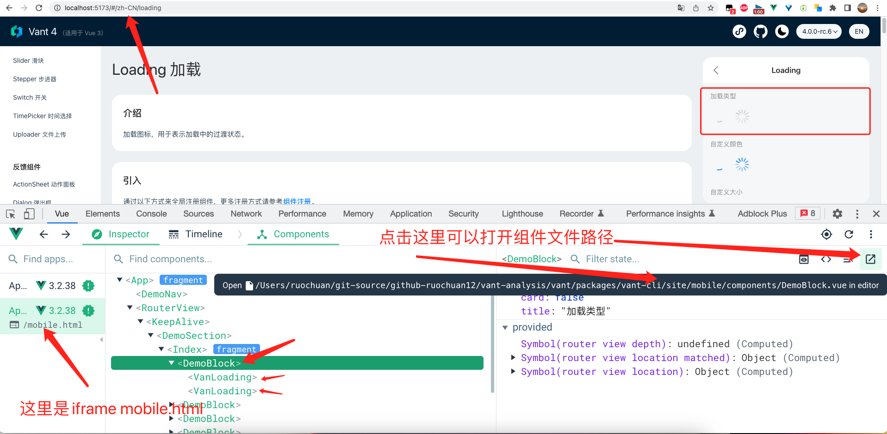
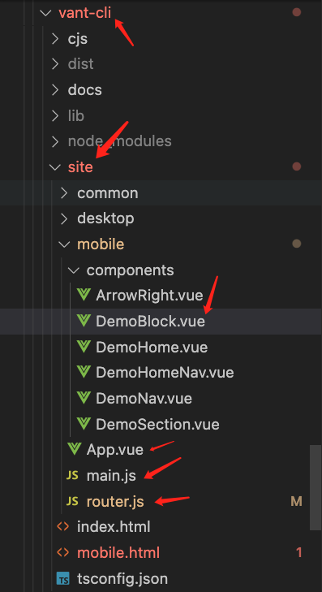
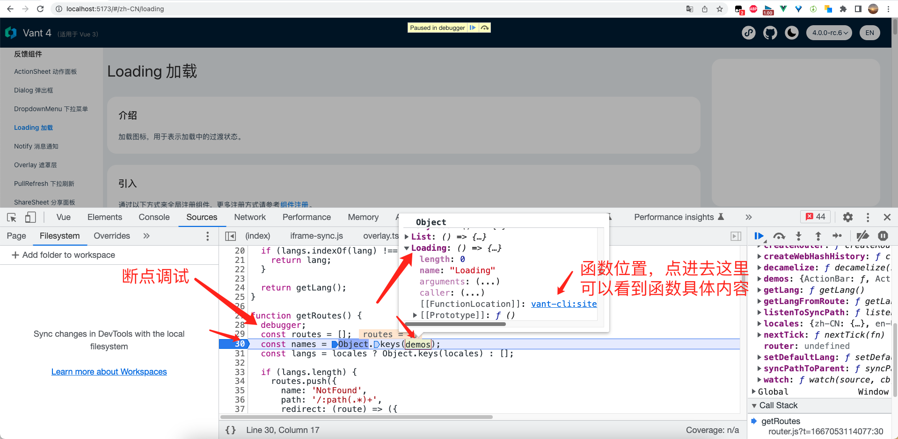
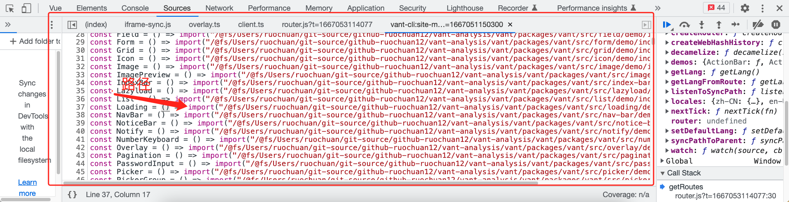
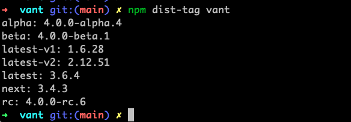

# 跟着 vant4 源码学习如何用 vue3 + ts 开发一个 loading 组件

本文为稀土掘金技术社区首发签约文章，14天内禁止转载，14天后未获授权禁止转载，侵权必究！

## 1. 前言

大家好，我是[若川](https://lxchuan12.gitee.io)。我倾力持续组织了一年[每周大家一起学习200行左右的源码共读活动](https://juejin.cn/post/7079706017579139102)，感兴趣的可以[点此扫码加我微信 `ruochuan02` 参与](https://juejin.cn/pin/7217386885793595453)。另外，想学源码，极力推荐关注我写的专栏[《学习源码整体架构系列》](https://juejin.cn/column/6960551178908205093)，目前是掘金关注人数（4.1k+人）第一的专栏，写有20余篇源码文章。

我们开发业务时经常会使用到组件库，一般来说，很多时候我们不需要关心内部实现。但是如果希望学习和深究里面的原理，这时我们可以分析自己使用的组件库实现。有哪些优雅实现、最佳实践、前沿技术等都可以值得我们借鉴。

相比于原生 `JS` 等源码。我们或许更应该学习，正在使用的组件库的源码，因为有助于帮助我们写业务和写自己的组件。

如果是 `Vue` 技术栈，开发移动端的项目，大多会选用 `vant` 组件库，目前（2022-10-31） `star` 多达 `20.4k`。我们可以挑选 `vant` 组件库学习，我会写一个[组件库源码系列专栏](https://juejin.cn/column/7140264842954276871)，欢迎大家关注。

上一篇是：[vant 4 即将正式发布，支持暗黑主题，那么是如何实现的呢](https://juejin.cn/post/7158239404484460574)

这次我们来学习 [loading 组件](https://vant-contrib.gitee.io/vant/v4/#/zh-CN/loading)。

学完本文，你将学到：

```bash
1. 学会如何用 vue3 + ts 开发一个 loading 组件
2. 学会使用 vue-devtools 打开组件文件，并可以学会其原理
3. 学会使用 @vue/babel-plugin-jsx 编写 jsx 组件
4. 等等
```

## 2. 准备工作

看一个开源项目，第一步应该是先看 [README.md](https://github.com/youzan/vant) 再看贡献文档 [github/CONTRIBUTING.md](https://github.com/youzan/vant/blob/main/.github/CONTRIBUTING.md)。

### 2.1 克隆源码 && 跑起来

You will need [Node.js >= 14](https://nodejs.org) and [pnpm](https://pnpm.io).

```bash
# 推荐克隆我的项目
git clone https://github.com/lxchuan12/vant-analysis
cd vant-analysis/vant

# 或者克隆官方仓库
git clone git@github.com:vant-ui/vant.git
cd vant

# 安装依赖，会运行所有 packages 下仓库的 pnpm i 钩子 pnpm prepare 和 pnpm i
pnpm i

# Start development
pnpm dev
```

我们先来看 `pnpm dev` 最终执行的什么命令。

`vant` 项目使用的是 `monorepo` 结构。查看根路径下的 `package.json`。

`vant/package.json => "dev": "pnpm --dir ./packages/vant dev"`
`vant/packages/vant/package.json` => "dev": "vant-cli dev"`

`pnpm dev` 最终执行的是：`vant-cli dev` 启动了一个服务。本文主要是学习 [loading 组件](https://vant-contrib.gitee.io/vant/v4/#/zh-CN/loading) 的实现，所以我们就不深入 `vant-cli dev` 命令了。

## 3. 从官方文档入手找到 demo 文件

有些小伙伴喜欢在新的项目中去安装组件，再去自行新建 `demo` 文件去调试预览。一般来说，其实没有必要。开源项目中一般就有 `demo` 类文件了。直接学习即可，省去新建的麻烦。

我们凭着前端人直觉，应该很容易在找到 `loading` 文件夹的路径：`vant/packages/vant/src/loading/demo/index.vue`。
但真的是这个路径吗？或者说这个路径是怎么渲染到官方文档中页面上的呢。带着这个疑问，我们从文档网站入手。

我们很容易我们通过 `http://localhost:5173/#/zh-CN/loading`。
接下来我们来看，**这个页面的对应的文件是在哪里，为啥路由 `loading` 就能到达这个页面**。

### 3.1 mobile 项目中的 DemoBlock 组件

我们通过 [vue-devtools](https://devtools.vuejs.org/guide/installation.html) 可以找到和打开 `DemoBlock` 组件文件。[也可以通过极简插件下载安装](https://chrome.zzzmh.cn/info/nhdogjmejiglipccpnnnanhbledajbpd)。我曾经写过文章分析原理[《据说 99% 的人不知道 vue-devtools 还能直接打开对应组件文件？本文原理揭秘》](https://juejin.cn/post/6959348263547830280)



打开后的文件是这样的，主要传入插槽，还有 `card` 和 `title` 属性。

```js
// vant/packages/vant-cli/site/mobile/components/DemoBlock.vue
<template>
  <div class="van-doc-demo-block">
    <h2 v-if="title" class="van-doc-demo-block__title">{{ title }}</h2>
    <div v-if="card" class="van-doc-demo-block__card">
      <slot />
    </div>
    <slot v-else />
  </div>
</template>

<script>
export default {
  name: 'DemoBlock',

  props: {
    card: Boolean,
    title: String,
  },
};
</script>
// 省略 less
```

在编辑器左侧，我们可以看到 `vant-cli/site` 目录结构。



### 3.2 mobile 项目中的 main.js 主入口文件

我们很容易看出这就是一个 `vue` 的项目。我们打开 `main.js` 查看。

```js
// vant/packages/vant-cli/site/mobile/main.js
import { createApp } from 'vue';
import DemoBlock from './components/DemoBlock.vue';
import DemoSection from './components/DemoSection.vue';
import { router } from './router';
import App from './App.vue';
// 模拟 touch
import '@vant/touch-emulator';

// 全局注册 DemoBlock 和 DemoSection 组件，在 demo 文件组件中会用到
window.app = createApp(App)
  .use(router)
  .component(DemoBlock.name, DemoBlock)
  .component(DemoSection.name, DemoSection);

setTimeout(() => {
  window.app.mount('#app');
}, 0);

// https://stackoverflow.com/questions/3885018/active-pseudo-class-doesnt-work-in-mobile-safari/33681490#33681490
document.addEventListener('touchstart', () => {}, {
  passive: true,
});
```

### 3.3 mobile 项目中的 App.vue 文件

```js
// 省略其他文件
<template>
  <demo-nav />
  <router-view v-slot="{ Component }">
    <keep-alive>
      <demo-section>
        <component :is="Component" />
      </demo-section>
    </keep-alive>
  </router-view>
</template>
```

查看[vue-router 文档](https://router.vuejs.org/zh/api/index.html#router-view-%E7%9A%84-v-slot)，可以发现：
`<router-view>` 暴露了一个 `v-slot` API，主要使用 `<transition>` 和 `<keep-alive>` 组件来包裹你的路由组件。
`Component`: VNodes, 传递给 `<component>` 的 `is` prop。
`route`: 解析出的标准化[路由地址](https://router.vuejs.org/zh/api/index.html#routelocationnormalized)。

### 3.4 mobile 项目中的 rotuer.js 路由文件

```js
// vant/packages/vant-cli/site/mobile/router.js
// 代码有省略
import { decamelize } from '../common';
import { demos, config } from 'site-mobile-shared';
import { createRouter, createWebHashHistory } from 'vue-router';

const { locales, defaultLang } = config.site;

function getRoutes() {
  // 可以加上 debugger 自行打断点调试
  debugger;
  const routes = [];
  const names = Object.keys(demos);
  const langs = locales ? Object.keys(locales) : [];
  names.forEach((name) => {
      // time-picker timePicker
      const component = decamelize(name);

      if (langs.length) {
        langs.forEach((lang) => {
          routes.push({
            name: `${lang}/${component}`,
            // http://localhost:5173/#/zh-CN/loading
            path: `/${lang}/${component}`,
            // () => import('xxxx/vant/packages/vant/src/loading/demo/index.vue')
            component: demos[name],
            meta: {
              name,
              lang,
            },
          });
        });
      }
      // 代码有省略
  }
}

export const router = createRouter({
  history: createWebHashHistory(),
  routes: getRoutes(),
  scrollBehavior: (to, from, savedPosition) => savedPosition || { x: 0, y: 0 },
});
```



按调试点进函数看到截图，可以看到具体代码和路径。



```js
// http://localhost:5173/@id/vant-cli:site-mobile-shared?t=1667051150300
// vant/packages/vant-cli/dist/package-entry.js
// 省略若干代码...
const Loading = () => import("/@fs/Users/ruochuan/git-source/github-ruochuan12/vant-analysis/vant/packages/vant/src/loading/demo/index.vue?t=1667051150300")
```

果然，确实是我们在前文猜测路径 `vant/packages/vant/src/loading/demo/index.vue`。

小结：通过路由 `/loading` 匹配组件 `demos` 中的组件 `Loading` `component: () => import('xxx/loading/demo/index.vue')`，`<router-view>` 传递给 `v-slot` `Component` `<component :is="Component" />` 属性渲染，不得不说秒啊。

接着我们继续来看，`loading` 的 `demo` 文件。

## 4. loading demo 文件 loading/demo/index.vue

```js
// vant/packages/vant/src/loading/demo/index.vue
// 代码有省略
<script setup lang="ts">
import VanIcon from '../../icon';
import VanLoading from '..';
import { useTranslate } from '../../../docs/site';

const t = useTranslate({
  'zh-CN': {
    type: '加载类型',
  },
  'en-US': {
    type: 'Type',
  },
});
</script>

<template>
  <demo-block :title="t('type')">
    <van-loading />
    <van-loading type="spinner" />
  </demo-block>
</template>
```

[vue 文档 component is](https://cn.vuejs.org/api/built-in-special-elements.html#component)如果将组件本身传递给 `is` 而不是其名称，则不需要注册，例如在 `<script setup>` 中。
也就是为什么不需要注册 `VanLoading`。

而 `demo-block` 是在 `mobile` `main.js` 入口文件注册的。

```js
window.app = createApp(App)
  .use(router)
  .component(DemoBlock.name, DemoBlock)
  .component(DemoSection.name, DemoSection)
```

## 5. loading 入口文件 loading/index.ts

组件源码中的 `TS` 代码我不会过多解释。没学过TS的小伙伴，推荐学这个[TypeScript 入门教程](http://ts.xcatliu.com/)。

```js
// vant/packages/vant/src/loading/index.ts
import { withInstall } from '../utils';
import _Loading from './Loading';

export const Loading = withInstall(_Loading);
export default Loading;
export { loadingProps } from './Loading';
export type { LoadingType, LoadingProps } from './Loading';
export type { LoadingThemeVars } from './types';

declare module 'vue' {
  export interface GlobalComponents {
    VanLoading: typeof Loading;
  }
}
```

### 5.1 withInstall 给组件对象添加 install 方法

```js
import { camelize } from './format';
import type { App, Component } from 'vue';

// https://github.com/vant-ui/vant/issues/8302
type EventShim = {
  new (...args: any[]): {
    $props: {
      onClick?: (...args: any[]) => void;
    };
  };
};

export type WithInstall<T> = T & {
  install(app: App): void;
} & EventShim;

// 给传入的options对象添加 install 属性，在 app.use() 时使用。
// 有传参中有 name 属性，则注册 `van-loading` 和 `VanLoading` 两个名称的组件
export function withInstall<T extends Component>(options: T) {
  (options as Record<string, unknown>).install = (app: App) => {
    const { name } = options;
    if (name) {
      // van-loading
      app.component(name, options);
      // VanLoading
      app.component(camelize(`-${name}`), options);
    }
  };

  return options as WithInstall<T>;
}
```

关于 `app.component` 的用法，更多可以参考 [vue 文档 app-component](https://cn.vuejs.org/api/application.html#app-component)

我们来讲讲安装。

### 5.2 安装 vant

```bash
# Vue 3 项目，安装最新版 Vant
npm i vant

# Vue 2 项目，安装 Vant 2
npm i vant@latest-v2
```

```bash
npm dist-tag vant
# alpha: 4.0.0-alpha.4
# beta: 4.0.0-beta.1
# latest-v1: 1.6.28
# latest-v2: 2.12.50
# latest: 3.6.4
# next: 3.4.3
# rc: 4.0.0-rc.6
```



对应的则是：[npmjs.com 上 vant 介绍](https://www.npmjs.com/package/vant) 的版本。

为啥讲这么详细，因为之前[源码共读](https://juejin.cn/post/7079706017579139102)群里有小伙伴问这些版本安装的问题。

我猜测很多人虽然经常使用 `npm`，但很少有完整看过 `npm` 文档的。[docs npmjs](https://docs.npmjs.com)
`npm` 也是脚手架，如果想看 `npm i`, `npm dist-tag` 等源码实现，可以查看它的[github 源码仓库](https://github.com/npm/cli)。

```jsx
import { createApp } from 'vue';
import { Loading } from 'vant';

const app = createApp();
app.use(Loading);
```

```html
<van-loading />
<van-loading type="spinner" />
// 也可以

<VanLoading />
```

关于 `app.use` 的用法更多可以参考[vue 文档 app.use](https://cn.vuejs.org/api/application.html#app-use)

我们继续看主文件。

## 6. 主文件 loading/Loading.tsx

主结构最后就是渲染图标和渲染文字。你可能会感慨原来就是这么简单。

```js
// vant/packages/vant/src/loading/Loading.tsx
// 代码有删减
export default defineComponent({
  name,

  props: loadingProps,

  setup(props, { slots }) {
    // 我们完全可以在这里打 debugger 调试源码
    // debugger;
    const spinnerStyle = computed(() =>
      extend({ color: props.color }, getSizeStyle(props.size))
    );

    // 渲染图标
    const renderIcon = () => {
      const DefaultIcon = props.type === 'spinner' ? SpinIcon : CircularIcon;
      return (
        <span class={bem('spinner', props.type)} style={spinnerStyle.value}>
          {slots.icon ? slots.icon() : DefaultIcon}
        </span>
      );
    };

    // 渲染文字
    const renderText = () => {
      if (slots.default) {
        return (
          <span
            class={bem('text')}
            style={{
              fontSize: addUnit(props.textSize),
              color: props.textColor ?? props.color,
            }}
          >
            {slots.default()}
          </span>
        );
      }
    };

    return () => {
      const { type, vertical } = props;
      return (
        <div
          class={bem([type, { vertical }])}
          aria-live="polite"
          aria-busy={true}
        >
          {renderIcon()}
          {renderText()}
        </div>
      );
    };
  },
});
```

有小伙伴可能注意到了，这感觉就是和 `react` 类似啊。其实 `vue` 也是支持 `jsx`。不过需要配置插件 [`@vue/babel-plugin-jsx`](https://www.npmjs.com/package/@vue/babel-plugin-jsx)。全局搜索这个插件，可以搜索到在 `vant-cli` 中配置了这个插件。

我们再来看前面完整的，介绍一些工具函数等。

```js
// vant/packages/vant/src/loading/Loading.tsx
import { computed, defineComponent, type ExtractPropTypes } from 'vue';
import {
  extend,
  addUnit,
  numericProp,
  getSizeStyle,
  makeStringProp,
  createNamespace,
} from '../utils';

// [van-loading, ]
// bem 是个函数 circular
const [name, bem] = createNamespace('loading');

// fill(null) 填充是因为 new Array (可以省略 new 操作符) 生成的数组是空位数组，不填充无法遍历。
const SpinIcon: JSX.Element[] = Array(12)
  .fill(null)
  .map((_, index) => <i class={bem('line', String(index + 1))} />);

const CircularIcon = (
  <svg class={bem('circular')} viewBox="25 25 50 50">
    <circle cx="50" cy="50" r="20" fill="none" />
  </svg>
);

// 导出 LoadingType
export type LoadingType = 'circular' | 'spinner';

// loading 属性
export const loadingProps = {
  size: numericProp,
  type: makeStringProp<LoadingType>('circular'),
  color: String,
  vertical: Boolean,
  textSize: numericProp,
  textColor: String,
};

// 导出类型
export type LoadingProps = ExtractPropTypes<typeof loadingProps>;
```

我们来看从 `utils` 文件引入的函数。

### 6.1 工具函数 extend

```js
export const extend = Object.assign;
```

就是取了个 `Object.assign` 别名。值得提醒的一点是：

`Object.assign` 是浅复制。参数也可以是 `undefined`，不会报错。

```js
const props = {
  name: undefined,
  mp: '若川视野',
  desc: '加我微信 ruochuan02 参加每周一起参加源码共读'
};
const person = Object.assign({name: '若川'}, {age: '18'}, props.name);
console.log(person);
// {name: '若川', age: '18'}
```

### 6.2 工具函数 addUnit 添加单位

```ts
// vant/packages/vant/src/utils/format.ts
import { isDef, isNumeric } from './validate';

export const isDef = <T>(val: T): val is NonNullable<T> =>
  val !== undefined && val !== null;

// '1.11' 字符串算是数字 
export const isNumeric = (val: Numeric): val is string =>
  typeof val === 'number' || /^\d+(\.\d+)?$/.test(val);

// 添加单位，也就是说 20px 省略单位可以写成 20
export function addUnit(value?: Numeric): string | undefined {
  if (isDef(value)) {
    return isNumeric(value) ? `${value}px` : String(value);
  }
  return undefined;
}
```

### 6.3 工具函数 numericProp 数组或字符串属性

```js
export const numericProp = [Number, String];
```

### 6.4 工具函数 getSizeStyle 获取样式

```js
export type Numeric = number | string;
```

```js
import type { CSSProperties } from 'vue';

import { type Numeric } from './basic';

export function getSizeStyle(
  originSize?: Numeric | Numeric[]
): CSSProperties | undefined {
  if (isDef(originSize)) {
    // 如果数组 [10, 20] 前面是 width, 后面是 height
    if (Array.isArray(originSize)) {
      return {
        width: addUnit(originSize[0]),
        height: addUnit(originSize[1]),
      };
    }
    const size = addUnit(originSize);
    return {
      width: size,
      height: size,
    };
  }
}
```

### 6.5 工具函数 createNamespace 创建域名空间

```js
// vant/packages/vant/src/utils/create.ts
export function createNamespace(name: string) {
  const prefixedName = `van-${name}`;
  return [
    prefixedName,
    createBEM(prefixedName),
    createTranslate(prefixedName),
  ] as const;
}
```

分析完工具函数，我们就基本分析完了 `loading` 组件，代码函数不多，主文件就 88 行。

## 7. 总结

我们从分析找到 `demo` 文件的位置 `loading/demo/index.vue`，找到入口文件 `loading/index.ts`，简要描述了安装 `vant` 对应 `npm` 版本和 `loading` 主文件 `loading/Loading.tsx` 工具函数。

其中 `demo` 文件位置原理设计的很巧妙。通过路由 `/loading` 匹配组件 `demos` 中的组件 `Loading` `component: () => import('xxx/loading/demo/index.vue')`，`<router-view>` 传递给 `v-slot` `Component` `<component :is="Component" />` 属性渲染。

源码也不是我们想象中的那么难，耐心学下来一定会有很多收获。

相比于原生 `JS` 等源码。我们或许更应该学习，正在使用的组件库的源码，因为有助于帮助我们写业务和写自己的组件。开源项目通常有很多优雅实现、最佳实践、前沿技术等都可以值得我们借鉴。

如果是自己写开源项目相对耗时耗力，而且短时间很难有很大收益，很容易放弃。而刚开始可能也无法参与到开源项目中，这时我们可以先从看懂开源项目的源码做起。**对于写源码来说，看懂源码相对容易。看懂源码后可以写文章分享回馈给社区，也算是对开源做出一种贡献**。重要的是行动起来，学着学着就会发现很多都已经学会，锻炼了自己看源码的能力。

---

**如果看完有收获，欢迎点赞、评论、分享支持。你的支持和肯定，是我写作的动力**。

最后可以持续关注我[@若川](https://juejin.cn/user/1415826704971918)。这是 `vant` 第二篇文章。
上一篇是：[vant 4 即将正式发布，支持暗黑主题，那么是如何实现的呢](https://juejin.cn/post/7158239404484460574)。我会写一个[组件库源码系列专栏](https://juejin.cn/column/7140264842954276871)，欢迎大家关注。

我倾力持续组织了一年[每周大家一起学习200行左右的源码共读活动](https://juejin.cn/post/7079706017579139102)，感兴趣的可以[点此扫码加我微信 `ruochuan02` 参与](https://juejin.cn/pin/7217386885793595453)。

另外，想学源码，极力推荐关注我写的专栏[《学习源码整体架构系列》](https://juejin.cn/column/6960551178908205093)，目前是掘金关注人数（4.1k+人）第一的专栏，写有20余篇源码文章。包含`jQuery`、`underscore`、`lodash`、`vuex`、`sentry`、`axios`、`redux`、`koa`、`vue-devtools`、`vuex4`、`koa-compose`、`vue 3.2 发布`、`vue-this`、`create-vue`、`玩具vite`、`create-vite` 等20余篇源码文章。
