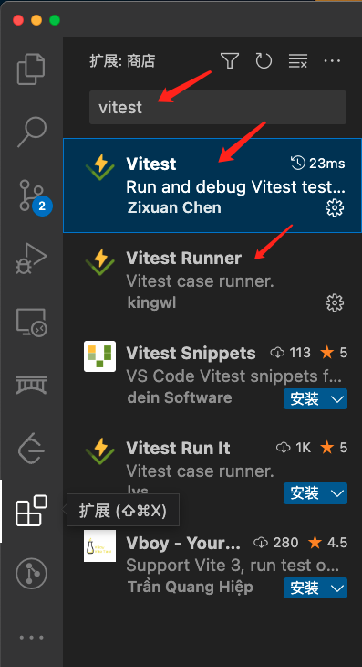
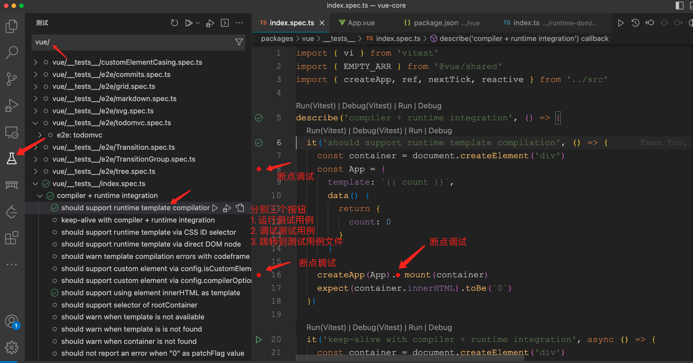
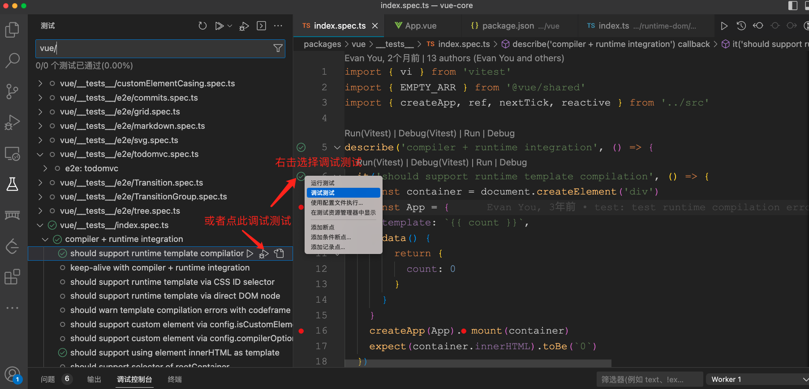
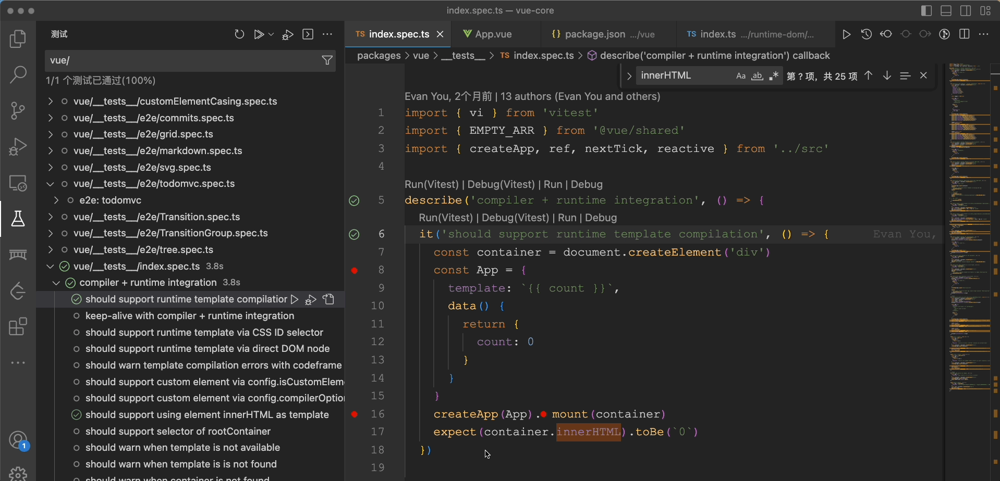
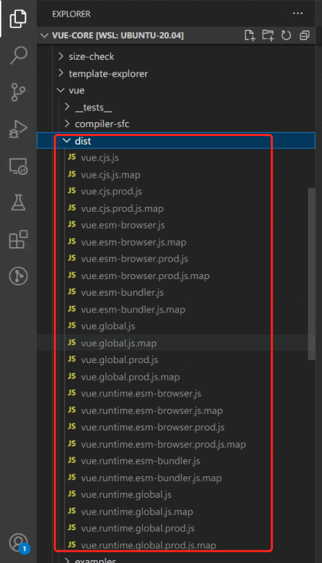
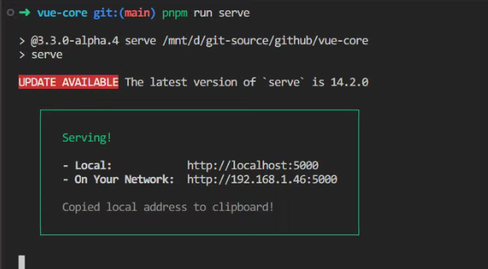
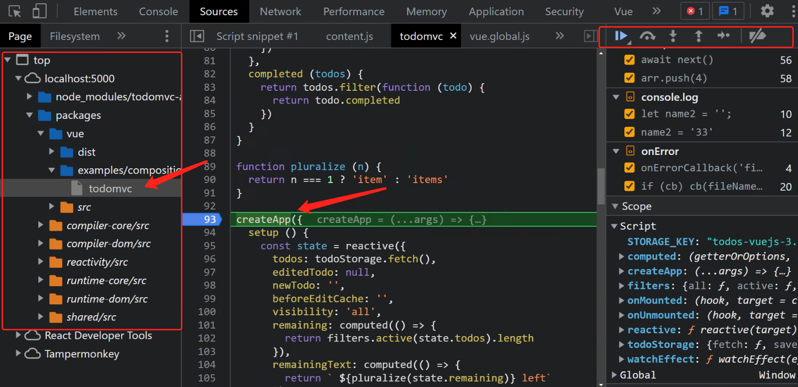
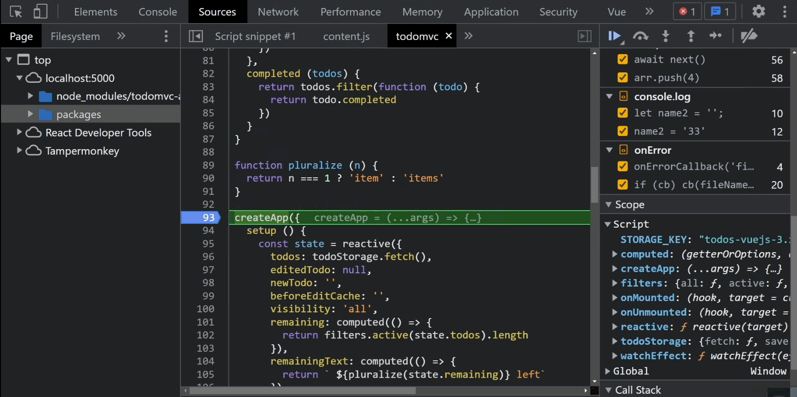

# 你可能从未使用过的调试 Vue3 (开源项目) 源码的方式

## 1. 前言

大家好，我是[若川](https://lxchuan12.gitee.io)。我倾力持续组织了一年[每周大家一起学习200行左右的源码共读活动](https://juejin.cn/post/7079706017579139102)，感兴趣的可以[点此扫码加我微信 `ruochuan02` 参与](https://juejin.cn/pin/7005372623400435725)。另外，想学源码，极力推荐关注我写的专栏[《学习源码整体架构系列》](https://juejin.cn/column/6960551178908205093)，目前是掘金关注人数（4.7k+人）第一的专栏，写有20余篇源码文章。

## 2. 看开源项目学习是怎样的步骤？

看一个开源仓库，第一步一般是看 `README.md` 和 `contributing.md` 贡献指南文档。

>`README.md` 中一般有提到贡献指南文档的链接的。贡献指南文档就是为了让别人参与项目贡献。

而贡献指南写了很多关于参与项目开发的信息。比如怎么跑起来，项目目录结构是怎样的。怎么投入开发，需要哪些知识储备等。

第二步的克隆下来。按照贡献指南文档，把项目跑起来。

## 3. 如何调试 `vue3` 源码

我们这次来学调试 `vue3` 源码，看 [vue3 源码](https://github.com/vuejs/core.git)仓库 [contributing.md](https://github.com/vuejs/core/blob/main/.github/contributing.md)。

`contributing.md` 部分内容

>**Development Setup**

>You will need [Node.js](https://nodejs.org) **version 16+**, and [PNPM](https://pnpm.io) **version 7+**.

>We also recommend installing [ni](https://github.com/antfu/ni) to help switching between repos using different package managers. `ni` also provides the handy `nr` command which running npm scripts easier.

>After cloning the repo, run:

```bash
$ pnpm i # install the dependencies of the project
```

关于上方提到的 `ni`，我曾经写过源码文章，可供参考。

[尤雨溪推荐神器 ni ，能替代 npm/yarn/pnpm ？简单好用！源码揭秘！](https://juejin.cn/post/7023910122770399269)


从贡献指南中，我们可以得知一些信息，那么先来克隆项目安装依赖。

```bash
git clone https://github.com/vuejs/core.git
cd core
# 安装依赖
pnpm i
```

## 4. 使用 vitest vscode 扩展的调试方式

安装[vitest vscode 扩展链接](https://marketplace.visualstudio.com/items?itemName=ZixuanChen.vitest-explorer)、[vitest vscode 扩展 github](https://github.com/vitest-dev/vscode)

安装[vitest-runner vscode 扩展链接](https://marketplace.visualstudio.com/items?itemName=kingwl.vscode-vitest-runner)、[vitest-runner vscode 扩展 github](https://github.com/kwai-explore/vscode-vitest-runner)







```ts
// packages/vue/__tests__/index.spec.ts
import { vi } from 'vitest'
import { EMPTY_ARR } from '@vue/shared'
import { createApp, ref, nextTick, reactive } from '../src'

describe('compiler + runtime integration', () => {
  it('should support runtime template compilation', () => {
    const container = document.createElement('div')
    const App = {
      template: `{{ count }}`,
      data() {
        return {
          count: 0
        }
      }
    }
	// 可以按住 alt + 鼠标左键点击 跳转到函数，提前断点好想断点的地方
    createApp(App).mount(container)
    expect(container.innerHTML).toBe(`0`)
  })
  // 省略若干代码
}
```

如下图 `gif` 图所示，就是调试 `vue` 源码了。



关于 `gif` 图中顶部各个按钮的作用，我曾经写过一篇文章[新手向：前端程序员必学基本技能——调试JS代码](https://juejin.cn/post/7030584939020042254)

通过开源项目的测试用例调试源码，它的优点在于不用打包、更接近源码，测试覆盖率高的开源项目，可以只针对某项功能做针对性调试，看测试用例的过程中也能直接学会使用。**而这种调试方式，可能是大部分人从未使用过的调试源码方式，因为大多数人可能没学过测试框架。**

`Vue` 源码的测试用例现在改成了 [Vitest](https://cn.vitest.dev/guide/)。

同理可得，如果开源项目是使用 `Jest` 测试框架，可以安装 [`Jest`](https://marketplace.visualstudio.com/items?itemName=Orta.vscode-jest)、[`Jest Runner`](https://marketplace.visualstudio.com/items?itemName=firsttris.vscode-jest-runner) `vscode` 插件。

## 5. 通过生成 sourcemap 调试

### 5.1 如何生成 sourcemap

[贡献指南的文档 contributing.md](https://github.com/vuejs/core/blob/main/.github/contributing.md) 中有写：

>**Build with Source Maps**

Use the `--sourcemap` or `-s` flag to build with source maps. Note this will make the build much slower.

```bash
pnpm run build -s
```

执行后，所有的都生成了 `sourcemap` 文件，如下图所示。



通过 `sourcemap` 文件，可以找到原始文件信息。

我们可以在根目录下的 `package.json` 中，看到有一个启动服务的命令。

```json
{
  "private": true,
  "version": "3.3.0-alpha.4",
  "packageManager": "pnpm@7.26.0",
  "type": "module",
  "scripts": {
    "serve": "serve",
  },
}
```

这时再在命令行终端，执行这条命令，启动服务。

```bash
pnpm run serve
```



浏览器打开 `http://localhost:5000` 可以找到相应路径。

比如我们打开这个源码中有的 `todomvc` 例子，来调试。
`http://localhost:64085/packages/vue/examples/composition/todomvc`

```html
// packages/vue/examples/composition/todomvc.html
<script src="../../dist/vue.global.js"></script>
<script>
const { createApp, reactive, computed, watchEffect, onMounted, onUnmounted } = Vue
// 省略若干代码
// 我们可以在这里断点调试
createApp({
  setup () {
    // 省略若干代码
}).mount('#app')
```

文件开头首先引入了文件`vue.global.js`，其底部注释表明了 `sourcemap` 文件 `URL`。

```js
// ../../dist/vue.global.js
var Vue = (function (exports) {})({});
//# sourceMappingURL=vue.global.js.map
```

我们可以在 `createApp` 函数处断点调试，`createApp` 函数里再断点调试，就是调试原来本身的源码。也和上文提到的`vitest vscode 插件` 一样调试。



调试如下图 `gif` 图所示。



至此，我们就也学会了根据项目中提供的命令通过生成 `sourcemap` 文件和调试源码。

### 5.2 为何贡献指南中写的方式就能生成 sourcemap ？

有小伙伴可能会好奇，为啥贡献指南，`pnpm run build` 编译加参数 `--sourcemap 或者 -s` 就能生成 `sourcemap` 呢。我们接下来探究下为啥 `--sourcemap` 或者 `-s` 就能生成 `sourcemap` 呢。

查看项目根目录下的 `package.json` 的文件，我们可以得知：`build` 命令，实际执行的是`node scripts/build.js`。

```json
{
  "private": true,
  "version": "3.3.0-alpha.4",
  "packageManager": "pnpm@7.26.0",
  "type": "module",
  "scripts": {
    "dev": "node scripts/dev.js",
    "build": "node scripts/build.js",
  },
}
```

找到这个文件 `scripts/build.js`。

```js
// scripts/build.js
import minimist from 'minimist'
import execa from 'execa'

const args = minimist(process.argv.slice(2))

const sourceMap = args.sourcemap || args.s

async function build(target) {
  //   省略若干代码
  const env =
    (pkg.buildOptions && pkg.buildOptions.env) ||
    (devOnly ? 'development' : 'production')
  await execa(
    'rollup',
    [
      '-c',
      '--environment',
      [
        `COMMIT:${commit}`,
        `NODE_ENV:${env}`,
        `TARGET:${target}`,
        formats ? `FORMATS:${formats}` : ``,
        prodOnly ? `PROD_ONLY:true` : ``,
        sourceMap ? `SOURCE_MAP:true` : ``
      ]
        .filter(Boolean)
        .join(',')
    ],
    { stdio: 'inherit' }
  )
}
```

[minimist](https://github.com/minimistjs/minimist) 是解析命令行参数。
[execa](https://github.com/sindresorhus/execa) 是子进程执行命令。

相当于在命令行终端执行
[rollup](https://rollupjs.org/guide/en) 打包：`rollup -c --environment COMMIT:650f5c2,NODE_ENV:production,TARGET:compiler-ssr,SOURCE_MAP:true`

看到这里，我们得知原来参数 `--sourcemap` 或者 `-s` 控制的是 `rollup` 的 `SOURCE_MAP:true` 参数，从而控制是否生成 `sourcemap` 文件。

## 6. 总结

行文至此，我们来总结下。

看开源项目一定要先看官方的 `README.md` 和贡献指南 `contributing.md`。

这是开源项目维护者为广大想参与贡献的开发者写的。

我们通过学会了安装 [vitest vscode 扩展](https://marketplace.visualstudio.com/items?itemName=ZixuanChen.vitest-explorer)、[vitest-runner vscode 扩展 github](https://github.com/kwai-explore/vscode-vitest-runner)，根据测试用例，指定相应的测试用例调试相应的源码。

测试用例非常重要。而且 [vitest](https://cn.vitest.dev/guide/) 是中文文档，相对容易学习，非常值得我们学习。

另外，我们学会了如何生成 `sourcemap`，通过项目提供的例子，调试 `Vue3` 的源码。
同时，还探究了为何能够编译时传参就能控制是否编译生成 `sourcemap` 文件，本质是利用命令行参数，最终控制 `rollup` 打包工具的 SOURCE_MAP:true 参数。

这篇文章整体比较简单，主要在于是否知道这两种调试源码的方式。如果把看源码比作登山，那么学会调试可以说是找到山的入口和爬山的方式。真正爬山，才是更难的时候。

---

**如果看完有收获，欢迎点赞、评论、分享支持。你的支持和肯定，是我写作的动力**。

最后可以持续关注我[@若川](https://juejin.cn/user/1415826704971918)。想学源码，推荐关注目前4.7K+人关注的掘金专栏[《学习源码整体架构系列》](https://juejin.cn/column/6960551178908205093)。

我倾力持续组织了一年[每周大家一起学习200行左右的源码共读活动](https://juejin.cn/post/7079706017579139102)，感兴趣的可以[点此扫码加我微信 `ruochuan02` 参与](https://juejin.cn/pin/7005372623400435725)。
