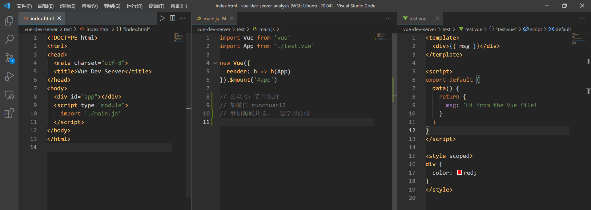
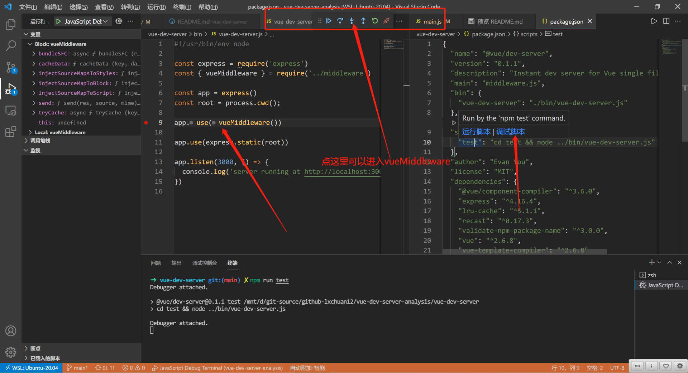
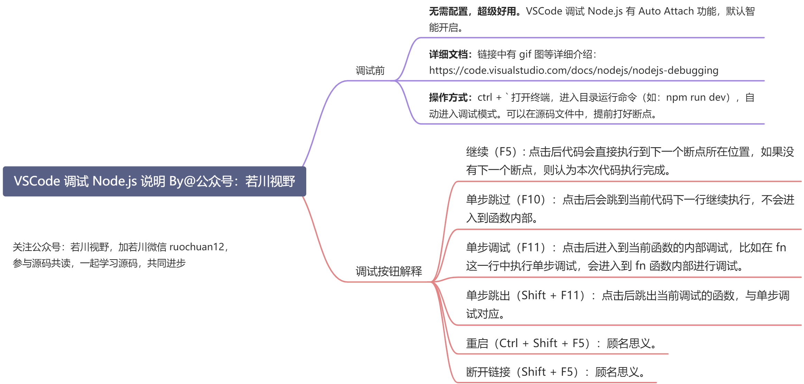
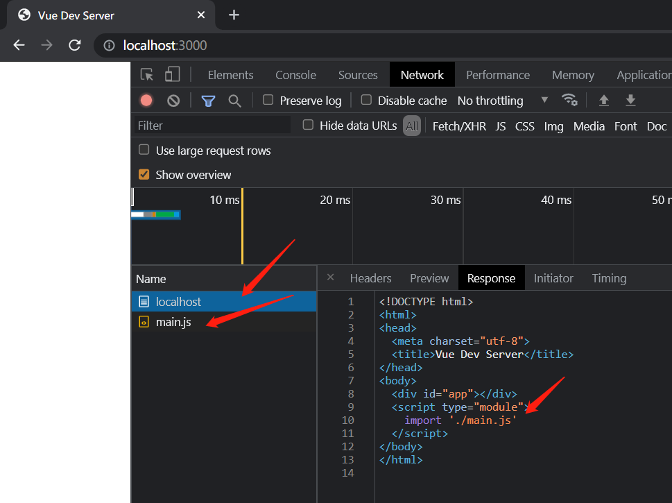
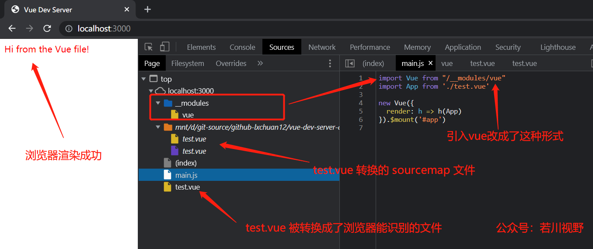

# 尤雨溪几年前开发的“玩具 vite”，才100多行代码，却十分有助于理解 vite 原理

## 1. 前言

>大家好，我是[若川](https://lxchuan12.gitee.io)。欢迎关注我的[公众号若川视野](https://p1-jj.byteimg.com/tos-cn-i-t2oaga2asx/gold-user-assets/2019/12/13/16efe57ddc7c9eb3~tplv-t2oaga2asx-image.image "https://p1-jj.byteimg.com/tos-cn-i-t2oaga2asx/gold-user-assets/2019/12/13/16efe57ddc7c9eb3~tplv-t2oaga2asx-image.image")，最近组织了[**源码共读活动**](https://www.yuque.com/ruochuan12/notice)，感兴趣的可以加我微信 [ruochuan12](https://juejin.cn/pin/7005372623400435725) 参与，已进行两个多月，大家一起交流学习，共同进步。

想学源码，极力推荐之前我写的[《学习源码整体架构系列》](https://juejin.cn/column/6960551178908205093) 包含`jQuery`、`underscore`、`lodash`、`vuex`、`sentry`、`axios`、`redux`、`koa`、`vue-devtools`、`vuex4`、`koa-compose`、`vue-next-release`、`vue-this`、`create-vue`等10余篇源码文章。

最近组织了[源码共读活动](https://www.yuque.com/ruochuan12/notice)，大家一起学习源码。于是各种搜寻值得我们学习，且代码行数不多的源码。

在 [vuejs组织](https://github.com/vuejs) 下，找到了尤雨溪几年前写的“玩具 vite”
[vue-dev-server](https://github.com/vuejs/vue-dev-server)，发现100来行代码，很值得学习。于是有了这篇文章。

阅读本文，你将学到：

```sh
1. 学会 vite 简单原理
2. 学会使用 VSCode 调试源码
3. 学会如何编译 Vue 单文件组件
4. 学会如何使用 recast 生成 ast 转换文件
5. 如何加载包文件
6. 等等
```

## 2. vue-dev-server 它的原理是什么

[vue-dev-server#how-it-works](https://github.com/vuejs/vue-dev-server#how-it-works)
`README` 文档上有四句英文介绍。

发现[谷歌翻译](https://translate.google.cn/)的还比较准确，我就原封不动的搬运过来。

- 浏览器请求导入作为原生 ES 模块导入 - 没有捆绑。
- 服务器拦截对 *.vue 文件的请求，即时编译它们，然后将它们作为 JavaScript 发回。
- 对于提供在浏览器中工作的 ES 模块构建的库，只需直接从 CDN 导入它们。
- 导入到 .js 文件中的 npm 包（仅包名称）会即时重写以指向本地安装的文件。 目前，仅支持 vue 作为特例。 其他包可能需要进行转换才能作为本地浏览器目标 ES 模块公开。

也可以看看[vitejs 文档](https://cn.vitejs.dev/guide/why.html)，了解下原理，文档中图画得非常好。


看完本文后，我相信你会有一个比较深刻的理解。

## 3. 准备工作

### 3.1 克隆项目

[本文仓库 vue-dev-server-analysis，求个star^_^](https://github.com/lxchuan12/vue-dev-server-analysis.git)

```sh
# 推荐克隆我的仓库
git clone https://github.com/lxchuan12/vue-dev-server-analysis.git
cd vue-dev-server-analysis/vue-dev-server
# npm i -g yarn
# 安装依赖
yarn

# 或者克隆官方仓库
git clone https://github.com/vuejs/vue-dev-server.git
cd vue-dev-server
# npm i -g yarn
# 安装依赖
yarn
```

一般来说，我们看源码先从`package.json`文件开始：

```json
// vue-dev-server/package.json
{
  "name": "@vue/dev-server",
  "version": "0.1.1",
  "description": "Instant dev server for Vue single file components",
  "main": "middleware.js",
  // 指定可执行的命令
  "bin": {
    "vue-dev-server": "./bin/vue-dev-server.js"
  },
  "scripts": {
    // 先跳转到 test 文件夹，再用 Node 执行 vue-dev-server 文件
    "test": "cd test && node ../bin/vue-dev-server.js"
  }
}
```

根据 `scripts` `test` 命令。我们来看 `test` 文件夹。

### 3.2 test 文件夹

`vue-dev-server/test` 文件夹下有三个文件，代码不长。

- index.html
- main.js
- text.vue

如图下图所示。



接着我们找到 `vue-dev-server/bin/vue-dev-server.js` 文件，代码也不长。

### 3.3 vue-dev-server.js

```js
// vue-dev-server/bin/vue-dev-server.js
#!/usr/bin/env node

const express = require('express')
const { vueMiddleware } = require('../middleware')

const app = express()
const root = process.cwd();

app.use(vueMiddleware())

app.use(express.static(root))

app.listen(3000, () => {
  console.log('server running at http://localhost:3000')
})
```

原来就是`express`启动了端口`3000`的服务。重点在 `vueMiddleware` 中间件。接着我们来调试这个中间件。

鉴于估计很多小伙伴没有用过`VSCode`调试，这里详细叙述下如何调试源码。**学会调试源码后，源码并没有想象中的那么难**。

### 3.4 用 VSCode 调试项目

`vue-dev-server/bin/vue-dev-server.js` 文件中这行 `app.use(vueMiddleware())` 打上断点。

找到 `vue-dev-server/package.json` 的 `scripts`，把鼠标移动到 `test` 命令上，会出现`运行脚本`和`调试脚本`命令。如下图所示，选择调试脚本。





点击`进入函数（F11）`按钮可以进入 `vueMiddleware` 函数。**如果发现断点走到不是本项目的文件中，不想看，看不懂的情况，可以退出或者重新来过**。**可以用浏览器无痕（隐私）模式（快捷键`Ctrl + Shift + N`，防止插件干扰）打开 `http://localhost:3000`，可以继续调试 `vueMiddleware` 函数返回的函数**。

>如果你的`VSCode`不是中文（不习惯英文），可以安装[简体中文插件](https://marketplace.visualstudio.com/items?itemName=MS-CEINTL.vscode-language-pack-zh-hans)。<br>
>如果 `VSCode` 没有这个调试功能。建议更新到最新版的 `VSCode`（目前最新版本 `v1.61.2`）。

接着我们来跟着调试学习 `vueMiddleware` 源码。可以先看主线，在你觉得重要的地方继续断点调试。

## 4. vueMiddleware 源码

### 4.1 有无 vueMiddleware 中间件对比

不在调试情况状态下，我们可以在 `vue-dev-server/bin/vue-dev-server.js` 文件中注释 `app.use(vueMiddleware())`，执行 `npm run test` 打开 `http://localhost:3000`。



再启用中间件后，如下图。



看图我们大概知道了有哪些区别。

### 4.2 vueMiddleware 中间件概览

我们可以找到`vue-dev-server/middleware.js`，查看这个中间件函数的概览。

```js
// vue-dev-server/middleware.js

const vueMiddleware = (options = defaultOptions) => {
  // 省略
  return async (req, res, next) => {
    // 省略
    // 对 .vue 结尾的文件进行处理
    if (req.path.endsWith('.vue')) {
    // 对 .js 结尾的文件进行处理
    } else if (req.path.endsWith('.js')) {
    // 对 /__modules/ 开头的文件进行处理
    } else if (req.path.startsWith('/__modules/')) {
    } else {
      next()
    }
  }
}
exports.vueMiddleware = vueMiddleware
```

`vueMiddleware` 最终返回一个函数。这个函数里主要做了四件事：
- 对 `.vue` 结尾的文件进行处理
- 对 `.js` 结尾的文件进行处理
- 对 `/__modules/` 开头的文件进行处理
- 如果不是以上三种情况，执行 `next` 方法，把控制权交给下一个中间件


接着我们来看下具体是怎么处理的。

我们也可以断点这些重要的地方来查看实现。比如：


### 4.3 对 .vue 结尾的文件进行处理

```js
if (req.path.endsWith('.vue')) {
  const key = parseUrl(req).pathname
  let out = await tryCache(key)

  if (!out) {
    // Bundle Single-File Component
    const result = await bundleSFC(req)
    out = result
    cacheData(key, out, result.updateTime)
  }

  send(res, out.code, 'application/javascript')
}
```

#### 4.3.1 bundleSFC 编译单文件组件

这个函数，根据 [@vue/component-compiler](https://github.com/vuejs/vue-component-compiler) 转换单文件组件，最终返回浏览器能够识别的文件。

```js
const vueCompiler = require('@vue/component-compiler')
async function bundleSFC (req) {
  const { filepath, source, updateTime } = await readSource(req)
  const descriptorResult = compiler.compileToDescriptor(filepath, source)
  const assembledResult = vueCompiler.assemble(compiler, filepath, {
    ...descriptorResult,
    script: injectSourceMapToScript(descriptorResult.script),
    styles: injectSourceMapsToStyles(descriptorResult.styles)
  })
  return { ...assembledResult, updateTime }
}
```

接着我们来看 `readSource` 函数实现。

#### 4.3.2 readSource 读取文件资源

这个函数主要作用：根据请求获取文件资源。返回文件路径 `filepath`、资源 `source`、和更新时间 `updateTime`。

```js
const path = require('path')
const fs = require('fs')
const readFile = require('util').promisify(fs.readFile)
const stat = require('util').promisify(fs.stat)
const parseUrl = require('parseurl')
const root = process.cwd()

async function readSource(req) {
  const { pathname } = parseUrl(req)
  const filepath = path.resolve(root, pathname.replace(/^\//, ''))
  return {
    filepath,
    source: await readFile(filepath, 'utf-8'),
    updateTime: (await stat(filepath)).mtime.getTime()
  }
}

exports.readSource = readSource
```

接着我们来看对 .js 文件的处理

### 4.4 对 .js 结尾的文件进行处理

```js
if (req.path.endsWith('.js')) {
  const key = parseUrl(req).pathname
  let out = await tryCache(key)

  if (!out) {
    // transform import statements
    // 转换 import 语句 
    // import Vue from 'vue'
    // => import Vue from "/__modules/vue"
    const result = await readSource(req)
    out = transformModuleImports(result.source)
    cacheData(key, out, result.updateTime)
  }

  send(res, out, 'application/javascript')
}
```


针对 `vue-dev-server/test/main.js` 转换

```js
import Vue from 'vue'
import App from './test.vue'

new Vue({
  render: h => h(App)
}).$mount('#app')

// 公众号：若川视野
// 加微信 ruochuan12
// 参加源码共读，一起学习源码
```

```js
import Vue from "/__modules/vue"
import App from './test.vue'

new Vue({
  render: h => h(App)
}).$mount('#app')

// 公众号：若川视野
// 加微信 ruochuan12
// 参加源码共读，一起学习源码
```

#### 4.4.1 transformModuleImports 转换 import 引入

[recast](https://github.com/benjamn/recast)

[validate-npm-package-name](https://github.com/npm/validate-npm-package-name)

```js
const recast = require('recast')
const isPkg = require('validate-npm-package-name')

function transformModuleImports(code) {
  const ast = recast.parse(code)
  recast.types.visit(ast, {
    visitImportDeclaration(path) {
      const source = path.node.source.value
      if (!/^\.\/?/.test(source) && isPkg(source)) {
        path.node.source = recast.types.builders.literal(`/__modules/${source}`)
      }
      this.traverse(path)
    }
  })
  return recast.print(ast).code
}

exports.transformModuleImports = transformModuleImports
```

也就是针对 `npm` 包转换。 这里就是 `"/__modules/vue"`

```js
import Vue from 'vue' => import Vue from "/__modules/vue"
```

### 4.5 对 /__modules/ 开头的文件进行处理

```js
import Vue from "/__modules/vue"
```

这段代码最终返回的是读取路径 `vue-dev-server/node_modules/vue/dist/vue.esm.browser.js` 下的文件。

```js
if (req.path.startsWith('/__modules/')) {
  // 
  const key = parseUrl(req).pathname
  const pkg = req.path.replace(/^\/__modules\//, '')

  let out = await tryCache(key, false) // Do not outdate modules
  if (!out) {
    out = (await loadPkg(pkg)).toString()
    cacheData(key, out, false) // Do not outdate modules
  }

  send(res, out, 'application/javascript')
}
```

#### 4.5.1 loadPkg 加载包（这里只支持Vue文件）

目前只支持 `Vue` 文件，也就是读取路径 `vue-dev-server/node_modules/vue/dist/vue.esm.browser.js` 下的文件返回。

```js
// vue-dev-server/loadPkg.js
const fs = require('fs')
const path = require('path')
const readFile = require('util').promisify(fs.readFile)

async function loadPkg(pkg) {
  if (pkg === 'vue') {
    // 路径
    // vue-dev-server/node_modules/vue/dist
    const dir = path.dirname(require.resolve('vue'))
    const filepath = path.join(dir, 'vue.esm.browser.js')
    return readFile(filepath)
  }
  else {
    // TODO
    // check if the package has a browser es module that can be used
    // otherwise bundle it with rollup on the fly?
    throw new Error('npm imports support are not ready yet.')
  }
}

exports.loadPkg = loadPkg
```

至此，我们就基本分析完毕了主文件和一些引入的文件。对主流程有个了解。

## 5. 总结

最后我们来看上文中有无 vueMiddleware 中间件的两张图总结一下：


启用中间件后，如下图。


浏览器支持原生 `type=module` 模块请求加载。`vue-dev-server` 对其拦截处理，返回浏览器支持内容，因为无需打包构建，所以速度很快。

```html
<script type="module">
    import './main.js'
</script>
```

### 5.1 import Vue from 'vue' 转换

```js
// vue-dev-server/test/main.js
import Vue from 'vue'
import App from './test.vue'

new Vue({
  render: h => h(App)
}).$mount('#app')
```

main.js 中的 import 语句
import Vue from 'vue'
通过 [recast](https://github.com/benjamn/recast) 生成 ast 转换成 `import Vue from "/__modules/vue"`
而最终返回给浏览器的是 `vue-dev-server/node_modules/vue/dist/vue.esm.browser.js`

### 5.2 import App from './test.vue' 转换

`main.js` 中的引入 `.vue` 的文件，`import App from './test.vue'`
则用 [@vue/component-compiler](https://github.com/vuejs/vue-component-compiler) 转换成浏览器支持的文件。

### 5.3 后续还能做什么？

鉴于文章篇幅有限，缓存 `tryCache` 部分目前没有分析。简单说就是使用了 [node-lru-cache](https://github.com/isaacs/node-lru-cache) `最近最少使用` 来做缓存的（这个算法常考）。后续应该会分析这个仓库的源码，欢迎持续关注我@若川。

非常建议读者朋友按照文中方法使用`VSCode`调试 `vue-dev-server` 源码。源码中还有很多细节文中由于篇幅有限，未全面展开讲述。

值得一提的是[这个仓库的 `master` 分支](https://github.com/vuejs/vue-dev-server/tree/master)，是尤雨溪两年前写的，相对本文会比较复杂，有余力的读者可以学习。

也可以直接去看 [`vite`](https://github.com/vitejs/vite) 源码。

看完本文，也许你就能发现其实前端能做的事情越来越多，不由感慨：前端水深不可测，唯有持续学习。

最后欢迎加我微信 [ruochuan12](https://juejin.cn/pin/7005372623400435725) 交流，参与 [源码共读](https://www.yuque.com/ruochuan12/notice) 活动，大家一起学习源码，共同进步。