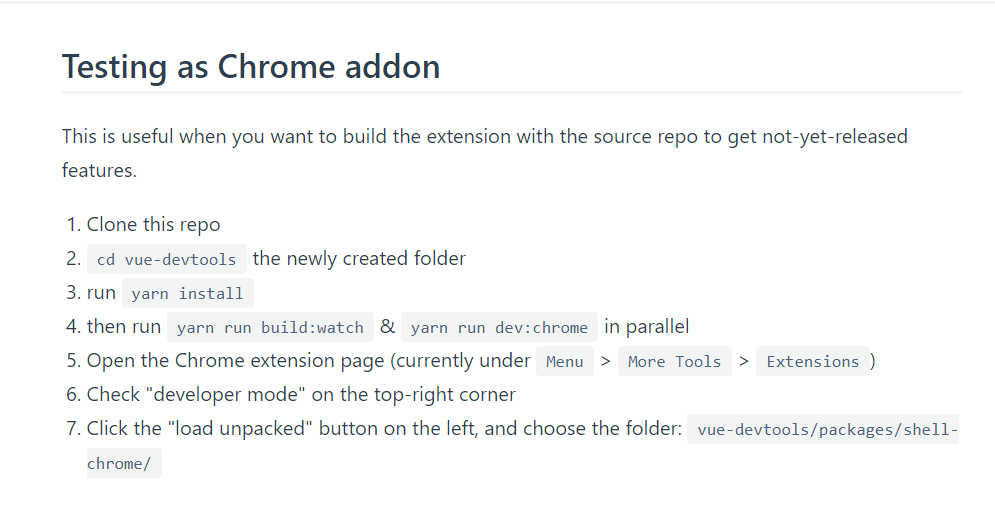
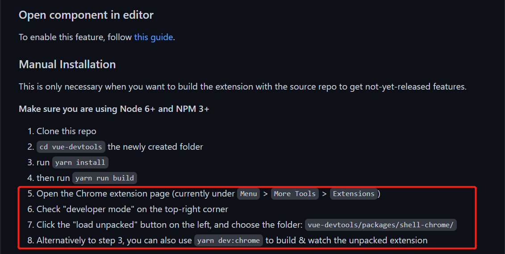
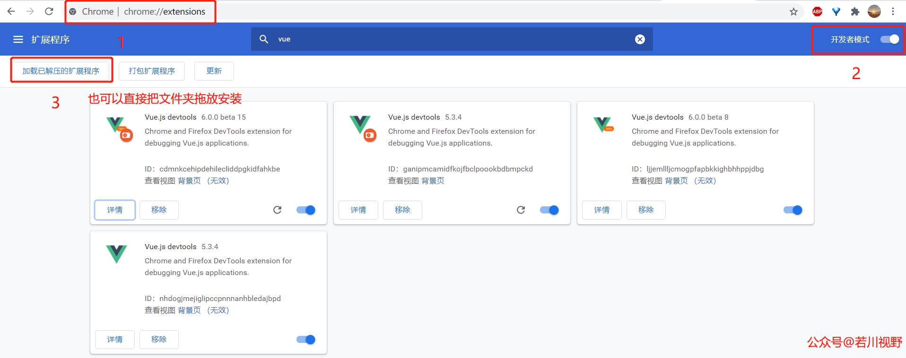

# 尤雨溪开发的 vue-devtools 如何安装，为何打开文件的功能鲜有人知？

## 1. 前言

>大家好，我是[若川](https://mp.weixin.qq.com/s?__biz=MzA5MjQwMzQyNw==&mid=2650749369&idx=1&sn=d605560d8faf6724977f870218b87b57&chksm=88663a35bf11b323c7dc2077ac5e4f38e31c651067ec15c68cff62de1578fa569209658a54dd&scene=21#wechat_redirect)。最近组织了一次**源码共读**活动。每周读200行左右的源码。很多第一次读源码的小伙伴都感觉很有收获，感兴趣可以加我微信 `ruochuan12`，拉你进群学习。

第一周读的是：[据说 99% 的人不知道 vue-devtools 还能直接打开对应组件文件？本文原理揭秘](https://mp.weixin.qq.com/s?__biz=MzA5MjQwMzQyNw==&mid=2650751278&idx=1&sn=3ac07b110e84e3ded5fa4ec4407ce13b&chksm=886642a2bf11cbb4cea35f0d208815c39c9cd13a0522e7cdc4a466bc55cb5b3071143a38bb04&token=1633047015&lang=zh_CN#rd)。虽然我写过文章，但我还是相信有部分小伙伴还是不知道这个功能。


文中项目用的是`vue3`，所以需要安装 `vue3` 版本对应的`vue-devtools`。

但有挺多小伙伴，无法打开谷歌应用市场。有人说不是谷歌应用市场可以下载嘛。但往往是这一步拦住了很多用户，也有了很多商机。比如各种插件网站应运而生。于是我写篇文章，我是如何打包安装 `devtools` 插件的。

>友情提醒：文章相对比较简单。估计有人会说，这也要写篇文章嘛。事实上，真的有挺多人不知道怎么打包。写文章也是提醒大家多看官方文档和`github README`。

>插件我已经打包好，放到百度网盘中，在我的公众号：若川视野，回复关键词【插件】即可获取到两个版本的 `devtools` 进行安装，两个版本可以共存。

## 2. 打包插件和安装方法

打开 [github vue-devtools](https://github.com/vuejs/devtools) 发现名字也更新了，之前是叫`vue-devtools`，现在是`devtools`了，竟然还出了[devtools 官网](https://devtools.vuejs.org/)。

### 2.1 打包 vue3 版本对应的 vue-devtools

查看官方`README`：[vue-devtools contributing](https://devtools.vuejs.org/guide/contributing.html#testing-as-chrome-addon)



```bash
git clone https://github.com/vuejs/devtools.git
cd devtools
# 如果没安装 yarn，可以 npm i yarn -g
# 安装依赖
yarn install
# 构建
yarn build
```

不出意外，构建成功后，可以得到有 `devtools/packages/shell-chrome/` 目录。

### 2.2 打包 vue2 版本对应的 vue-devtools

查看官方`README`：[vue2 devtools REAMDE.md](https://github.com/vuejs/devtools/tree/v5.3.4)



```bash
# 可以复制上文克隆的项目
# 终端下复制 或者手动复制
cp -rf devtools devtools-v2
cd devtools-v2
# 复制成功后，切换分支 tag 到 v5.3.4 ，这是 vue2 对应的 devtools。
git checkout v5.3.4
# 删除 node_modules
rm -rf node_modules
# 安装依赖
yarn install
# 构建
yarn build
```

同样，不出意外，构建成功后，可以得到有 `devtools-v2/packages/shell-chrome/` 目录。

### 2.3 安装



如上图所示，谷歌浏览器打开 `chrome://extensions/`，右上角点击开启`开发者模式`，点击`加载已解压的扩展程序`，选择打包生成的 `devtools-v2/packages/shell-chrome/` 文件夹即可安装，或者直接拖入也可以安装，`vue2` 和 `vue3` 的插件可以共存。

安装好后，可以开心的调试啦，顺便可以查看下插件的详细信息。目前 `vue3` 对应版本的是`6.0.0-beta-15`。`vue2` 对应的版本是 `5.3.4`。其中详细信息中，`允许访问文件网址`，默认是开启的，建议开启。


## 3. 总结

文章相对简短，如果你身边有新人同事，还在为安装 `devtools` 插件发愁，可以分享这篇给TA。

启发：我们要养成多查阅官方文档或者`github README`的习惯。好的开源项目，`README`一般都写得非常好。另外除了什么新功能，一般在官方文档或者 `README` 会有体现。虽然一般 `README` 是英文的会阻拦一部分人，但如果真的看不懂还可以通过谷歌翻译等翻译工具。

>再次友情提醒：插件我已经打包好，放到百度网盘中，在我的公众号：若川视野，回复关键词【插件】即可获取到两个版本的 `devtools` 进行安装，两个版本可以共存。

最后欢迎加我微信 [ruochuan12](https://mp.weixin.qq.com/s?__biz=MzA5MjQwMzQyNw==&mid=2650756550&idx=1&sn=9acc5e30325963e455f53ec2f64c1fdd&chksm=8866564abf11df5c41307dba3eb84e8e14de900e1b3500aaebe802aff05b0ba2c24e4690516b&token=917686367&lang=zh_CN#rd) 交流，参与 [源码共读](https://mp.weixin.qq.com/s?__biz=MzA5MjQwMzQyNw==&mid=2650756550&idx=1&sn=9acc5e30325963e455f53ec2f64c1fdd&chksm=8866564abf11df5c41307dba3eb84e8e14de900e1b3500aaebe802aff05b0ba2c24e4690516b&token=917686367&lang=zh_CN#rd) 活动，大家一起学习源码，共同进步。
