# 开发小程序又一新选择 vue-mini，据说性能是 Taro 的 10 倍，遥遥领先

## 1. 前言

大家好，我是[若川](https://juejin.cn/user/1415826704971918)，欢迎关注我的[公众号：若川视野](https://mp.weixin.qq.com/s/MacNfeTPODNMLLFdzrULow)。我倾力持续组织了 3 年多[每周大家一起学习 200 行左右的源码共读活动](https://juejin.cn/post/7079706017579139102)，感兴趣的可以[点此扫码加我微信 `ruochuan02` 参与](https://juejin.cn/pin/7217386885793595453)。另外，想学源码，极力推荐关注我写的专栏[《学习源码整体架构系列》](https://juejin.cn/column/6960551178908205093)，目前是掘金关注人数（6k+人）第一的专栏，写有几十篇源码文章。

刚刚结束不久的[vueconf 2024 深圳](https://vueconf.cn)，有一个主题《Vue-Mini 不妥协的小程序框架》，[仓库](https://github.com/yangmingshan/slides)、[PPT](https://feday.fequan.com/vueconf24/mingshan_VueConf%20CN%202024.pdf)、[视频](https://www.bilibili.com/video/BV1J4421D7ja/)

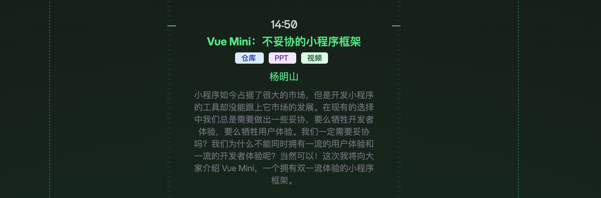

PPT 中有这样两页。


[和 taro 性能对比数据的仓库链接](https://github.com/yangmingshan/mp-framework-benchmark)，目前作者暂未给出与 `uniapp` 的性能对比。[有小伙伴在 issue 中问到，作者回复后续会补上](https://github.com/yangmingshan/mp-framework-benchmark/issues/1)

[vue-mini 官网](https://vuemini.org/guide/comparisons.html) 与其他的比较。

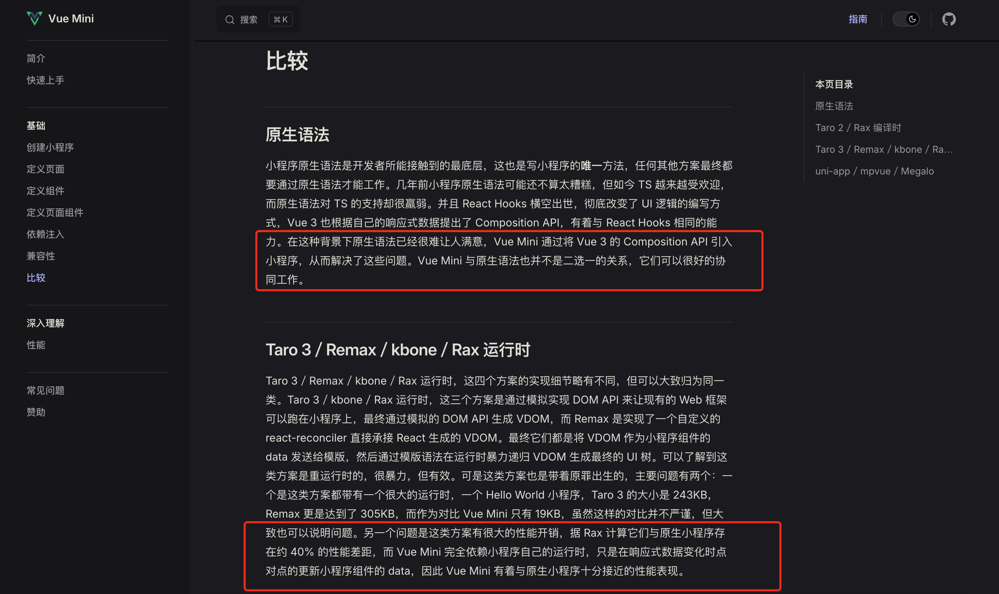

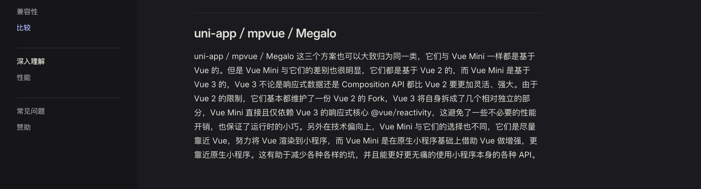

更多兼容性和使用方法等查阅[vue-mini 文档](https://vuemini.org/)。

本文主要来简单体验下 `vue-mini`，并且学习下基本的打包构建大概是如何实现的。

学完本文，你将学到：

```bash
1. vue-mini 初步体验
2. 初始化项目中的 build.js 是如何打包小程序代码的
3. 如何处理 ts、css、html 文件
4. 等等
```

## 2. 初始化项目

根据 [官网文档快速开始](https://vuemini.org/guide/quick-start.html) 生成小程序项目，我采用的是 `pnpm create vue-mini@latest`，我都选择的"是"。如下图所示：

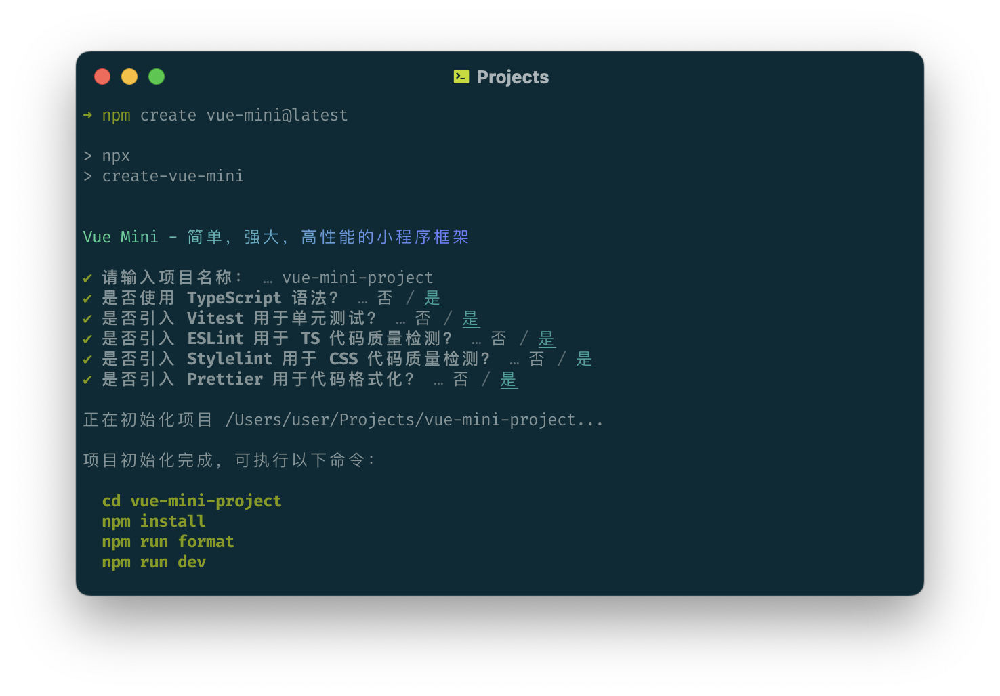

这个命令调用的是 [create-vue-mini](https://github.com/vue-mini/create-vue-mini) 这个项目，写文章时的版本是 `1.0.4`。它由 [create-vue](https://github.com/vuejs/create-vue) 修改而来。我在21年写过它的源码文章[Vue 团队公开快如闪电的全新脚手架工具 create-vue，未来将替代 Vue-CLI，才300余行代码，学它！](https://juejin.cn/post/7018344866811740173)，(3.9w+阅读量、483赞)可供学习。

也可以直接克隆我的项目。

```bash
git clone https://github.com/ruochuan12/vue-mini-analysis.git
cd vue-mini-analysis
pnpm install
```

执行 `pnpm install` 之后，再执行 `pnpm run dev` 或者 `pnpm run build` 命令。

## 3. 体验 vue-mini

直接选择项目根目录而非 `dist` 目录，将此项目导入微信开发者工具。

打开项目如图：

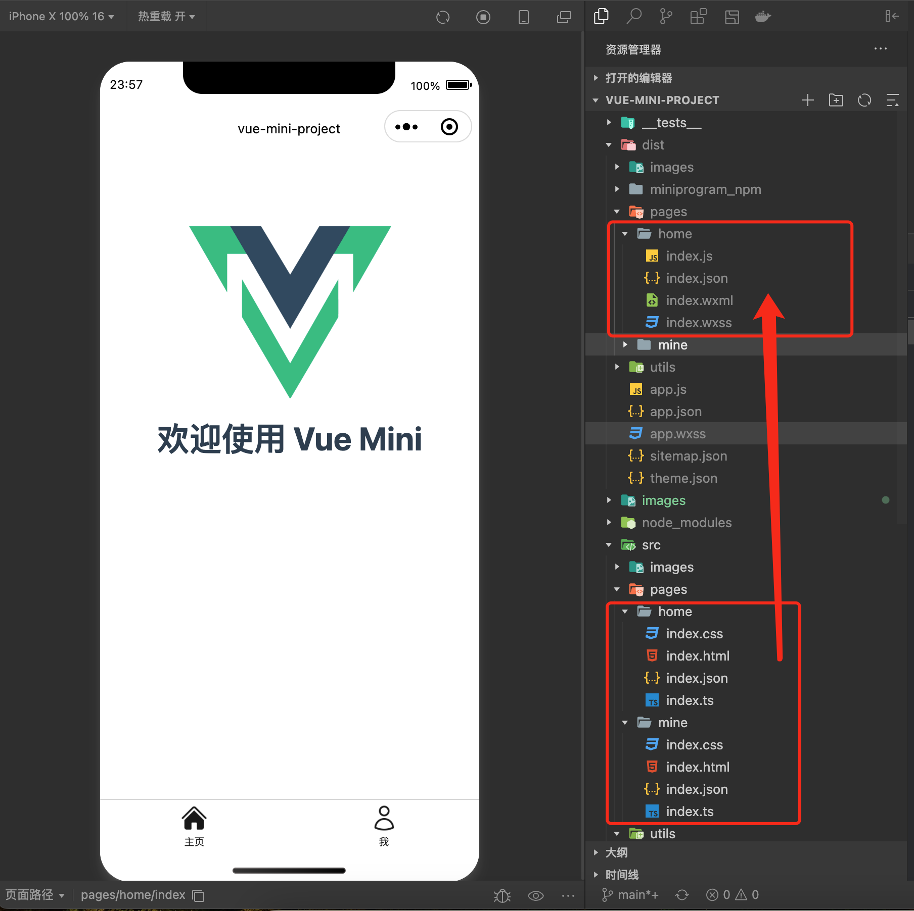

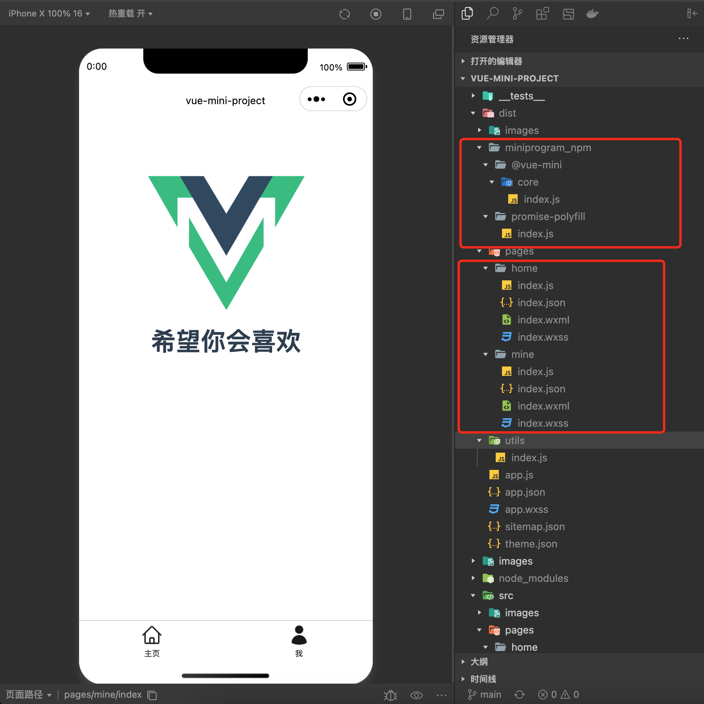

### 3.1 对比打包构建的代码

我们具体来对比执行 `pnpm run dev` 命令之后生成的代码。

入口 app.ts 文件。

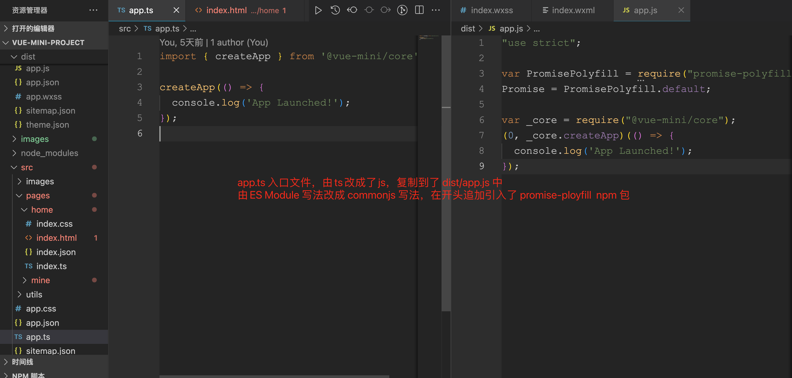

首页 html 文件
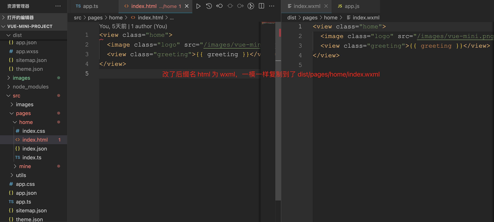

首页 css 文件
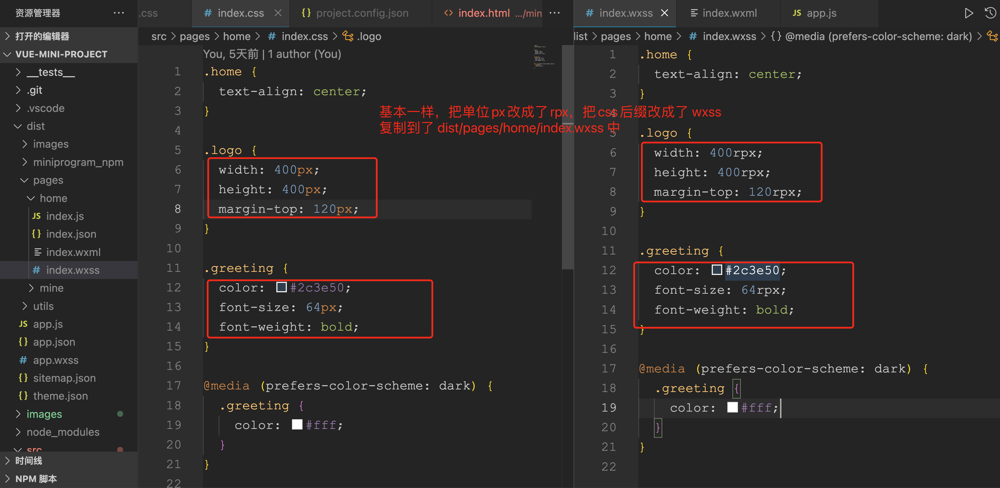

首页 ts 文件
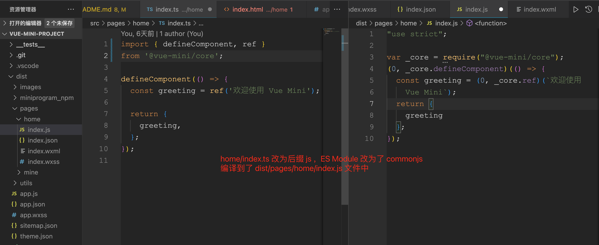

首页 json 文件
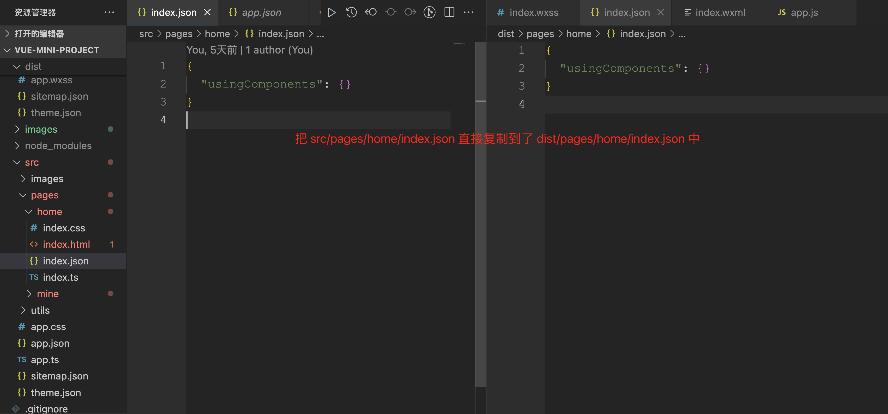

我们可以看到主要就是处理入口 `app.ts` 文件（单独追加了 `promise-polyfill`）、`html`、`css`、`ts`文件编译成了微信小程序支持的 `app.js`、`wxml`、`wxss`、`js`。`json` 文件是直接复制的，没做处理。

换句话说：
模板写法使用的是原生微信小程序的`wxml`，只是改名了 `html` 而已，`css` 部分也是原生微信小程序的 `wxss` 只是单位 `rpx` 改成了 `px` 而已，未做类似单文件组件的编译。只是在逻辑侧，`ts` 文件使用了 `vue-mini/core`，轻运行时，会把 `ES Module` 编译成 `commonjs`。

### 3.1 dev 和 build 命令

`pnpm run dev` 和 `pnpm run build` 分别对应的是 `package.json` 中的两个命令。

```json
// package.json
{
 "scripts": {
  "dev": "cross-env NODE_ENV=development node build.js",
  "build": "cross-env NODE_ENV=production node build.js"
 }
}
```

[cross-env](https://www.npmjs.com/package/cross-env) 是用来跨平台设置环境变量的，`NODE_ENV=development` 代表开发环境，`NODE_ENV=production` 代表生产环境。

我们可以打开 `build.js` 文件，查看下它的代码。

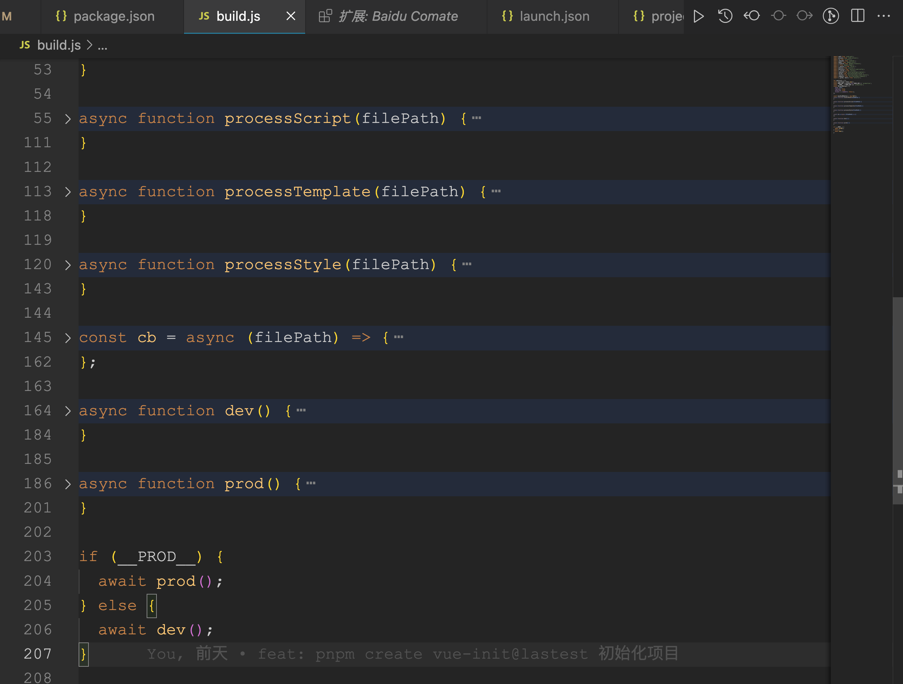

调试可参考我的文章[新手向：前端程序员必学基本技能——调试 JS 代码](https://juejin.cn/post/7030584939020042254)，或者[据说 90%的人不知道可以用测试用例(Vitest)调试开源项目(Vue3) 源码](https://juejin.cn/post/7212263304394981432)。本文就不做过多赘述。

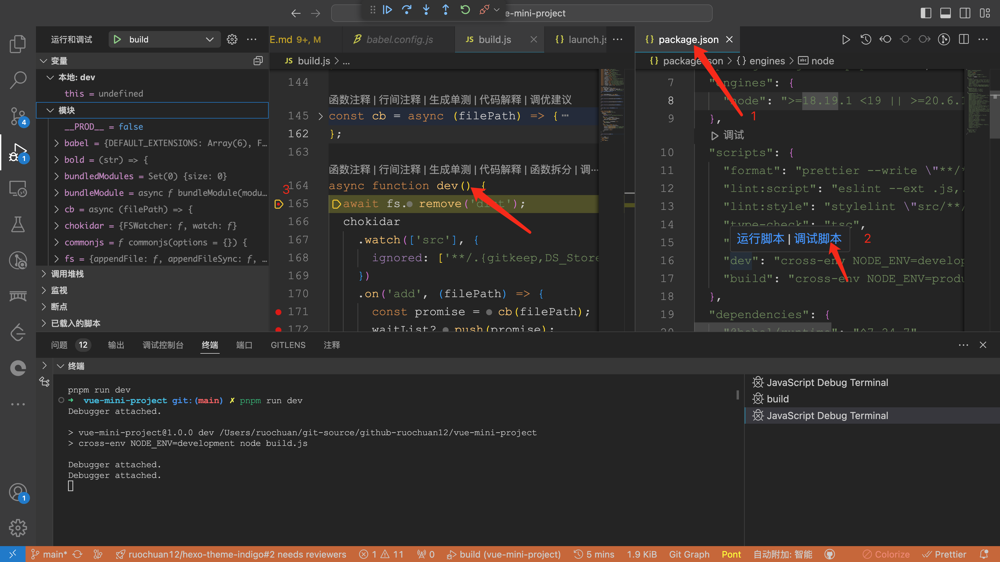

`build.js` 目前是比较原始的方式，没有各种封装，相对容易学习。有小伙伴提建议[[Feature] 希望可以增强工程化等基建体验 #65](https://github.com/vue-mini/vue-mini/issues/65)。

让我想起很久很久以前（大约是6年前），`vue-cli@2.9.3` 版本时就是用生成 `vue` 项目就是直接生成在开发者的项目中。比较难以和官方保持同步升级。后来 `vue-cli@3.0` 之后版本就能相对容易升级了。
>当时写过一篇文章[分析vue-cli@2.9.3 搭建的webpack项目工程](https://juejin.cn/post/6844903619184033800)，webpack 配置相关可能过时了，但其他知识没有过时，感兴趣的小伙伴可以学习。

## 3. build.js 打包构建文件

### 3.1 引入各种依赖

```ts
// 引入 node path 模块和 process 模块
import path from 'node:path';
import process from 'node:process';
```

>引入 node path 模块和 process 模块

```js
import fs from 'fs-extra';
import chokidar from 'chokidar';
```

>引入 [fs-extra](https://www.npmjs.com/package/fs-extra) 模块，用来操作文件和目录
>引入 [chokidar](https://www.npmjs.com/package/chokidar) 模块，用来监听文件变化

```js
import babel from '@babel/core';
import traverse from '@babel/traverse';
import t from '@babel/types';
import { minify } from 'terser';
```

>引入 [@babel/core](https://www.npmjs.com/package/@babel/core) 模块，用来编译 js 代码
>引入 [@babel/traverse](https://www.npmjs.com/package/@babel/traverse) 模块，用来遍历 js 代码
>引入 [@babel/types](https://www.npmjs.com/package/@babel/types) 模块，用来编译 js 代码
>引入 [terser](https://www.npmjs.com/package/terser) 模块，用来压缩 js 代码

```js
import postcss from 'postcss';
import postcssrc from 'postcss-load-config';
```

>引入 [postcss](https://www.npmjs.com/package/postcss) 模块，用来编译 css 代码
>引入 [postcss-load-config](https://www.npmjs.com/package/postcss-load-config) 模块，用来加载 postcss 配置文件

```js
import { rollup } from 'rollup';
import replace from '@rollup/plugin-replace';
import terser from '@rollup/plugin-terser';
import resolve from '@rollup/plugin-node-resolve';
import commonjs from '@rollup/plugin-commonjs';
```

>引入 [rollup](https://www.npmjs.com/package/rollup) 模块，用来打包 js 代码
>引入 [@rollup/plugin-replace](https://www.npmjs.com/package/@rollup/plugin-replace) 模块，用来替换代码
>引入 [@rollup/plugin-terser](https://www.npmjs.com/package/@rollup/plugin-terser) 模块，用来压缩 js 代码
>引入 [@rollup/plugin-node-resolve](https://www.npmjs.com/package/@rollup/@rollup/plugin-node-resolve) 模块，用来解析 node_modules 中的依赖
>引入 [@rollup/commonjs](https://www.npmjs.com/package/@rollup/@rollup/commonjs) 模块，用来解析 commonjs 依赖

```js
import { green, bold } from 'kolorist';
```

>引入 [kolorist](https://www.npmjs.com/package/kolorist) 模块，用来输出彩色文字

### 3.2 定义变量

```js
// 等待列表， promise 数组
let waitList = [];
// 开始时间，计算最终打包时间
const startTime = Date.now();
// 区分开发环境和生产环境
const NODE_ENV = process.env.NODE_ENV || 'production';
// 生产环境
const __PROD__ = NODE_ENV === 'production';
// 压缩代码的配置
const terserOptions = {
  ecma: 2016,
  toplevel: true,
  safari10: true,
  format: { comments: false },
};

// 记录打包的模块，方便避免重复打包
const bundledModules = new Set();
```

### 3.3 调用 prod 或者 dev

```js
if (__PROD__) {
  await prod();
} else {
  await dev();
}
```

我们先来看 `prod` 函数，再看 `dev` 函数。

### 3.4 prod 函数

```js
async function prod() {
  await fs.remove('dist');
  const watcher = chokidar.watch(['src'], {
    ignored: ['**/.{gitkeep,DS_Store}'],
  });
  watcher.on('add', (filePath) => {
    const promise = cb(filePath);
    waitList.push(promise);
  });
  watcher.on('ready', async () => {
    const promise = watcher.close();
    waitList.push(promise);
    await Promise.all(waitList);
    console.log(bold(green(`构建完成，耗时：${Date.now() - startTime}ms`)));
  });
}
```

这个函数主要做了以下几件事：
1. 移除 dist 目录
2. 监听 src 目录
3. 对于监听的文件，调用 cb 函数，把返回的 promise ，存入数组 waitList。
4. 最后调用 Promise.all(waitList) 执行所有的 `promise`。
5. 最后打印构建时长。

### 3.5 dev 函数

```js
async function dev() {
  await fs.remove('dist');
  chokidar
    .watch(['src'], {
      ignored: ['**/.{gitkeep,DS_Store}'],
    })
    .on('add', (filePath) => {
      const promise = cb(filePath);
      waitList?.push(promise);
    })
    .on('change', (filePath) => {
      cb(filePath);
    })
    .on('ready', async () => {
      await Promise.all(waitList);
      console.log(bold(green(`启动完成，耗时：${Date.now() - startTime}ms`)));
      console.log(bold(green('监听文件变化中...')));
      // Release memory.
      waitList = null;
    });
}
```

这个函数和 prod 函数类似，主要做了以下几件事：
1. 移除 dist 目录
2. 监听 src 目录
3. 对于监听的文件，调用 cb 函数，把返回的 promise ，存入数组 waitList。
4. 文件改变时，调用 cb 函数。
5. 调用 Promise.all(waitList) 执行所有的 `promise`。
6. 最后打印启动时长，清空 waitList。

我们接着来看，`cb` 函数，这个函数用来处理文件变化。

```js
const cb = async (filePath) => {
  if (/\.ts$/.test(filePath)) {
    await processScript(filePath);
    return;
  }

  if (/\.html$/.test(filePath)) {
    await processTemplate(filePath);
    return;
  }

  if (/\.css$/.test(filePath)) {
    await processStyle(filePath);
    return;
  }

  await fs.copy(filePath, filePath.replace('src', 'dist'));
};
```

`cb` 函数主要用来处理 `ts、html、css` 文件和复制文件到 `dist` 目录。

分别来看这几个函数的实现，我们先看 `processScript` 处理 `ts` 文件

### 3.6 processScript 处理 ts

```js
async function processScript(filePath) {
  let ast, code;
  try {
    const result = await babel.transformFileAsync(path.resolve(filePath), {
      ast: true,
    });
    ast = result.ast;
    code = result.code;
  } catch (error) {
    console.error(`Failed to compile ${filePath}`);

    if (__PROD__) throw error;

    console.error(error);
    return;
  }
```

使用 [babel.transformFileAsync](https://babeljs.io/docs/babel-core#transformfileasync) 异步地将文件内容转换为抽象语法树（AST）和转换后的代码。

```js
  if (filePath.endsWith('app.ts')) {
    /**
     * IOS 小程序 Promise 使用的内置的 Polyfill，但这个 Polyfill 有 Bug 且功能不全，
     * 在某些情况下 Promise 回调不会执行，并且不支持 Promise.prototype.finally。
     * 这里将全局的 Promise 变量重写为自定义的 Polyfill，如果你不需要兼容 iOS10 也可以使用以下方式：
     * Promise = Object.getPrototypeOf((async () => {})()).constructor;
     * 写在此处是为了保证 Promise 重写最先被执行。
     */
    code = code.replace(
      '"use strict";',
      '"use strict";\n\nvar PromisePolyfill = require("promise-polyfill");\nPromise = PromisePolyfill.default;',
    );
    const promise = bundleModule('promise-polyfill');
    waitList?.push(promise);
  }
```

替换代码 '"use strict";'，追加 `Promise` 的 Polyfill，这里使用的是 [promise-polyfill](https://github.com/taylorhakes/promise-polyfill)。

```js
  traverse.default(ast, {
    CallExpression({ node }) {
      if (
        node.callee.name !== 'require' ||
        !t.isStringLiteral(node.arguments[0]) ||
        node.arguments[0].value.startsWith('.')
      ) {
        return;
      }

      const promise = bundleModule(node.arguments[0].value);
      waitList?.push(promise);
    },
  });
```

遍历 `AST`，找到 `CallExpression` 节点，判断是否为 `require` 函数，并且参数是字符串，且不是相对路径。

```js
  // 生产环境压缩代码
  if (__PROD__) {
    code = (await minify(code, terserOptions)).code;
  }

  const destination = filePath.replace('src', 'dist').replace(/\.ts$/, '.js');
  // Make sure the directory already exists when write file
  await fs.copy(filePath, destination);
  await fs.writeFile(destination, code);
}
```

经过以上处理后，`src/pages/home/index.ts` 变成了 `dist/pages/home/index.js`，代码如下所示：

```js
// src/pages/home/index.ts
import { defineComponent, ref } from '@vue-mini/core';

defineComponent(() => {
  const greeting = ref('欢迎使用 Vue Mini');

  return {
    greeting,
  };
});
```

```js
"use strict";

var _core = require("@vue-mini/core");
(0, _core.defineComponent)(() => {
  const greeting = (0, _core.ref)('欢迎使用 Vue Mini');
  return {
    greeting
  };
});
```

我们来简单看下 babel 配置。

#### 3.6.1 babel.config.js babel 配置文件

```js
// babel.config.js
import fs from 'node:fs';

const runtimeVersion = JSON.parse(
  fs.readFileSync(
    new URL(import.meta.resolve('@babel/runtime/package.json')),
    'utf8',
  ),
).version;

const config = {
  targets: {},
  assumptions: {
    // 省略若干代码
  },
  presets: [
    [
      '@babel/preset-env',
      {
        bugfixes: true,
        modules: 'commonjs',
      },
    ],
    '@babel/preset-typescript',
  ],
  plugins: [
    [
      '@babel/plugin-transform-runtime',
      {
        version: runtimeVersion,
      },
    ],
    'transform-inline-environment-variables',
    [
      'module-resolver',
      {
        alias: {
          '@': './src',
        },
      },
    ],
    'autocomplete-index',
  ],
};

export default config;
```

我们继续来看 `bundleModule` 函数的具体实现。

### 3.7 bundleModule 打包模块

```js
async function bundleModule(module) {
  if (bundledModules.has(module)) return;
  bundledModules.add(module);

  const bundle = await rollup({
    input: module,
    plugins: [
      commonjs(),
      replace({
        preventAssignment: true,
        values: {
          'process.env.NODE_ENV': JSON.stringify(NODE_ENV),
        },
      }),
      resolve(),
      __PROD__ && terser(terserOptions),
    ].filter(Boolean),
  });
  await bundle.write({
    exports: 'named',
    file: `dist/miniprogram_npm/${module}/index.js`,
    format: 'cjs',
  });
}
```

如果已经有打包好的模块，直接返回。
用 `rollup` 打包模块，处理成 `commonjs`，并写入 `dist/miniprogram_npm` 目录。

如图所示：
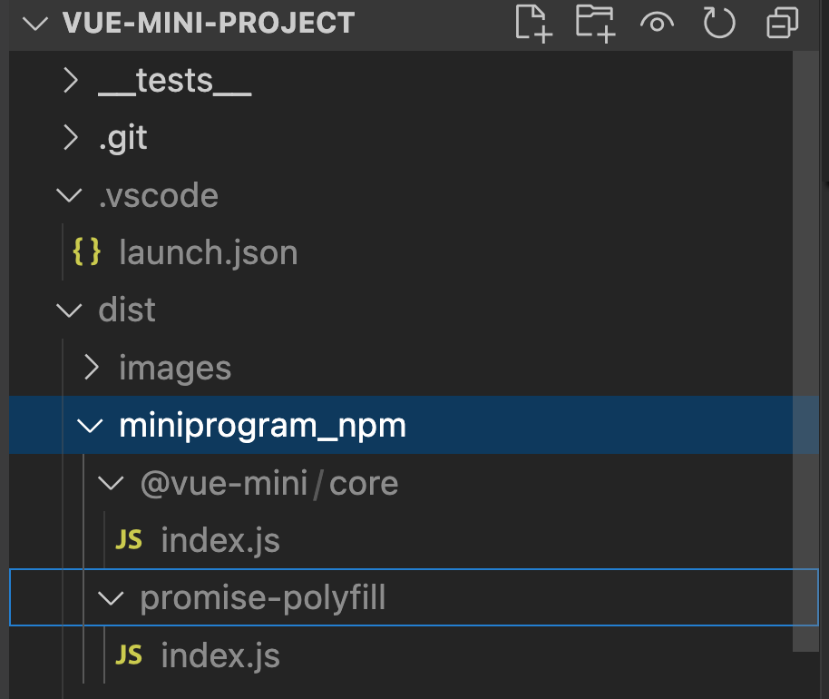

我们继续来看 `html` 文件处理：

### 3.8 processTemplate 处理模板 html

```js
async function processTemplate(filePath) {
  const destination = filePath
    .replace('src', 'dist')
    .replace(/\.html$/, '.wxml');
  await fs.copy(filePath, destination);
}
```

这个函数相对简单，就是复制 `src` `html` 文件修改后缀名为 `.wxml` 文件到 `dist` 目录。

### 3.9 processStyle 处理样式文件

```js
async function processStyle(filePath) {
  // 读取样式文件
  const source = await fs.readFile(filePath, 'utf8');
  // 读取配置 postcss.config.js
  const { plugins, options } = await postcssrc({ from: undefined });

  let css;
  try {
    const result = await postcss(plugins).process(source, options);
    css = result.css;
  } catch (error) {
    console.error(`Failed to compile ${filePath}`);

    // 生产环境打包构建时，抛出错误
    if (__PROD__) throw error;

    console.error(error);
    return;
  }

  const destination = filePath
    .replace('src', 'dist')
    .replace(/\.css$/, '.wxss');
  // Make sure the directory already exists when write file
  await fs.copy(filePath, destination);
  await fs.writeFile(destination, css);
}
```

[postcss-load-config](https://github.com/postcss/postcss-load-config#readme) `Autoload Config for PostCSS` 是自动加载 `postcss.config.js` 等配置文件，并解析其中的插件。
然后调用 `postcss` 解析样式文件，并写入 `dist` 目录。

#### 3.9.1 postcss.config.js postcss 配置文件

```js
// postcss.config.js
import pxtorpx from 'postcss-pxtorpx-pro';

const config = {
  plugins: [pxtorpx({ transform: (x) => x })],
};

export default config;
```

引入 [postcss-pxtorpx-pro](https://github.com/Genuifx/postcss-pxtorpx-pro#readme) 插件，将 `px` 转换为 `rpx`。

处理 `px` 为 `rpx` 如下所示：

```css
// input
h1 {
    margin: 0 0 20px;
    font-size: 32px;
    line-height: 1.2;
    letter-spacing: 1px;
}

// output
h1 {
  margin: 0 0 40rpx;
  font-size: 64rpx;
  line-height: 1.2;
  letter-spacing: 2rpx;
}
```

## 4. 总结

我们学习了初始化项目中的 `build.js` 是如何打包小程序代码的。

学习了使用 `cross-env` 配置环境变量，使用 `chokidar` 监听文件变动。`html` 文件就是原生微信小程序的wxml，直接复制粘贴修改了后缀名到`dist`目录。 使用 `babel` 和 `rollup` 处理 `js` 文件，入口文件 app.config.ts ，还在开头追加了 `promise-ployfill` ，使用 `postcss` 处理样式文件，其他文件是直接复制粘贴到 `dist` 目录的。

也就是说：只是`html`(`wxml`)模板部分还是原生微信小程序写法，`ts`(`js`)逻辑部分使用了`vue-mini`（轻运行时）。

常言道：一图胜千言。我画了一张图表示：

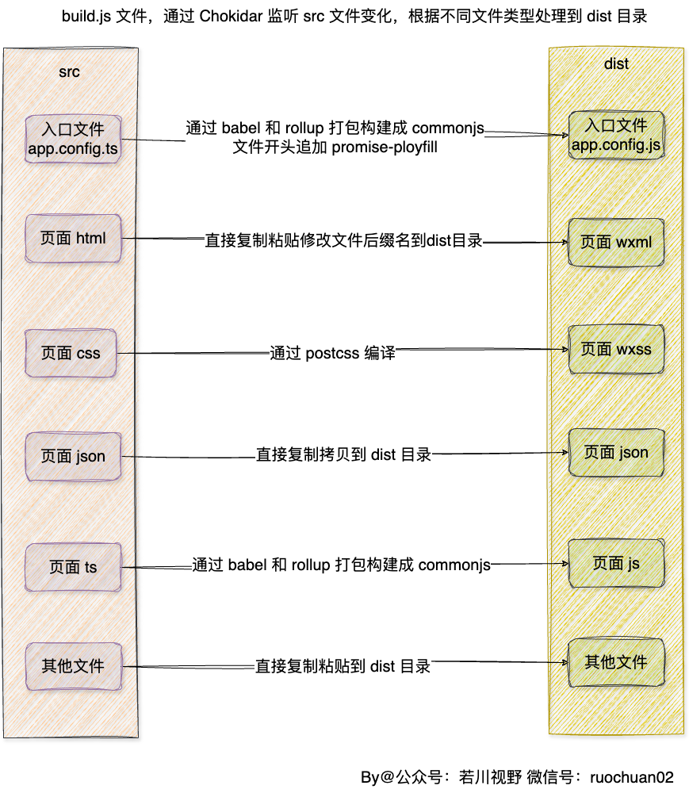

`vue-mini` 比较适合不需要跨端，比如不需要同时支持微信小程序和支付宝小程序。只开发微信小程序是一个新选择，性能基本等于原生微信小程序，逻辑部分开发体验优于原生微信小程序。适合本身就是使用的原生微信小程序开发的，可以渐进式升级替换为 `vue-mini`。

也就是说 `vue-mini` 是渐进式开发微信小程序。和原生开发不是二选一。性能上，`vue-mini` 接近原生，开发体验优于原生开发。

不过目前还处于相对初期阶段，生态还不是很完善，比如暂不支持 `less、sass` 等。

`vue-mini` 作者在最后也有一页接下来的开发方向的PPT。作者目前时间和精力有限，没有支持多端的打算。长期可能有。

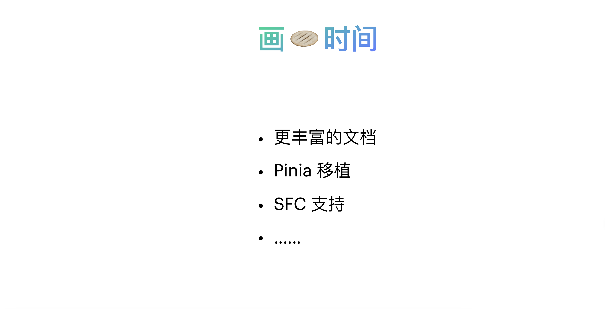

感兴趣的小伙伴可以[点个 star](https://github.com/vue-mini/vue-mini)。我们持续关注后续发展，有余力的小伙伴也可以多参与贡献。

----

**如果看完有收获，欢迎点赞、评论、分享、收藏支持。你的支持和肯定，是我写作的动力**。

作者：常以**若川**为名混迹于江湖。所知甚少，唯善学。[若川的博客](https://ruochuan12.github.io)

最后可以持续关注我[@若川](https://juejin.cn/user/1415826704971918)，欢迎关注我的[公众号：若川视野](https://mp.weixin.qq.com/s/MacNfeTPODNMLLFdzrULow)。我倾力持续组织了 3 年多[每周大家一起学习 200 行左右的源码共读活动](https://juejin.cn/post/7079706017579139102)，感兴趣的可以[点此扫码加我微信 `ruochuan02` 参与](https://juejin.cn/pin/7217386885793595453)。另外，想学源码，极力推荐关注我写的专栏[《学习源码整体架构系列》](https://juejin.cn/column/6960551178908205093)，目前是掘金关注人数（6k+人）第一的专栏，写有几十篇源码文章。
