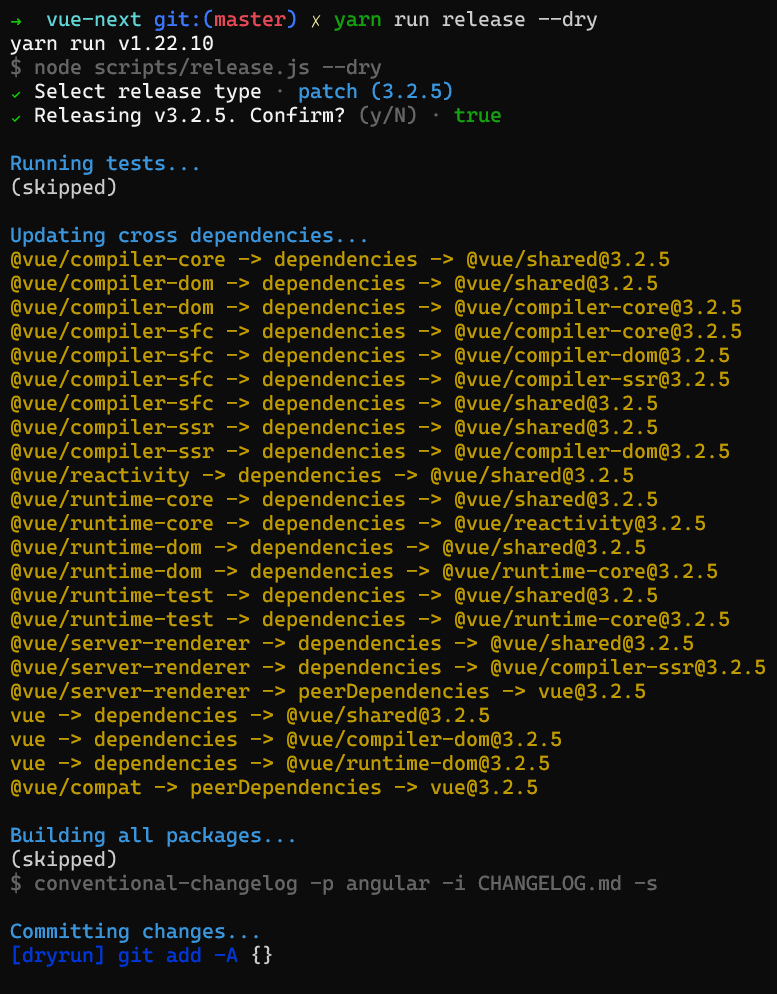

## 1. 前言

大家好，我是[若川](https://lxchuan12.gitee.io)。欢迎关注我的[公众号若川视野](https://mp.weixin.qq.com/s?__biz=MzA5MjQwMzQyNw==&mid=2650756550&idx=1&sn=9acc5e30325963e455f53ec2f64c1fdd&chksm=8866564abf11df5c41307dba3eb84e8e14de900e1b3500aaebe802aff05b0ba2c24e4690516b&token=1266363653&lang=zh_CN#rd)，最近组织了**源码共读**活动[1个月，200+人，一起读了4周源码](https://mp.weixin.qq.com/s?__biz=MzA5MjQwMzQyNw==&mid=2650756550&idx=1&sn=9acc5e30325963e455f53ec2f64c1fdd&chksm=8866564abf11df5c41307dba3eb84e8e14de900e1b3500aaebe802aff05b0ba2c24e4690516b&token=1266363653&lang=zh_CN#rd)，感兴趣的可以加我微信 [ruochuan12](https://mp.weixin.qq.com/s?__biz=MzA5MjQwMzQyNw==&mid=2650756550&idx=1&sn=9acc5e30325963e455f53ec2f64c1fdd&chksm=8866564abf11df5c41307dba3eb84e8e14de900e1b3500aaebe802aff05b0ba2c24e4690516b&token=1266363653&lang=zh_CN#rd)，长期交流学习。

之前写的[《学习源码整体架构系列》](https://mp.weixin.qq.com/mp/appmsgalbum?__biz=MzA5MjQwMzQyNw==&action=getalbum&album_id=1342211915371675650&scene=173&from_msgid=2650756199&from_itemidx=1&count=3&nolastread=1#wechat_redirect) 包含`jQuery`、`underscore`、`lodash`、`vuex`、`sentry`、`axios`、`redux`、`koa`、`vue-devtools`、`vuex4`十篇源码文章。

写相对很难的源码，耗费了自己的时间和精力，也没收获多少阅读点赞，其实是一件挺受打击的事情。从阅读量和读者受益方面来看，不能促进作者持续输出文章。

所以转变思路，写一些相对通俗易懂的文章。**其实源码也不是想象的那么难，至少有很多看得懂**。

最近尤雨溪发布了3.2版本。小版本已经是`3.2.4`了。本文来学习下尤大是怎么发布`vuejs`的，学习源码为自己所用。

本文涉及到的 `vue-next/scripts/release.js`文件，整个文件代码行数虽然只有 `200` 余行，但非常值得我们学习。

歌德曾说：读一本好书，就是在和高尚的人谈话。 同理可得：读源码，也算是和作者的一种学习交流的方式。

阅读本文，你将学到：

```bash
1. 熟悉 vuejs 发布流程
2. 学会调试 nodejs 代码
3. 动手优化公司项目发布流程
```

环境准备之前，我们先预览下`vuejs`的发布流程。


## 2. 环境准备

打开 [vue-next](https://github.com/vuejs/vue-next)，
开源项目一般都能在 `README.md` 或者 [.github/contributing.md](https://github.com/vuejs/vue-next/blob/master/.github/contributing.md) 找到贡献指南。

而贡献指南写了很多关于参与项目开发的信息。比如怎么跑起来，项目目录结构是怎样的。怎么投入开发，需要哪些知识储备等。

你需要确保 [Node.js](http://nodejs.org/) 版本是 `10+`, 而且 `yarn` 的版本是 `1.x` [Yarn 1.x](https://yarnpkg.com/en/docs/install)。

你安装的 `Node.js` 版本很可能是低于 `10`。最简单的办法就是去官网重新安装。也可以使用 `nvm`等管理`Node.js`版本。

```bash
node -v
# v14.16.0
# 全局安装 yarn
# 克隆项目
git clone https://github.com/vuejs/vue-next.git
cd vue-next

# 或者克隆我的项目
git clone https://github.com/lxchuan12/vue-next-analysis.git
cd vue-next-analysis/vue-next

# 安装 yarn
npm install --global yarn
# 安装依赖
yarn # install the dependencies of the project
# yarn release
```

### 2.1 严格校验使用 yarn 安装依赖

接着我们来看下 `vue-next/package.json` 文件。

```json
// vue-next/package.json
{
    "private": true,
    "version": "3.2.4",
    "workspaces": [
        "packages/*"
    ],
    "scripts": {
        // --dry 参数是我加的，如果你是调试 代码也建议加
        // 不执行测试和编译 、不执行 推送git等操作
        // 也就是说空跑，只是打印，后文再详细讲述
        "release": "node scripts/release.js --dry",
        "preinstall": "node ./scripts/checkYarn.js",
    }
}
```

如果你尝试使用 `npm` 安装依赖，应该是会报错的。为啥会报错呢。
因为 `package.json` 有个前置 `preinstall`  `node ./scripts/checkYarn.js` 判断强制要求是使用`yarn`安装。

`scripts/checkYarn.js`文件如下，也就是在`process.env`环境变量中找执行路径`npm_execpath`，如果不是`yarn`就输出警告，且进程结束。

```js
// scripts/checkYarn.js
if (!/yarn\.js$/.test(process.env.npm_execpath || '')) {
  console.warn(
    '\u001b[33mThis repository requires Yarn 1.x for scripts to work properly.\u001b[39m\n'
  )
  process.exit(1)
}
```

如果你想忽略这个前置的钩子判断，可以使用`yarn --ignore-scripts` 命令。也有后置的钩子`post`。[更多详细的可以查看 npm 文档](https://docs.npmjs.com/cli/v6/using-npm/scripts)

### 2.2 调试  vue-next/scripts/release.js 文件

接着我们来学习如何调试 `vue-next/scripts/release.js`文件。

这里声明下我的 `VSCode` 版本 是 `1.59.0` 应该 `1.50.0` 起就可以按以下步骤调试了。

```bash
code -v
# 1.59.0
```

找到 `vue-next/package.json` 文件打开，然后在 `scripts` 上方，会有`debug`（调试）按钮，点击后，选择 `release`。即可进入调试模式。


这时终端会如下图所示，有 `Debugger attached.` 输出。这时放张图。


[更多 nodejs 调试相关  可以查看官方文档](https://code.visualstudio.com/docs/nodejs/nodejs-debugging)

学会调试后，先大致走一遍流程，在关键地方多打上几个断点多走几遍，就能猜测到源码意图了。

## 3 文件开头的一些依赖引入和函数声明

我们可以跟着断点来，先看文件开头的一些依赖引入和函数声明

### 3.1 第一部分

```js
// vue-next/scripts/release.js
const args = require('minimist')(process.argv.slice(2))
// 文件模块
const fs = require('fs')
// 路径
const path = require('path')
// 控制台
const chalk = require('chalk')
const semver = require('semver')
const currentVersion = require('../package.json').version
const { prompt } = require('enquirer')

// 执行子进程命令   简单说 就是在终端命令行执行 命令
const execa = require('execa')
```

通过依赖，我们可以在 `node_modules` 找到对应安装的依赖。也可以找到其`README`和`github`仓库。

#### 3.1.1 minimist  命令行参数解析

[minimist](https://github.com/substack/minimist)

简单说，这个库，就是解析命令行参数的。看例子，我们比较容易看懂传参和解析结果。

```bash
$ node example/parse.js -a beep -b boop
{ _: [], a: 'beep', b: 'boop' }

$ node example/parse.js -x 3 -y 4 -n5 -abc --beep=boop foo bar baz
{ _: [ 'foo', 'bar', 'baz' ],
  x: 3,
  y: 4,
  n: 5,
  a: true,
  b: true,
  c: true,
  beep: 'boop' }
```

```js
const args = require('minimist')(process.argv.slice(2))
```

其中`process.argv`的第一和第二个元素是`Node`可执行文件和被执行JavaScript文件的完全限定的文件系统路径，无论你是否这样输入他们。

#### 3.1.2 chalk 终端多色彩输出

[chalk](https://github.com/chalk/chalk)

简单说，这个是用于终端显示多色彩输出。

#### 3.1.3 semver  语义化版本

[semver](https://github.com/npm/node-semver)

语义化版本的nodejs实现，用于版本校验比较等。关于语义化版本可以看这个[语义化版本 2.0.0 文档](https://semver.org/lang/zh-CN/)

>版本格式：主版本号.次版本号.修订号，版本号递增规则如下：<br>
>主版本号：当你做了不兼容的 API 修改，<br>
>次版本号：当你做了向下兼容的功能性新增，<br>
>修订号：当你做了向下兼容的问题修正。<br>
>先行版本号及版本编译信息可以加到“主版本号.次版本号.修订号”的后面，作为延伸。<br>

#### 3.1.4 enquirer 交互式询问 CLI

简单说就是交互式询问用户输入。

[enquirer](https://github.com/enquirer/enquirer)

#### 3.1.5 execa 执行命令

简单说就是执行命令的，类似我们自己在终端输入命令，比如 `echo 若川`。

[execa](https://github.com/sindresorhus/execa)

```js
// 例子
const execa = require('execa');

(async () => {
  const {stdout} = await execa('echo', ['unicorns']);
  console.log(stdout);
  //=> 'unicorns'
})();
```

看完了第一部分，接着我们来看第二部分。

### 3.2 第二部分

```js
// vue-next/scripts/release.js

// 对应 yarn run release --preid=beta
// beta
const preId =
  args.preid ||
  (semver.prerelease(currentVersion) && semver.prerelease(currentVersion)[0])
// 对应 yarn run release --dry
// true
const isDryRun = args.dry
// 对应 yarn run release --skipTests
// true 跳过测试
const skipTests = args.skipTests
// 对应 yarn run release --skipBuild 
// true
const skipBuild = args.skipBuild

// 读取 packages 文件夹，过滤掉 不是 .ts文件 结尾 并且不是 . 开头的文件夹
const packages = fs
  .readdirSync(path.resolve(__dirname, '../packages'))
  .filter(p => !p.endsWith('.ts') && !p.startsWith('.'))
```

第二部分相对简单，继续看第三部分。

### 3.3 第三部分

```js
// vue-next/scripts/release.js

// 跳过的包
const skippedPackages = []

// 版本递增
const versionIncrements = [
  'patch',
  'minor',
  'major',
  ...(preId ? ['prepatch', 'preminor', 'premajor', 'prerelease'] : [])
]

const inc = i => semver.inc(currentVersion, i, preId)
```

这一块可能不是很好理解。`inc`是生成一个版本。更多可以查看[semver文档](https://github.com/npm/node-semver#prerelease-identifiers)

```js
semver.inc('3.2.4', 'prerelease', 'beta')
// 3.2.5-beta.0
```

### 3.4 第四部分

第四部分声明了一些执行脚本函数等

```js
// vue-next/scripts/release.js

// 获取 bin 命令
const bin = name => path.resolve(__dirname, '../node_modules/.bin/' + name)
const run = (bin, args, opts = {}) =>
  execa(bin, args, { stdio: 'inherit', ...opts })
const dryRun = (bin, args, opts = {}) =>
  console.log(chalk.blue(`[dryrun] ${bin} ${args.join(' ')}`), opts)
const runIfNotDry = isDryRun ? dryRun : run

// 获取包的路径
const getPkgRoot = pkg => path.resolve(__dirname, '../packages/' + pkg)

// 控制台输出
const step = msg => console.log(chalk.cyan(msg))
```

#### 3.4.1 bin 函数

获取 `node_modules/.bin/` 目录下的命令，整个文件就用了一次。

```js
bin('jest')
```

相当于在命令终端，项目根目录 运行 `./node_modules/.bin/jest` 命令。

#### 3.4.2 run、dryRun、runIfNotDry

```js
const run = (bin, args, opts = {}) =>
  execa(bin, args, { stdio: 'inherit', ...opts })
const dryRun = (bin, args, opts = {}) =>
  console.log(chalk.blue(`[dryrun] ${bin} ${args.join(' ')}`), opts)
const runIfNotDry = isDryRun ? dryRun : run
```

`run` 真实在终端跑命令，比如 `yarn build --release`

`dryRun` 则是不跑，只是 `console.log();` 打印 'yarn build --release'

`runIfNotDry` 如果不是空跑就执行命令。isDryRun 参数是通过控制台输入的。`yarn run release --dry`这样就是`true`。`runIfNotDry`就是只是打印，不执行命令。这样设计的好处在于，可以有时不想直接提交，要先看看执行命令的结果。不得不说，尤大就是会玩。

在 `main` 函数末尾，也可以看到类似的提示。可以用`git diff`先看看文件修改。

```js
if (isDryRun) {
  console.log(`\nDry run finished - run git diff to see package changes.`)
}
```

看完了文件开头的一些依赖引入和函数声明等，我们接着来看`main`主入口函数。

## 4 main 主流程

第4节，主要都是`main` 函数拆解分析。

### 4.1 流程梳理 main 函数

```js
const chalk = require('chalk')
const step = msg => console.log(chalk.cyan(msg))
// 前面一堆依赖引入和函数定义等
async function main(){
  // 版本校验

  // run tests before release
  step('\nRunning tests...')
  // update all package versions and inter-dependencies
  step('\nUpdating cross dependencies...')
  // build all packages with types
  step('\nBuilding all packages...')

  // generate changelog
  step('\nCommitting changes...')

  // publish packages
  step('\nPublishing packages...')

  // push to GitHub
  step('\nPushing to GitHub...')
}

main().catch(err => {
  console.error(err)
})
```

上面的`main`函数省略了很多具体函数实现。接下来我们拆解 `main` 函数。

### 4.2 确认要发布的版本

第一段代码虽然比较长，但是还好理解。
主要就是确认要发布的版本。

调试时，我们看下这段的两张截图，就好理解啦。


```js
// 根据上文 mini 这句代码意思是 yarn run release 3.2.4 
// 取到参数 3.2.4
let targetVersion = args._[0]

if (!targetVersion) {
  // no explicit version, offer suggestions
  const { release } = await prompt({
    type: 'select',
    name: 'release',
    message: 'Select release type',
    choices: versionIncrements.map(i => `${i} (${inc(i)})`).concat(['custom'])
  })

// 选自定义
  if (release === 'custom') {
    targetVersion = (
      await prompt({
        type: 'input',
        name: 'version',
        message: 'Input custom version',
        initial: currentVersion
      })
    ).version
  } else {
    // 取到括号里的版本号
    targetVersion = release.match(/\((.*)\)/)[1]
  }
}

// 校验 版本是否符合 规范
if (!semver.valid(targetVersion)) {
  throw new Error(`invalid target version: ${targetVersion}`)
}

// 确认要 release
const { yes } = await prompt({
  type: 'confirm',
  name: 'yes',
  message: `Releasing v${targetVersion}. Confirm?`
})

// false 直接返回
if (!yes) {
  return
}
```

### 4.3 执行测试用例

```js
// run tests before release
step('\nRunning tests...')
if (!skipTests && !isDryRun) {
  await run(bin('jest'), ['--clearCache'])
  await run('yarn', ['test', '--bail'])
} else {
  console.log(`(skipped)`)
}
```

### 4.4 更新所有包的版本号和内部 vue 相关依赖版本号

这一部分，就是更新根目录下`package.json` 的版本号和所有 `packages` 的版本号。

```js
// update all package versions and inter-dependencies
step('\nUpdating cross dependencies...')
updateVersions(targetVersion)
```

```js
function updateVersions(version) {
  // 1. update root package.json
  updatePackage(path.resolve(__dirname, '..'), version)
  // 2. update all packages
  packages.forEach(p => updatePackage(getPkgRoot(p), version))
}
```

#### 4.4.1 updatePackage 更新包的版本号

```js
function updatePackage(pkgRoot, version) {
  const pkgPath = path.resolve(pkgRoot, 'package.json')
  const pkg = JSON.parse(fs.readFileSync(pkgPath, 'utf-8'))
  pkg.version = version
  updateDeps(pkg, 'dependencies', version)
  updateDeps(pkg, 'peerDependencies', version)
  fs.writeFileSync(pkgPath, JSON.stringify(pkg, null, 2) + '\n')
}
```

主要就是三种修改。

```bash
1. 自己本身 package.json 的版本号
2. packages.json 中 dependencies 中 vue 相关的依赖修改
3. packages.json 中 peerDependencies 中 vue 相关的依赖修改
```

一图胜千言。我们执行`yarn release --dry` 后 `git diff` 查看的 `git` 修改，部分截图如下。


#### 4.4.2 updateDeps 更新内部 vue 相关依赖的版本号

```js
function updateDeps(pkg, depType, version) {
  const deps = pkg[depType]
  if (!deps) return
  Object.keys(deps).forEach(dep => {
    if (
      dep === 'vue' ||
      (dep.startsWith('@vue') && packages.includes(dep.replace(/^@vue\//, '')))
    ) {
      console.log(
        chalk.yellow(`${pkg.name} -> ${depType} -> ${dep}@${version}`)
      )
      deps[dep] = version
    }
  })
}
```

一图胜千言。我们在终端执行`yarn release --dry`。会看到这样是输出。



也就是这句代码输出的。

```js
console.log(
  chalk.yellow(`${pkg.name} -> ${depType} -> ${dep}@${version}`)
)
```

### 4.5 打包编译所有包

```js
// build all packages with types
step('\nBuilding all packages...')
if (!skipBuild && !isDryRun) {
  await run('yarn', ['build', '--release'])
  // test generated dts files
  step('\nVerifying type declarations...')
  await run('yarn', ['test-dts-only'])
} else {
  console.log(`(skipped)`)
}
```

### 4.6 生成 changelog

```js
// generate changelog
await run(`yarn`, ['changelog'])
```

`yarn changelog` 对应的脚本是`conventional-changelog -p angular -i CHANGELOG.md -s`。

### 4.7 提交代码

经过更新版本号后，有文件改动，于是`git diff`。
是否有文件改动，如果有提交。

`git add -A`
`git  commit -m 'release: v${targetVersion}'`

```js
const { stdout } = await run('git', ['diff'], { stdio: 'pipe' })
if (stdout) {
  step('\nCommitting changes...')
  await runIfNotDry('git', ['add', '-A'])
  await runIfNotDry('git', ['commit', '-m', `release: v${targetVersion}`])
} else {
  console.log('No changes to commit.')
}
```

### 4.8 发布包

```js
// publish packages
step('\nPublishing packages...')
for (const pkg of packages) {
  await publishPackage(pkg, targetVersion, runIfNotDry)
}
```

这段函数比较长，可以不用细看，简单说就是 `yarn publish` 发布包。
我们 `yarn release --dry`后，这块函数在终端输出的如下：


值得一提的是，如果是 `vue` 默认有个 `tag` 为 `next`。当 `Vue 3.x` 是默认时删除。

```js
} else if (pkgName === 'vue') {
  // TODO remove when 3.x becomes default
  releaseTag = 'next'
}
```

也就是为什么我们现在安装 `vue3` 还是 `npm i vue@next`命令。

```js
async function publishPackage(pkgName, version, runIfNotDry) {
  // 如果在 跳过包里 则跳过
  if (skippedPackages.includes(pkgName)) {
    return
  }
  const pkgRoot = getPkgRoot(pkgName)
  const pkgPath = path.resolve(pkgRoot, 'package.json')
  const pkg = JSON.parse(fs.readFileSync(pkgPath, 'utf-8'))
  if (pkg.private) {
    return
  }

  // For now, all 3.x packages except "vue" can be published as
  // `latest`, whereas "vue" will be published under the "next" tag.
  let releaseTag = null
  if (args.tag) {
    releaseTag = args.tag
  } else if (version.includes('alpha')) {
    releaseTag = 'alpha'
  } else if (version.includes('beta')) {
    releaseTag = 'beta'
  } else if (version.includes('rc')) {
    releaseTag = 'rc'
  } else if (pkgName === 'vue') {
    // TODO remove when 3.x becomes default
    releaseTag = 'next'
  }

  // TODO use inferred release channel after official 3.0 release
  // const releaseTag = semver.prerelease(version)[0] || null

  step(`Publishing ${pkgName}...`)
  try {
    await runIfNotDry(
      'yarn',
      [
        'publish',
        '--new-version',
        version,
        ...(releaseTag ? ['--tag', releaseTag] : []),
        '--access',
        'public'
      ],
      {
        cwd: pkgRoot,
        stdio: 'pipe'
      }
    )
    console.log(chalk.green(`Successfully published ${pkgName}@${version}`))
  } catch (e) {
    if (e.stderr.match(/previously published/)) {
      console.log(chalk.red(`Skipping already published: ${pkgName}`))
    } else {
      throw e
    }
  }
}
```

### 4.9 推送到 github

```js
// push to GitHub
step('\nPushing to GitHub...')
// 打 tag
await runIfNotDry('git', ['tag', `v${targetVersion}`])
// 推送 tag
await runIfNotDry('git', ['push', 'origin', `refs/tags/v${targetVersion}`])
// git push 所有改动到 远程  - github
await runIfNotDry('git', ['push'])
```

```js
// yarn run release --dry

// 如果传了这个参数则输出 可以用 git diff 看看更改

// const isDryRun = args.dry
if (isDryRun) {
  console.log(`\nDry run finished - run git diff to see package changes.`)
}

// 如果 跳过的包，则输出以下这些包没有发布。不过代码 `skippedPackages` 里是没有包。
// 所以这段代码也不会执行。
// 我们习惯写 arr.length !== 0 其实 0 就是 false 。可以不写。
if (skippedPackages.length) {
  console.log(
    chalk.yellow(
      `The following packages are skipped and NOT published:\n- ${skippedPackages.join(
        '\n- '
      )}`
    )
  )
}
console.log()
```

我们 `yarn release --dry`后，这块函数在终端输出的如下：


到这里我们就拆解分析完 `main` 函数了。

整个流程很清晰。

```bash
1. 确认要发布的版本
2. 执行测试用例
3. 更新所有包的版本号和内部 vue 相关依赖版本号
    3.1 updatePackage 更新包的版本号
    3.2 updateDeps 更新内部 vue 相关依赖的版本号
4. 打包编译所有包
5. 生成 changelog
6. 提交代码
7. 发布包
8. 推送到 github
```

用一张图总结则是：


看完`vue-next/scripts/release.js`，感兴趣还可以看`vue-next/scripts`文件夹下其他代码，相对行数不多，但收益较大。

## 5. 总结

通过本文学习，我们学会了这些。

```bash
1. 熟悉 vuejs 发布流程
2. 学会调试 nodejs 代码
3. 动手优化公司项目发布流程
```

同时建议自己动手用 `VSCode` 多调试，在终端多执行几次，多理解消化。

`vuejs`发布的文件很多代码我们可以直接复制粘贴修改，优化我们自己发布的流程。比如写小程序，相对可能发布频繁，完全可以使用这套代码，配合[miniprogram-ci](https://developers.weixin.qq.com/miniprogram/dev/devtools/ci.html)，再加上一些自定义，加以优化。

当然也可以用开源的 [release-it](https://github.com/release-it/release-it)。

同时，我们可以：

引入 [git flow](https://www.atlassian.com/git/tutorials/comparing-workflows/gitflow-workflow)，管理`git`分支。估计很多人不知道`windows` `git bash`已经默认支持 `git flow`命令。

引入 [husky](https://github.com/typicode/husky) 和 [lint-staged](https://github.com/okonet/lint-staged) 提交`commit`时用`ESLint`等校验代码提交是否能够通过检测。

引入 单元测试 [jest](https://github.com/facebook/jest)，测试关键的工具函数等。

引入 [conventional-changelog](https://github.com/conventional-changelog/conventional-changelog)

引入 [git-cz](https://github.com/streamich/git-cz) 交互式`git commit`。

等等规范自己项目的流程。如果一个候选人，通过看`vuejs`发布的源码，积极主动优化自己项目。我觉得面试官会认为这个候选人比较加分。

看开源项目源码的好处在于：一方面可以拓展视野，另外一方面可以为自己所用，收益相对较高。
