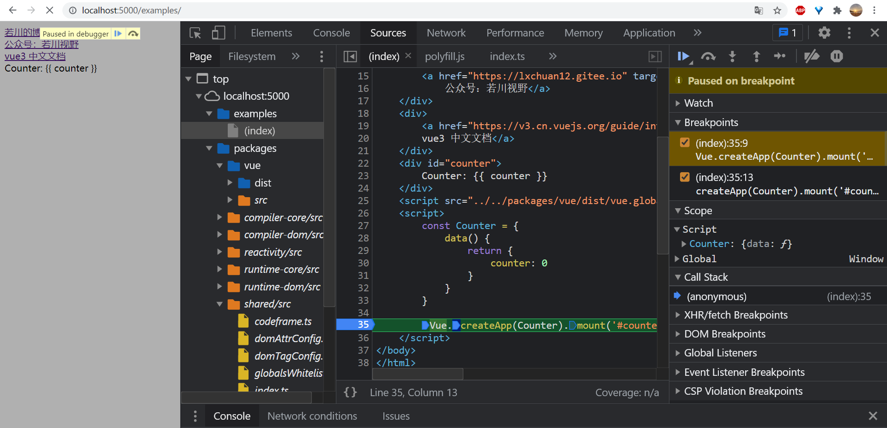

# 初学者也能看懂的 Vue3 源码中那些实用的基础工具函数

## 1. 前言

大家好，我是[若川](https://lxchuan12.gitee.io)。欢迎关注我的[公众号若川视野](https://p1-jj.byteimg.com/tos-cn-i-t2oaga2asx/gold-user-assets/2019/12/13/16efe57ddc7c9eb3~tplv-t2oaga2asx-image.image "https://p1-jj.byteimg.com/tos-cn-i-t2oaga2asx/gold-user-assets/2019/12/13/16efe57ddc7c9eb3~tplv-t2oaga2asx-image.image")，最近组织了[**源码共读活动**《1个月，200+人，一起读了4周源码》](https://mp.weixin.qq.com/s?__biz=MzA5MjQwMzQyNw==&mid=2650756550&idx=1&sn=9acc5e30325963e455f53ec2f64c1fdd&chksm=8866564abf11df5c41307dba3eb84e8e14de900e1b3500aaebe802aff05b0ba2c24e4690516b&token=917686367&lang=zh_CN#rd)，感兴趣的可以加我微信 [ruochuan12](https://mp.weixin.qq.com/s?__biz=MzA5MjQwMzQyNw==&mid=2650756550&idx=1&sn=9acc5e30325963e455f53ec2f64c1fdd&chksm=8866564abf11df5c41307dba3eb84e8e14de900e1b3500aaebe802aff05b0ba2c24e4690516b&token=917686367&lang=zh_CN#rd) 加微信群参与，长期交流学习。

之前写的[《学习源码整体架构系列》](https://juejin.cn/column/6960551178908205093) 包含`jQuery`、`underscore`、`lodash`、`vuex`、`sentry`、`axios`、`redux`、`koa`、`vue-devtools`、`vuex4`十篇源码文章。

写相对很难的源码，耗费了自己的时间和精力，也没收获多少阅读点赞，其实是一件挺受打击的事情。从阅读量和读者受益方面来看，不能促进作者持续输出文章。

所以转变思路，写一些相对通俗易懂的文章。**其实源码也不是想象的那么难，至少有很多看得懂。比如工具函数**。本文通过学习`Vue3`源码中的工具函数模块的源码，学习源码为自己所用。歌德曾说：读一本好书，就是在和高尚的人谈话。
同理可得：读源码，也算是和作者的一种学习交流的方式。

阅读本文，你将学到：

```js
1. 如何学习 JavaScript 基础知识，会推荐很多学习资料
2. 如何学习调试 vue 3 源码
3. 如何学习源码中优秀代码和思想，投入到自己的项目中
4. Vue 3 源码 shared 模块中的几十个实用工具函数
5. 我的一些经验分享
```

`shared`模块中`57个`工具函数，本次阅读其中的`30余个`。
## 2. 环境准备

### 2.1 读开源项目 贡献指南

打开 [vue-next](https://github.com/vuejs/vue-next)，
开源项目一般都能在 `README.md` 或者 [.github/contributing.md](https://github.com/vuejs/vue-next/blob/master/.github/contributing.md) 找到贡献指南。

而贡献指南写了很多关于参与项目开发的信息。比如怎么跑起来，项目目录结构是怎样的。怎么投入开发，需要哪些知识储备等。

我们可以在 [项目目录结构](https://github.com/vuejs/vue-next/blob/master/.github/contributing.md#project-structure) 描述中，找到`shared`模块。

`shared`: Internal utilities shared across multiple packages (especially environment-agnostic utils used by both runtime and compiler packages).

`README.md` 和 `contributing.md` 一般都是英文的。可能会难倒一部分人。其实看不懂，完全可以可以借助划词翻译，整页翻译和百度翻译等翻译工具。再把英文加入后续学习计划。

本文就是讲`shared`模块，对应的文件路径是：[`vue-next/packages/shared/src/index.ts`](https://github.com/vuejs/vue-next/blob/master/packages/shared/src/index.ts)

也可以用`github1s`访问，速度更快。[github1s packages/shared/src/index.ts](https://github1s.com/vuejs/vue-next/blob/master/packages/shared/src/index.ts)

### 2.2 按照项目指南 打包构建代码

为了降低文章难度，我按照贡献指南中方法打包把`ts`转成了`js`。如果你需要打包，也可以参考下文打包构建。

你需要确保 [Node.js](http://nodejs.org/) 版本是 `10+`, 而且 `yarn` 的版本是 `1.x` [Yarn 1.x](https://yarnpkg.com/en/docs/install)。

你安装的 `Node.js` 版本很可能是低于 `10`。最简单的办法就是去官网重新安装。也可以使用 `nvm`等管理`Node.js`版本。

```bash
node -v
# v14.16.0
# 全局安装 yarn

# 推荐克隆我的项目
git clone https://github.com/lxchuan12/vue-next-analysis.git
cd vue-next-analysis/vue-next

# 或者克隆官方项目
git clone https://github.com/vuejs/vue-next.git
cd vue-next

npm install --global yarn
yarn # install the dependencies of the project
yarn build
```

可以得到 `vue-next/packages/shared/dist/shared.esm-bundler.js`，文件也就是纯`js`文件。接下来就是解释其中的一些方法。

>当然，前面可能比较啰嗦。我可以直接讲 `3. 工具函数`。但通过我上文的介绍，即使是初学者，都能看懂一些开源项目源码，也许就会有一定的成就感。
>另外，面试问到被类似的问题或者笔试题时，你说看`Vue3`源码学到的，面试官绝对对你刮目相看。

### 2.3 如何生成 sourcemap 调试 vue-next 源码

熟悉我的读者知道，我是经常强调生成`sourcemap`调试看源码，所以顺便提一下如何配置生成`sourcemap`，如何调试。这部分可以简单略过，动手操作时再仔细看。

其实[贡献指南](https://github.com/vuejs/vue-next/blob/master/.github/contributing.md)里描述了。
>Build with Source Maps
>Use the `--sourcemap` or `-s` flag to build with source maps. Note this will make the build much slower.

所以在 `vue-next/package.json` 追加 `"dev:sourcemap": "node scripts/dev.js --sourcemap"`，`yarn dev:sourcemap`执行，即可生成`sourcemap`，或者直接 `build`。

```json
// package.json
{
    "version": "3.2.1",
    "scripts": {
        "dev:sourcemap": "node scripts/dev.js --sourcemap"
    }
}
```

会在控制台输出类似`vue-next/packages/vue/src/index.ts → packages/vue/dist/vue.global.js`的信息。

其中`packages/vue/dist/vue.global.js.map` 就是`sourcemap`文件了。

我们在 Vue3官网找个例子，在 `vue-next/examples/index.html`。其内容引入`packages/vue/dist/vue.global.js`。

```js
// vue-next/examples/index.html
<script src="../../packages/vue/dist/vue.global.js"></script>
<script>
    const Counter = {
        data() {
            return {
                counter: 0
            }
        }
    }

    Vue.createApp(Counter).mount('#counter')
</script>
```

然后我们新建一个终端窗口，`yarn serve`，在浏览器中打开`http://localhost:5000/examples/`，如下图所示，按`F11`等进入函数，就可以愉快的调试源码了。



## 3. 工具函数

本文主要按照源码 [`vue-next/packages/shared/src/index.ts`](https://github.com/vuejs/vue-next/blob/master/packages/shared/src/index.ts) 的顺序来写。也省去了一些从外部导入的方法。

我们也可以通过`ts`文件，查看使用函数的位置。同时在`VSCode`运行调试JS代码，我们比较推荐韩老师写的`code runner`插件。

### 3.1 babelParserDefaultPlugins  babel 解析默认插件

```js
/**
 * List of @babel/parser plugins that are used for template expression
 * transforms and SFC script transforms. By default we enable proposals slated
 * for ES2020. This will need to be updated as the spec moves forward.
 * Full list at https://babeljs.io/docs/en/next/babel-parser#plugins
 */
const babelParserDefaultPlugins = [
    'bigInt',
    'optionalChaining',
    'nullishCoalescingOperator'
];
```

这里就是几个默认插件。感兴趣看英文注释查看。

### 3.2 EMPTY_OBJ 空对象

```js
const EMPTY_OBJ = (process.env.NODE_ENV !== 'production')
    ? Object.freeze({})
    : {};

// 例子：
// Object.freeze 是 冻结对象
// 冻结的对象最外层无法修改。
const EMPTY_OBJ_1 = Object.freeze({});
EMPTY_OBJ_1.name = '若川';
console.log(EMPTY_OBJ_1.name); // undefined

const EMPTY_OBJ_2 = Object.freeze({ props: { mp: '若川视野' } });
EMPTY_OBJ_2.props.name = '若川';
EMPTY_OBJ_2.props2 = 'props2';
console.log(EMPTY_OBJ_2.props.name); // '若川'
console.log(EMPTY_OBJ_2.props2); // undefined
console.log(EMPTY_OBJ_2);
/**
 * 
 * { 
 *  props: {
     mp: "若川视野",
     name: "若川"
    }
 * }
 * */
```

`process.env.NODE_ENV` 是 `node` 项目中的一个环境变量，一般定义为：`development` 和`production`。根据环境写代码。比如开发环境，有报错等信息，生产环境则不需要这些报错警告。

### 3.3 EMPTY_ARR 空数组

```js
const EMPTY_ARR = (process.env.NODE_ENV !== 'production') ? Object.freeze([]) : [];

// 例子：
EMPTY_ARR.push(1) // 报错，也就是为啥生产环境还是用 []
EMPTY_ARR.length = 3;
console.log(EMPTY_ARR.length); // 0
```

### 3.4 NOOP 空函数

```js
const NOOP = () => { };

// 很多库的源码中都有这样的定义函数，比如 jQuery、underscore、lodash 等
// 使用场景：1. 方便判断， 2. 方便压缩
// 1. 比如：
const instance = {
    render: NOOP
};

// 条件
const dev = true;
if(dev){
    instance.render = function(){
        console.log('render');
    }
}

// 可以用作判断。
if(instance.render === NOOP){
 console.log('i');
}
// 2. 再比如：
// 方便压缩代码
// 如果是 function(){} ，不方便压缩代码
```

### 3.5 NO 永远返回 false 的函数

```js
/**
 * Always return false.
 */
const NO = () => false;

// 除了压缩代码的好处外。
// 一直返回 false
```

### 3.6 isOn 判断字符串是不是 on 开头，并且 on 后首字母不是小写字母

```js
const onRE = /^on[^a-z]/;
const isOn = (key) => onRE.test(key);

// 例子：
isOn('onChange'); // true
isOn('onchange'); // false
isOn('on3change'); // true
```

`onRE` 是正则。`^`符号在开头，则表示是什么开头。而在其他地方是指非。

与之相反的是：`$`符合在结尾，则表示是以什么结尾。

`[^a-z]`是指不是`a`到`z`的小写字母。

同时推荐一个正则在线工具。

[regex101](https://regex101.com)

另外正则看老姚的迷你书就够用了。

[老姚：《JavaScript 正则表达式迷你书》问世了！](https://juejin.cn/post/6844903501034684430)

### 3.7 isModelListener 监听器

判断字符串是不是以`onUpdate:`开头

```js
const isModelListener = (key) => key.startsWith('onUpdate:');

// 例子：
isModelListener('onUpdate:change'); // true
isModelListener('1onUpdate:change'); // false
// startsWith 是 ES6 提供的方法
```

[ES6入门教程：字符串的新增方法](https://es6.ruanyifeng.com/#docs/string-methods)

很多方法都在《ES6入门教程》中有讲到，就不赘述了。

### 3.8 extend 继承 合并

说合并可能更准确些。

```js
const extend = Object.assign;

// 例子：
const data = { name: '若川' };
const data2 = extend(data, { mp: '若川视野', name: '是若川啊' });
console.log(data); // { name: "是若川啊", mp: "若川视野" }
console.log(data2); // { name: "是若川啊", mp: "若川视野" }
console.log(data === data2); // true
```

### 3.9 remove 移除数组的一项

```js
const remove = (arr, el) => {
    const i = arr.indexOf(el);
    if (i > -1) {
        arr.splice(i, 1);
    }
};

// 例子：
const arr = [1, 2, 3];
remove(arr, 3);
console.log(arr); // [1, 2]
```

`splice` 其实是一个很耗性能的方法。删除数组中的一项，其他元素都要移动位置。

**引申**：[`axios InterceptorManager` 拦截器源码](https://github.com/axios/axios/blob/master/lib/core/InterceptorManager.js) 中，拦截器用数组存储的。但实际移除拦截器时，只是把拦截器置为 `null` 。而不是用`splice`移除。最后执行时为 `null` 的不执行，同样效果。`axios` 拦截器这个场景下，不得不说为性能做到了很好的考虑。

看如下 `axios` 拦截器代码示例：

```js
// 代码有删减
// 声明
this.handlers = [];

// 移除
if (this.handlers[id]) {
    this.handlers[id] = null;
}

// 执行
if (h !== null) {
    fn(h);
}
```

### 3.10 hasOwn 是不是自己本身所拥有的属性

```js
const hasOwnProperty = Object.prototype.hasOwnProperty;
const hasOwn = (val, key) => hasOwnProperty.call(val, key);

// 例子：

// 特别提醒：__proto__ 是浏览器实现的原型写法，后面还会用到
// 现在已经有提供好几个原型相关的API
// Object.getPrototypeOf
// Object.setPrototypeOf
// Object.isPrototypeOf

// .call 则是函数里 this 显示指定以为第一个参数，并执行函数。

hasOwn({__proto__: { a: 1 }}, 'a') // false
hasOwn({ a: undefined }, 'a') // true
hasOwn({}, 'a') // false
hasOwn({}, 'hasOwnProperty') // false
hasOwn({}, 'toString') // false
// 是自己的本身拥有的属性，不是通过原型链向上查找的。
```

对象API可以看我之前写的一篇文章[JavaScript 对象所有API解析](https://mp.weixin.qq.com/s/Y3nL3GPcxiqb3zK6pEuycg)，写的还算全面。

### 3.11 isArray 判断数组

```js
const isArray = Array.isArray;

isArray([]); // true
const fakeArr = { __proto__: Array.prototype, length: 0 };
isArray(fakeArr); // false
fakeArr instanceof Array; // true
// 所以 instanceof 这种情况 不准确
```

### 3.12 isMap 判断是不是 Map 对象

```js
const isMap = (val) => toTypeString(val) === '[object Map]';

// 例子：
const map = new Map();
const o = { p: 'Hello World' };

map.set(o, 'content');
map.get(o); // 'content'
isMap(map); // true
```

>ES6 提供了 Map 数据结构。它类似于对象，也是键值对的集合，但是“键”的范围不限于字符串，各种类型的值（包括对象）都可以当作键。也就是说，Object 结构提供了“字符串—值”的对应，Map 结构提供了“值—值”的对应，是一种更完善的 Hash 结构实现。如果你需要“键值对”的数据结构，Map 比 Object 更合适。

### 3.13 isSet 判断是不是 Set 对象

```js
const isSet = (val) => toTypeString(val) === '[object Set]';

// 例子：
const set = new Set();
isSet(set); // true
```

>`ES6` 提供了新的数据结构 `Set`。它类似于数组，但是成员的值都是唯一的，没有重复的值。

`Set`本身是一个构造函数，用来生成 `Set` 数据结构。

### 3.14 isDate 判断是不是 Date 对象

```js
const isDate = (val) => val instanceof Date;

// 例子：
isDate(new Date()); // true

// `instanceof` 操作符左边是右边的实例。但不是很准，但一般够用了。原理是根据原型链向上查找的。

isDate({__proto__: new Date()}); // true
// 实际上是应该是 Object 才对。
// 所以用 instanceof 判断数组也不准确。
// 再比如
({__proto__: [] }) instanceof Array; // true
// 实际上是对象。
// 所以用 数组本身提供的方法 Array.isArray 是比较准确的。
```

### 3.15 isFunction 判断是不是函数

```js
const isFunction = (val) => typeof val === 'function';
// 判断函数有多种方法，但这个是比较常用也相对兼容性好的。
```

### 3.16 isString 判断是不是字符串

```js
const isString = (val) => typeof val === 'string';

// 例子：
isString('') // true
```

### 3.17 isSymbol 判断是不是 Symbol

```js
const isSymbol = (val) => typeof val === 'symbol';

// 例子：
let s = Symbol();

typeof s;
// "symbol"
// Symbol 是函数，不需要用 new 调用。
```

>`ES6` 引入了一种新的原始数据类型`Symbol`，表示独一无二的值。

### 3.18 isObject 判断是不是对象

```js
const isObject = (val) => val !== null && typeof val === 'object';

// 例子：
isObject(null); // false
isObject({name: '若川'}); // true
// 判断不为 null 的原因是 typeof null 其实 是 object
```

### 3.19 isPromise 判断是不是 Promise

```js
const isPromise = (val) => {
    return isObject(val) && isFunction(val.then) && isFunction(val.catch);
};

// 判断是不是Promise对象
const p1 = new Promise(function(resolve, reject){
  resolve('若川');
});
isPromise(p1); // true

// promise 对于初学者来说可能比较难理解。但是重点内容，JS异步编程，要着重掌握。
// 现在 web 开发 Promise 和 async await 等非常常用。
```

可以根据文末推荐的书籍看`Promise`相关章节掌握。同时也推荐这本迷你书[JavaScript Promise迷你书（中文版）](http://liubin.org/promises-book/)

### 3.20 objectToString 对象转字符串

```js
const objectToString = Object.prototype.toString;

// 对象转字符串
```

### 3.21 toTypeString  对象转字符串

```js
const toTypeString = (value) => objectToString.call(value);

// call 是一个函数，第一个参数是 执行函数里面 this 指向。
// 通过这个能获得 类似  "[object String]" 其中 String 是根据类型变化的
```

### 3.22 toRawType  对象转字符串 截取后几位

```js
const toRawType = (value) => {
    // extract "RawType" from strings like "[object RawType]"
    return toTypeString(value).slice(8, -1);
};

// 截取到
toRawType('');  'String'
```

可以 截取到 `String` `Array` 等这些类型

是 `JS` 判断数据类型非常重要的知识点。

`JS` 判断类型也有  typeof ，但不是很准确，而且能够识别出的不多。

这些算是基础知识

[mdn typeof 文档](https://developer.mozilla.org/zh-CN/docs/Web/JavaScript/Reference/Operators/typeof)，文档比较详细，也实现了一个很完善的`type`函数，本文就不赘述了。

```js
// typeof 返回值目前有以下8种 
'undefined'
'object'
'boolean'
'number'
'bigint'
'string'
'symobl'
'function'
```

### 3.23 isPlainObject 判断是不是纯粹的对象

```js
const objectToString = Object.prototype.toString;
const toTypeString = (value) => objectToString.call(value);
// 
const isPlainObject = (val) => toTypeString(val) === '[object Object]';

// 前文中 有 isObject 判断是不是对象了。
// isPlainObject 这个函数在很多源码里都有，比如 jQuery 源码和 lodash 源码等，具体实现不一样
// 上文的 isObject([]) 也是 true ，因为 type [] 为 'object'
// 而 isPlainObject([]) 则是false
const Ctor = function(){
    this.name = '我是构造函数';
}
isPlainObject({}); // true
isPlainObject(new Ctor()); // true
```

### 3.24 isIntegerKey 判断是不是数字型的字符串key值

```js
const isIntegerKey = (key) => isString(key) &&
    key !== 'NaN' &&
    key[0] !== '-' &&
    '' + parseInt(key, 10) === key;

// 例子:
isIntegerKey('a'); // false
isIntegerKey('0'); // true
isIntegerKey('011'); // false
isIntegerKey('11'); // true
// 其中 parseInt 第二个参数是进制。
// 字符串能用数组取值的形式取值。
//  还有一个 charAt 函数，但不常用 
'abc'.charAt(0) // 'a'
// charAt 与数组形式不同的是 取不到值会返回空字符串''，数组形式取值取不到则是 undefined
```

### 3.25 makeMap && isReservedProp

传入一个以逗号分隔的字符串，生成一个 `map`(键值对)，并且返回一个函数检测 `key` 值在不在这个 `map` 中。第二个参数是小写选项。

```js
/**
 * Make a map and return a function for checking if a key
 * is in that map.
 * IMPORTANT: all calls of this function must be prefixed with
 * \/\*#\_\_PURE\_\_\*\/
 * So that rollup can tree-shake them if necessary.
 */
function makeMap(str, expectsLowerCase) {
    const map = Object.create(null);
    const list = str.split(',');
    for (let i = 0; i < list.length; i++) {
        map[list[i]] = true;
    }
    return expectsLowerCase ? val => !!map[val.toLowerCase()] : val => !!map[val];
}
const isReservedProp = /*#__PURE__*/ makeMap(
// the leading comma is intentional so empty string "" is also included
',key,ref,' +
    'onVnodeBeforeMount,onVnodeMounted,' +
    'onVnodeBeforeUpdate,onVnodeUpdated,' +
    'onVnodeBeforeUnmount,onVnodeUnmounted');

// 保留的属性
isReservedProp('key'); // true
isReservedProp('ref'); // true
isReservedProp('onVnodeBeforeMount'); // true
isReservedProp('onVnodeMounted'); // true
isReservedProp('onVnodeBeforeUpdate'); // true
isReservedProp('onVnodeUpdated'); // true
isReservedProp('onVnodeBeforeUnmount'); // true
isReservedProp('onVnodeUnmounted'); // true
```

### 3.26 cacheStringFunction 缓存

```js
const cacheStringFunction = (fn) => {
    const cache = Object.create(null);
    return ((str) => {
        const hit = cache[str];
        return hit || (cache[str] = fn(str));
    });
};
```

这个函数也是和上面 MakeMap 函数类似。只不过接收参数的是函数。
《JavaScript 设计模式与开发实践》书中的第四章 JS单例模式也是类似的实现。

```js
var getSingle = function(fn){ // 获取单例
    var result;
    return function(){
        return result || (result = fn.apply(this, arguments));
    }
};
```

以下是一些正则，系统学习正则推荐[老姚：《JavaScript 正则表达式迷你书》问世了！](https://juejin.cn/post/6844903501034684430)，看过的都说好。所以本文不会过多描述正则相关知识点。

```js
// \w 是 0-9a-zA-Z_ 数字 大小写字母和下划线组成
// () 小括号是 分组捕获
const camelizeRE = /-(\w)/g;
/**
 * @private
 */
// 连字符 - 转驼峰  on-click => onClick
const camelize = cacheStringFunction((str) => {
    return str.replace(camelizeRE, (_, c) => (c ? c.toUpperCase() : ''));
});
// \B 是指 非 \b 单词边界。
const hyphenateRE = /\B([A-Z])/g;
/**
 * @private
 */

const hyphenate = cacheStringFunction((str) => str.replace(hyphenateRE, '-$1').toLowerCase());

// 举例：onClick => on-click
const hyphenateResult = hyphenate('onClick');
console.log('hyphenateResult', hyphenateResult); // 'on-click'

/**
 * @private
 */
// 首字母转大写
const capitalize = cacheStringFunction((str) => str.charAt(0).toUpperCase() + str.slice(1));
/**
 * @private
 */
// click => onClick
const toHandlerKey = cacheStringFunction((str) => (str ? `on${capitalize(str)}` : ``));

const result = toHandlerKey('click');
console.log(result, 'result'); // 'onClick'
```

### 3.27 hasChanged 判断是不是有变化

`hasChanged` 这个方法，值得一提的是：我刚写这篇文章时，还没有用`Object.is`，后来看 `git` 记录发现有人 [提PR](
https://github.com/vuejs/vue-next/pull/3837) 修改为`Object.is`了，尤大合并了。

```js
const hasChanged = (value, oldValue) => !Object.is(value, oldValue);
```

以下是原先的源码。

```js
// compare whether a value has changed, accounting for NaN.
const hasChanged = (value, oldValue) => value !== oldValue && (value === value || oldValue === oldValue);
// 例子：
// 认为 NaN 是不变的
hasChanged(NaN, NaN); // false
hasChanged(1, 1); // false
hasChanged(1, 2); // true
hasChanged(+0, -0); // false
// Obect.is 认为 +0 和 -0 不是同一个值
Object.is(+0, -0); // false           
// Object.is 认为  NaN 和 本身 相比 是同一个值
Object.is(NaN, NaN); // true
// 场景
// watch 监测值是不是变化了

// (value === value || oldValue === oldValue)
// 为什么会有这句 因为要判断 NaN 。认为 NaN 是不变的。因为 NaN === NaN 为 false
```

根据 `hasChanged` 这个我们继续来看看：`Object.is` `API`。

`Object.is(value1, value2) (ES6)`

该方法用来比较两个值是否严格相等。它与严格比较运算符（===）的行为基本一致。 不同之处只有两个：一是`+0`不等于`-0`，而是 `NaN` 等于自身。

```js
Object.is('若川', '若川'); // true
Object.is({},{}); // false
Object.is(+0, -0); // false
+0 === -0; // true
Object.is(NaN, NaN); // true
NaN === NaN; // false
```

`ES5`可以通过以下代码部署`Object.is`。

```js
Object.defineProperty(Object, 'is', {
    value: function() {x, y} {
        if (x === y) {
           // 针对+0不等于-0的情况
           return x !== 0 || 1 / x === 1 / y;
        }
        // 针对 NaN的情况
        return x !== x && y !== y;
    },
    configurable: true,
    enumerable: false,
    writable: true
});
```

根据举例可以说明

### 3.28 invokeArrayFns  执行数组里的函数

```js
const invokeArrayFns = (fns, arg) => {
    for (let i = 0; i < fns.length; i++) {
        fns[i](arg);
    }
};

// 例子：
const arr = [
    function(val){
        console.log(val + '的博客地址是：https://lxchuan12.gitee.io');
    },
    function(val){
        console.log('百度搜索 若川 可以找到' + val);
    },
    function(val){
        console.log('微信搜索 若川视野 可以找到关注' + val);
    },
]
invokeArrayFns(arr, '我');
```

为什么这样写，我们一般都是一个函数执行就行。

数组中存放函数，函数其实也算是数据。这种写法方便统一执行多个函数。

### 3.29 def 定义对象属性

```js
const def = (obj, key, value) => {
    Object.defineProperty(obj, key, {
        configurable: true,
        enumerable: false,
        value
    });
};
```

`Object.defineProperty` 算是一个非常重要的`API`。还有一个定义多个属性的`API`：`Object.defineProperties(obj, props) (ES5)`

`Object.defineProperty` 涉及到比较重要的知识点。<br>
在`ES3`中，除了一些内置属性（如：`Math.PI`），对象的所有的属性在任何时候都可以被修改、插入、删除。在`ES5`中，我们可以设置属性是否可以被改变或是被删除——在这之前，它是内置属性的特权。`ES5`中引入了**属性描述符**的概念，我们可以通过它对所定义的属性有更大的控制权。这些**属性描述符**（特性）包括：

>`value`——当试图获取属性时所返回的值。<br>
>`writable`——该属性是否可写。<br>
>`enumerable`——该属性在`for in`循环中是否会被枚举。<br>
>`configurable`——该属性是否可被删除。<br>
>`set()`——该属性的更新操作所调用的函数。<br>
>`get()`——获取属性值时所调用的函数。<br>

另外，**数据描述符**（其中属性为：`enumerable`，`configurable`，`value`，`writable`）与**存取描述符**（其中属性为`enumerable`，`configurable`，`set()`，`get()`）之间是有互斥关系的。在定义了`set()`和`get()`之后，描述符会认为存取操作已被 定义了，其中再定义`value`和`writable`会**引起错误**。

以下是*ES3*风格的属性定义方式：

```js
var person = {};
person.legs = 2;
```

以下是等价的ES5通过**数据描述符**定义属性的方式：

```js
var person = {};
Object.defineProperty(person, 'legs', {
    value: 2,
    writable: true,
    configurable: true,
    enumerable: true
});
```

其中， 除了value的默认值为`undefined`以外，其他的默认值都为`false`。这就意味着，如果想要通过这一方式定义一个可写的属性，必须显示将它们设为`true`。
或者，我们也可以通过`ES5`的存储描述符来定义：

```js
var person = {};
Object.defineProperty(person, 'legs', {
    set:function(v) {
        return this.value = v;
    },
    get: function(v) {
        return this.value;
    },
    configurable: true,
    enumerable: true
});
person.legs = 2;
```

这样一来，多了许多可以用来描述属性的代码，如果想要防止别人篡改我们的属性，就必须要用到它们。此外，也不要忘了浏览器向后兼容`ES3`方面所做的考虑。例如，跟添加`Array.prototype`属性不一样，我们不能再旧版的浏览器中使用`shim`这一特性。
另外，我们还可以（通过定义`nonmalleable`属性），在具体行为中运用这些描述符：

```js
var person = {};
Object.defineProperty(person, 'heads', {value: 1});
person.heads = 0; // 0
person.heads; // 1  (改不了)
delete person.heads; // false
person.heads // 1 (删不掉)
```

其他本文就不过多赘述了。更多对象 `API` 可以查看这篇文章[JavaScript 对象所有API解析](https://mp.weixin.qq.com/s/Y3nL3GPcxiqb3zK6pEuycg)。

### 3.30 toNumber 转数字

```js
const toNumber = (val) => {
    const n = parseFloat(val);
    return isNaN(n) ? val : n;
};

toNumber('111'); // 111
toNumber('a111'); // 'a111'
parseFloat('a111'); // NaN
isNaN(NaN); // true
```

>其实 `isNaN` 本意是判断是不是 `NaN` 值，但是不准确的。
比如：`isNaN('a')` 为 `true`。
所以 `ES6` 有了 `Number.isNaN` 这个判断方法，为了弥补这一个`API`。

```js
Number.isNaN('a')  // false
Number.isNaN(NaN); // true
```

### 3.31 getGlobalThis 全局对象

```js
let _globalThis;
const getGlobalThis = () => {
    return (_globalThis ||
        (_globalThis =
            typeof globalThis !== 'undefined'
                ? globalThis
                : typeof self !== 'undefined'
                    ? self
                    : typeof window !== 'undefined'
                        ? window
                        : typeof global !== 'undefined'
                            ? global
                            : {}));
};
```

获取全局 `this` 指向。

初次执行肯定是 `_globalThis` 是 `undefined`。所以会执行后面的赋值语句。

如果存在 `globalThis` 就用 `globalThis`。[MDN globalThis](https://developer.mozilla.org/zh-CN/docs/Web/JavaScript/Reference/Global_Objects/globalThis)

如果存在`self`，就用`self`。在 `Web Worker` 中不能访问到 `window` 对象，但是我们却能通过 `self` 访问到 `Worker` 环境中的全局对象。

如果存在`window`，就用`window`。

如果存在`global`，就用`global`。`Node`环境下，使用`global`。

如果都不存在，使用空对象。可能是微信小程序环境下。

下次执行就直接返回 `_globalThis`，不需要第二次继续判断了。这种写法值得我们学习。

## 4. 最后推荐一些文章和书籍

先推荐我认为不错的`JavaScript API`的几篇文章和几本值得读的书。

[JavaScript字符串所有API全解密](https://juejin.cn/post/6844903476720320525)

[【深度长文】JavaScript数组所有API全解密](https://juejin.cn/post/6844903476216987655)

[正则表达式前端使用手册](https://juejin.cn/post/6844903469824868365)

[老姚：《JavaScript 正则表达式迷你书》问世了！](https://juejin.cn/post/6844903501034684430)

[老姚浅谈：怎么学JavaScript？](https://mp.weixin.qq.com/s?__biz=MzA5MjQwMzQyNw==&mid=2650754216&idx=1&sn=9163fb9d843bb2e0b07a5dec862ea9cc&chksm=88664f24bf11c632df132a8c34443a5dd9ef34437f811b3c05a4d409e2e27794bb9d005712b6&token=917686367&lang=zh_CN#rd)

[JavaScript 对象所有API解析](https://mp.weixin.qq.com/s/Y3nL3GPcxiqb3zK6pEuycg) https://lxchuan12.gitee.io/js-object-api/

[MDN JavaScript](https://developer.mozilla.org/zh-CN/docs/Web/JavaScript)

[《JavaScript高级程序设计》第4版](https://book.douban.com/subject/35175321/)

[《JavaScript 权威指南》第7版](https://book.douban.com/subject/35396470/)

[《JavaScript面向对象编程2》](https://book.douban.com/subject/26302623/) 面向对象讲的很详细。

[阮一峰老师：《ES6 入门教程》](http://es6.ruanyifeng.com/)

[《现代 JavaScript 教程》](https://zh.javascript.info/)

[《你不知道的JavaScript》上中卷](https://book.douban.com/subject/26351021/)

[《JavaScript 设计模式与开发实践》](https://book.douban.com/subject/26382780/)

我也是从小白看不懂书经历过来的。到现在写文章分享。

我看书的方法：多本书同时看，看相同类似的章节，比如函数。看完这本可能没懂，看下一本，几本书看下来基本就懂了，一遍没看懂，再看几遍，可以避免遗忘，巩固相关章节。当然，刚开始看书很难受，看不进。这些书大部分在微信读书都有，如果习惯看纸质书，那可以买来看。

这时可以看些视频和动手练习一些简单的项目。

比如：可以自己注册一个`github`账号，分章节小节，抄写书中的代码，提交到`github`，练习了才会更有感觉。

再比如 [freeCodeCamp 中文在线学习网站](https://chinese.freecodecamp.org) 网站。看书是系统学习非常好的方法。后来我就是看源码较多，写文章分享出来给大家。

## 5. 总结

文中主要通过学习 `shared` 模块下的几十个工具函数，比如有：`isPromise`、`makeMap`、`cacheStringFunction`、`invokeArrayFns`、`def`、`getGlobalThis`等等。

同时还分享了`vue`源码的调试技巧，推荐了一些书籍和看书籍的方法。

源码也不是那么可怕。平常我们工作中也是经常能使用到这些工具函数。通过学习一些简单源码，拓展视野的同时，还能落实到自己工作开发中，收益相对比较高。

最后欢迎加我微信 [ruochuan12](https://mp.weixin.qq.com/s?__biz=MzA5MjQwMzQyNw==&mid=2650756550&idx=1&sn=9acc5e30325963e455f53ec2f64c1fdd&chksm=8866564abf11df5c41307dba3eb84e8e14de900e1b3500aaebe802aff05b0ba2c24e4690516b&token=917686367&lang=zh_CN#rd) 交流，参与 [源码共读](https://mp.weixin.qq.com/s?__biz=MzA5MjQwMzQyNw==&mid=2650756550&idx=1&sn=9acc5e30325963e455f53ec2f64c1fdd&chksm=8866564abf11df5c41307dba3eb84e8e14de900e1b3500aaebe802aff05b0ba2c24e4690516b&token=917686367&lang=zh_CN#rd) 活动，大家一起学习源码，共同进步。
