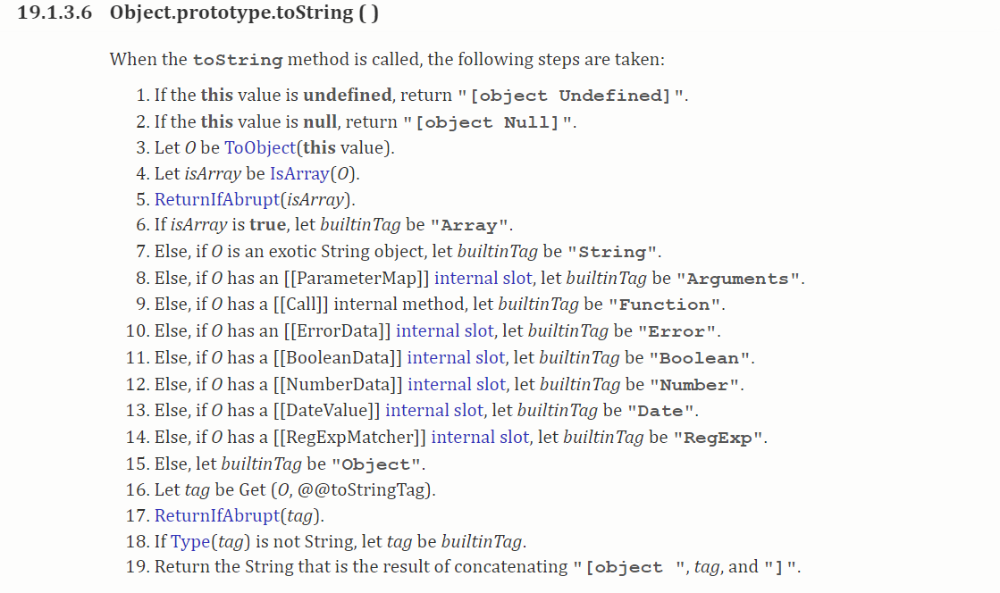

# 初学者也能看懂的 Vue2 源码中那些实用的基础工具函数

## 1. 前言

>大家好，我是[若川](https://ruochuan12.github.io)。欢迎关注我的[公众号若川视野](https://ruochuan12.github.io)，最近组织了[源码共读活动](https://juejin.cn/pin/7005372623400435725)，感兴趣的可以加我微信 [ruochuan12](https://juejin.cn/pin/7005372623400435725) 参与，从8月份开始，如今已进行近三个月，大家一起交流学习，共同进步，很多人都表示收获颇丰。

想学源码，极力推荐之前我写的[《学习源码整体架构系列》](https://juejin.cn/column/6960551178908205093) 包含`jQuery`、`underscore`、`lodash`、`vuex`、`sentry`、`axios`、`redux`、`koa`、`vue-devtools`、`vuex4`、`koa-compose`、`vue 3.2 发布`、`vue-this`、`create-vue`、`玩具vite`等10余篇源码文章。

[本文仓库 vue-analysis，求个star^_^](https://github.com/ruochuan12/vue-analysis.git)

最近组织了[源码共读活动](https://juejin.cn/pin/7005372623400435725)，大家一起学习源码。于是搜寻各种值得我们学习，且代码行数不多的源码。

之前写了 `Vue3` 相关的两篇文章。

- [初学者也能看懂的 Vue3 源码中那些实用的基础工具函数](https://juejin.cn/post/6994976281053888519)

这篇写了**如何学习 JavaScript 基础知识**，**推荐了很多书籍和学习资料**，**还有我的一些经验分享**。

- [Vue 3.2 发布了，那尤雨溪是怎么发布 Vue.js 的？](https://juejin.cn/post/6997943192851054606)

参加[源码共读]((https://juejin.cn/pin/7005372623400435725))的读者反馈，TA 其实还是用着 `Vue2`。能不能写篇 `Vue2` 基础工具函数。作为一名~~知识博主~~**卑微号主**，本着**学我所学，为我所用，帮助他人**的宗旨，于是写上了这篇文章。算是 `Vue3` 工具函数的**姐妹篇**，本文和这篇文章会有类似的地方。

阅读本文，你将学到：

```js
1. Vue2 源码 shared 模块中的几十个实用工具函数
2. 如何学习源码中优秀代码和思想，投入到自己的项目中
3. 如何学习 JavaScript 基础知识，会推荐很多学习资料
4. 我的一些经验分享
5. 等等
```

## 2. 环境准备

### 2.1 读开源项目 贡献指南

打开 [vue 仓库](https://github.com/vuejs/vue)，
开源项目一般都能在 `README.md` 或者 [.github/contributing.md](https://github.com/vuejs/vue/blob/dev/.github/CONTRIBUTING.md) 找到贡献指南。

而贡献指南写了很多关于参与项目开发的信息。比如怎么跑起来，项目目录结构是怎样的。怎么投入开发，需要哪些知识储备等。

我们可以在 [项目目录结构](https://github.com/vuejs/vue-next/blob/master/.github/contributing.md#project-structure) 描述中，找到`shared`模块。

`shared`: contains utilities shared across the entire codebase.

`README.md` 和 `contributing.md` 一般都是英文的。可能会难倒一部分人。其实看不懂，完全可以可以借助划词翻译，整页翻译和谷歌翻译等翻译工具。再把英文加入后续学习计划。

本文就是讲 `shared` 模块，对应的文件路径是：[`vue/vue/src/shared`](https://github.com/vuejs/vue/tree/dev/src/shared/utils.js)。

也可以用`github1s`访问，速度更快。[github1s vue/vue/src/shared](https://github1s.com/vuejs/vue/blob/dev/src/shared/util.js)

### 2.2 为了降低文章难度，直接学习打包后的源码

源代码的代码[`vue/vue/src/shared`](https://github.com/vuejs/vue/tree/dev/src/shared/utils.js)，使用了[Flow](https://flowtype.org/) 类型，可能不太好理解。

为了降低文章难度，我们直接学习源码仓库中的[打包后的 dist/vue.js 14行到379行](https://github.com/vuejs/vue/blob/dev/dist/vue.js#L14-L379)。

>当然，前面可能比较啰嗦。我可以直接讲 `3. 工具函数`。但通过我上文的介绍，即使是初学者，都能看懂一些开源项目源码，也许就会有一定的成就感。
>另外，面试问到被类似的问题或者笔试题时，你说看`Vue2`源码学到的，面试官绝对对你刮目相看。

## 3. 工具函数

[打包后的 vue.js 14行到379行](https://github.com/vuejs/vue/blob/dev/dist/vue.js#L14-L379)，接下来就是解释其中的这些方法。

### 3.1 emptyObject

```js
/*!
 * Vue.js v2.6.14
 * (c) 2014-2021 Evan You
 * Released under the MIT License.
 */
/*  */
var emptyObject = Object.freeze({});
```

冻结对象。第一层无法修改。对象中也有判断是否冻结的方法。

```js
Object.isFrozen(emptyObject); // true
```

关于对象 `API` 推荐看之前我的文章 [JavaScript 对象所有API解析](https://ruochuan12.github.io/js-object-api/)

还可以看阮一峰老师的[ES6 入门书籍 reflect](https://es6.ruanyifeng.com/#docs/reflect)

### 3.2 isUndef 是否是未定义

```js
// These helpers produce better VM code in JS engines due to their
// explicitness and function inlining.
function isUndef (v) {
  return v === undefined || v === null
}
```

### 3.3 isDef 是否是已经定义

`JavaScript`中假值有六个。

```js
false
null
undefined
0
'' (空字符串)
NaN
```

为了判断准确，Vue2 源码中封装了`isDef`、 `isTrue`、`isFalse`函数来准确判断。

见名知意。

```js
function isDef (v) {
  return v !== undefined && v !== null
}
```

### 3.4 isTrue 是否是 true

见名知意。

```js
function isTrue (v) {
  return v === true
}
```

### 3.5 isFalse 是否是 false

见名知意。

```js
function isFalse (v) {
  return v === false
}
```

### 3.6 isPrimitive 判断值是否是原始值

判断是否是字符串、或者数字、或者 `symbol`、或者布尔值。

```js
/**
 * Check if value is primitive.
 */
function isPrimitive (value) {
  return (
    typeof value === 'string' ||
    typeof value === 'number' ||
    // $flow-disable-line
    typeof value === 'symbol' ||
    typeof value === 'boolean'
  )
}
```

### 3.7 isObject 判断是对象

因为 `typeof null` 是 'object'。数组等用这个函数判断也是 true

```js
/**
 * Quick object check - this is primarily used to tell
 * Objects from primitive values when we know the value
 * is a JSON-compliant type.
 */
function isObject (obj) {
  return obj !== null && typeof obj === 'object'
}

// 例子:
isObject([]) // true
// 有时不需要严格区分数组和对象
```

### 3.8 toRawType 转换成原始类型

`Object.prototype.toString()` 方法返回一个表示该对象的字符串。

[mdn](https://developer.mozilla.org/zh-CN/docs/Web/JavaScript/Reference/Global_Objects/Object/toString)

[ecma 规范](https://262.ecma-international.org/6.0/#sec-object.prototype.tostring)，说明了这些类型。



[ECMAScript5.1 中文版](https://yanhaijing.com/es5/#book)

```js
/**
 * Get the raw type string of a value, e.g., [object Object].
 */
var _toString = Object.prototype.toString;

function toRawType (value) {
  return _toString.call(value).slice(8, -1)
}

// 例子：
toRawType('') // 'String'
toRawType() // 'Undefined'
```

### 3.9 isPlainObject 是否是纯对象

```js
/**
 * Strict object type check. Only returns true
 * for plain JavaScript objects.
 */
function isPlainObject (obj) {
  return _toString.call(obj) === '[object Object]'
}

// 上文 isObject([]) 也是 true
// 这个就是判断对象是纯对象的方法。
// 例子：
isPlainObject([]) // false
isPlainObject({}) // true
```

### 3.10 isRegExp 是否是正则表达式

```js
function isRegExp (v) {
  return _toString.call(v) === '[object RegExp]'
}

// 例子：
// 判断是不是正则表达式
isRegExp(/ruochuan/) // true
```

### 3.11 isValidArrayIndex 是否是可用的数组索引值

数组可用的索引值是 0 ('0')、1 ('1') 、2 ('2') ...

```js
/**
 * Check if val is a valid array index.
 */
function isValidArrayIndex (val) {
  var n = parseFloat(String(val));
  return n >= 0 && Math.floor(n) === n && isFinite(val)
}
```

该全局 `isFinite()` 函数用来判断被传入的参数值是否为一个有限数值（`finite number`）。在必要情况下，参数会首先转为一个数值。

[isFinite mdn](https://developer.mozilla.org/zh-CN/docs/Web/JavaScript/Reference/Global_Objects/isFinite)

```js
isFinite(Infinity);  // false
isFinite(NaN);       // false
isFinite(-Infinity); // false

isFinite(0);         // true
isFinite(2e64);      // true, 在更强壮的Number.isFinite(null)中将会得到false

isFinite('0');       // true, 在更强壮的Number.isFinite('0')中将会得到false
```

### 3.12 isPromise 判断是否是 promise

```js
function isPromise (val) {
  return (
    isDef(val) &&
    typeof val.then === 'function' &&
    typeof val.catch === 'function'
  )
}

// 例子：
// 判断是不是Promise对象
const p1 = new Promise(function (resolve, reject) {
    resolve('若川');
});
isPromise(p1); // true
```

这里用 `isDef` 判断其实相对 `isObject` 来判断 来说有点不严谨。但是够用。

### 3.13 toString 转字符串

转换成字符串。是数组或者对象并且对象的 `toString` 方法是 `Object.prototype.toString`，用 `JSON.stringify` 转换。

```js
/**
 * Convert a value to a string that is actually rendered.
 */
function toString (val) {
  return val == null
    ? ''
    : Array.isArray(val) || (isPlainObject(val) && val.toString === _toString)
      ? JSON.stringify(val, null, 2)
      : String(val)
}
```

### 3.14 toNumber 转数字

转换成数字。如果转换失败依旧返回原始字符串。

```js
/**
 * Convert an input value to a number for persistence.
 * If the conversion fails, return original string.
 */
function toNumber (val) {
  var n = parseFloat(val);
  return isNaN(n) ? val : n
}

toNumber('a') // 'a'
toNumber('1') // 1
toNumber('1a') // 1
toNumber('a1') // 'a1'
```

### 3.15 makeMap 生成一个 map （对象）

传入一个以逗号分隔的字符串，生成一个 `map`(键值对)，并且返回一个函数检测 `key` 值在不在这个 `map` 中。第二个参数是小写选项。

```js
/**
 * Make a map and return a function for checking if a key
 * is in that map.
 */
function makeMap (
  str,
  expectsLowerCase
) {
  var map = Object.create(null);
  var list = str.split(',');
  for (var i = 0; i < list.length; i++) {
    map[list[i]] = true;
  }
  return expectsLowerCase
    ? function (val) { return map[val.toLowerCase()]; }
    : function (val) { return map[val]; }
}

// Object.create(null) 没有原型链的空对象
```

### 3.16 isBuiltInTag 是否是内置的 tag

```js
/**
 * Check if a tag is a built-in tag.
 */
var isBuiltInTag = makeMap('slot,component', true);

// 返回的函数，第二个参数不区分大小写
isBuiltInTag('slot') // true
isBuiltInTag('component') // true
isBuiltInTag('Slot') // true
isBuiltInTag('Component') // true
```

### 3.17 isReservedAttribute 是否是保留的属性

```js
/**
 * Check if an attribute is a reserved attribute.
 */
var isReservedAttribute = makeMap('key,ref,slot,slot-scope,is');

isReservedAttribute('key') // true
isReservedAttribute('ref') // true
isReservedAttribute('slot') // true
isReservedAttribute('slot-scope') // true
isReservedAttribute('is') // true
isReservedAttribute('IS') // undefined
```

### 3.18 remove 移除数组中的中一项

```js
/**
 * Remove an item from an array.
 */
function remove (arr, item) {
  if (arr.length) {
    var index = arr.indexOf(item);
    if (index > -1) {
      return arr.splice(index, 1)
    }
  }
}
```

`splice` 其实是一个很耗性能的方法。删除数组中的一项，其他元素都要移动位置。

**引申**：[`axios InterceptorManager` 拦截器源码](https://github.com/axios/axios/blob/master/lib/core/InterceptorManager.js) 中，拦截器用数组存储的。但实际移除拦截器时，只是把拦截器置为 `null` 。而不是用`splice`移除。最后执行时为 `null` 的不执行，同样效果。`axios` 拦截器这个场景下，不得不说为性能做到了很好的考虑。**因为拦截器是用户自定义的，理论上可以有无数个，所以做性能考虑是必要的**。

看如下 `axios` 拦截器代码示例：

```js
// 代码有删减
// 声明
this.handlers = [];

// 移除
if (this.handlers[id]) {
    this.handlers[id] = null;
}

// 执行
if (h !== null) {
    fn(h);
}
```

### 3.19 hasOwn 检测是否是自己的属性

```js
/**
 * Check whether an object has the property.
 */
var hasOwnProperty = Object.prototype.hasOwnProperty;
function hasOwn (obj, key) {
  return hasOwnProperty.call(obj, key)
}

// 例子：

// 特别提醒：__proto__ 是浏览器实现的原型写法，后面还会用到
// 现在已经有提供好几个原型相关的API
// Object.getPrototypeOf
// Object.setPrototypeOf
// Object.isPrototypeOf

// .call 则是函数里 this 显示指定以为第一个参数，并执行函数。

hasOwn({__proto__: { a: 1 }}, 'a') // false
hasOwn({ a: undefined }, 'a') // true
hasOwn({}, 'a') // false
hasOwn({}, 'hasOwnProperty') // false
hasOwn({}, 'toString') // false
// 是自己的本身拥有的属性，不是通过原型链向上查找的。
```

### 3.20 cached 缓存

**利用闭包特性，缓存数据**

```js
/**
 * Create a cached version of a pure function.
 */
function cached (fn) {
  var cache = Object.create(null);
  return (function cachedFn (str) {
    var hit = cache[str];
    return hit || (cache[str] = fn(str))
  })
}

```

系统学习正则推荐[老姚：《JavaScript 正则表达式迷你书》问世了！](https://juejin.cn/post/6844903501034684430)，看过的都说好。所以本文不会很详细的描述正则相关知识点。

### 3.21 camelize 连字符转小驼峰

连字符 - 转驼峰  on-click => onClick

```js
/**
 * Camelize a hyphen-delimited string.
 */
var camelizeRE = /-(\w)/g;
var camelize = cached(function (str) {
  return str.replace(camelizeRE, function (_, c) { return c ? c.toUpperCase() : ''; })
});
```

### 3.22 capitalize 首字母转大写

首字母转大写

```js
/**
 * Capitalize a string.
 */
var capitalize = cached(function (str) {
  return str.charAt(0).toUpperCase() + str.slice(1)
});
```

### 3.23 hyphenate 小驼峰转连字符

onClick => on-click

```js
/**
 * Hyphenate a camelCase string.
 */
var hyphenateRE = /\B([A-Z])/g;
var hyphenate = cached(function (str) {
  return str.replace(hyphenateRE, '-$1').toLowerCase()
});
```

### 3.24 polyfillBind bind 的垫片

```js
/**
 * Simple bind polyfill for environments that do not support it,
 * e.g., PhantomJS 1.x. Technically, we don't need this anymore
 * since native bind is now performant enough in most browsers.
 * But removing it would mean breaking code that was able to run in
 * PhantomJS 1.x, so this must be kept for backward compatibility.
 */

/* istanbul ignore next */
function polyfillBind (fn, ctx) {
  function boundFn (a) {
    var l = arguments.length;
    return l
      ? l > 1
        ? fn.apply(ctx, arguments)
        : fn.call(ctx, a)
      : fn.call(ctx)
  }

  boundFn._length = fn.length;
  return boundFn
}

function nativeBind (fn, ctx) {
  return fn.bind(ctx)
}

var bind = Function.prototype.bind
  ? nativeBind
  : polyfillBind;
```

简单来说就是兼容了老版本浏览器不支持原生的 `bind` 函数。同时兼容写法，对参数的多少做出了判断，使用`call`和`apply`实现，据说参数多适合用 `apply`，少用 `call` 性能更好。

如果对于`call、apply、bind`的用法和实现不熟悉，可以查看我在[面试官问系列](https://juejin.cn/column/6962099958979756062)中写的[面试官问：能否模拟实现JS的call和apply方法](https://juejin.cn/post/6844903728147857415)
[面试官问：能否模拟实现JS的bind方法](https://juejin.cn/post/6844903718089916429)

### 3.25 toArray 把类数组转成真正的数组

把类数组转换成数组，支持从哪个位置开始，默认从 0 开始。

```js
/**
 * Convert an Array-like object to a real Array.
 */
function toArray (list, start) {
  start = start || 0;
  var i = list.length - start;
  var ret = new Array(i);
  while (i--) {
    ret[i] = list[i + start];
  }
  return ret
}

// 例子：
function fn(){
  var arr1 = toArray(arguments);
  console.log(arr1); // [1, 2, 3, 4, 5]
  var arr2 = toArray(arguments, 2);
  console.log(arr2); // [3, 4, 5]
}
fn(1,2,3,4,5);
```

### 3.26 extend 合并

```js
/**
 * Mix properties into target object.
 */
function extend (to, _from) {
  for (var key in _from) {
    to[key] = _from[key];
  }
  return to
}

// 例子：
const data = { name: '若川' };
const data2 = extend(data, { mp: '若川视野', name: '是若川啊' });
console.log(data); // { name: "是若川啊", mp: "若川视野" }
console.log(data2); // { name: "是若川啊", mp: "若川视野" }
console.log(data === data2); // true
```

### 3.27 toObject 转对象

```js
/**
 * Merge an Array of Objects into a single Object.
 */
function toObject (arr) {
  var res = {};
  for (var i = 0; i < arr.length; i++) {
    if (arr[i]) {
      extend(res, arr[i]);
    }
  }
  return res
}

// 数组转对象
toObject(['若川', '若川视野'])
// {0: '若', 1: '川', 2: '视', 3: '野'}
```

### 3.28 noop 空函数

```js
/* eslint-disable no-unused-vars */
/**
 * Perform no operation.
 * Stubbing args to make Flow happy without leaving useless transpiled code
 * with ...rest (https://flow.org/blog/2017/05/07/Strict-Function-Call-Arity/).
 */
function noop (a, b, c) {}

// 初始化赋值
```

### 3.29 no 一直返回 false

```js
/**
 * Always return false.
 */
var no = function (a, b, c) { return false; };
/* eslint-enable no-unused-vars */
```

### 3.30 identity 返回参数本身

```js
/**
 * Return the same value.
 */
var identity = function (_) { return _; };
```

### 3.31 genStaticKeys 生成静态属性

```js
/**
 * Generate a string containing static keys from compiler modules.
 */
function genStaticKeys (modules) {
  return modules.reduce(function (keys, m) {
    return keys.concat(m.staticKeys || [])
  }, []).join(',')
}
```

### 3.32 looseEqual 宽松相等

由于数组、对象等是引用类型，所以两个内容看起来相等，严格相等都是不相等。

```js
var a = {};
var b = {};
a === b; // false
a == b; // false
```

所以该函数是对数组、日期、对象进行递归比对。如果内容完全相等则宽松相等。

```js
/**
 * Check if two values are loosely equal - that is,
 * if they are plain objects, do they have the same shape?
 */
function looseEqual (a, b) {
  if (a === b) { return true }
  var isObjectA = isObject(a);
  var isObjectB = isObject(b);
  if (isObjectA && isObjectB) {
    try {
      var isArrayA = Array.isArray(a);
      var isArrayB = Array.isArray(b);
      if (isArrayA && isArrayB) {
        return a.length === b.length && a.every(function (e, i) {
          return looseEqual(e, b[i])
        })
      } else if (a instanceof Date && b instanceof Date) {
        return a.getTime() === b.getTime()
      } else if (!isArrayA && !isArrayB) {
        var keysA = Object.keys(a);
        var keysB = Object.keys(b);
        return keysA.length === keysB.length && keysA.every(function (key) {
          return looseEqual(a[key], b[key])
        })
      } else {
        /* istanbul ignore next */
        return false
      }
    } catch (e) {
      /* istanbul ignore next */
      return false
    }
  } else if (!isObjectA && !isObjectB) {
    return String(a) === String(b)
  } else {
    return false
  }
}
```

### 3.33 looseIndexOf 宽松的 indexOf

该函数实现的是宽松相等。原生的 `indexOf` 是严格相等。

```js
/**
 * Return the first index at which a loosely equal value can be
 * found in the array (if value is a plain object, the array must
 * contain an object of the same shape), or -1 if it is not present.
 */
function looseIndexOf (arr, val) {
  for (var i = 0; i < arr.length; i++) {
    if (looseEqual(arr[i], val)) { return i }
  }
  return -1
}
```

### 3.34 once 确保函数只执行一次

**利用闭包特性，存储状态**

```js
/**
 * Ensure a function is called only once.
 */
function once (fn) {
  var called = false;
  return function () {
    if (!called) {
      called = true;
      fn.apply(this, arguments);
    }
  }
}


const fn1 = once(function(){
  console.log('哎嘿，无论你怎么调用，我只执行一次');
});

fn1(); // '哎嘿，无论你怎么调用，我只执行一次'
fn1(); // 不输出
fn1(); // 不输出
fn1(); // 不输出
```

### 3.35 生命周期等

```js
var SSR_ATTR = 'data-server-rendered';

var ASSET_TYPES = [
  'component',
  'directive',
  'filter'
];

[Vue 生命周期](https://cn.vuejs.org/v2/api/#%E9%80%89%E9%A1%B9-%E7%94%9F%E5%91%BD%E5%91%A8%E6%9C%9F%E9%92%A9%E5%AD%90)

var LIFECYCLE_HOOKS = [
  'beforeCreate',
  'created',
  'beforeMount',
  'mounted',
  'beforeUpdate',
  'updated',
  'beforeDestroy',
  'destroyed',
  'activated',
  'deactivated',
  'errorCaptured',
  'serverPrefetch'
];
```

## 4. 最后推荐一些文章和书籍

这部分和Vue3工具函数文章一样，值得推荐，所以复制到这里。

先推荐我认为不错的`JavaScript API`的几篇文章和几本值得读的书。

[JavaScript字符串所有API全解密](https://juejin.cn/post/6844903476720320525)

[【深度长文】JavaScript数组所有API全解密](https://juejin.cn/post/6844903476216987655)

[正则表达式前端使用手册](https://juejin.cn/post/6844903469824868365)

[老姚：《JavaScript 正则表达式迷你书》问世了！](https://juejin.cn/post/6844903501034684430)

[老姚浅谈：怎么学JavaScript？](https://mp.weixin.qq.com/s?__biz=MzA5MjQwMzQyNw==&mid=2650754216&idx=1&sn=9163fb9d843bb2e0b07a5dec862ea9cc&chksm=88664f24bf11c632df132a8c34443a5dd9ef34437f811b3c05a4d409e2e27794bb9d005712b6&token=917686367&lang=zh_CN#rd)

[JavaScript 对象所有API解析](https://mp.weixin.qq.com/s/Y3nL3GPcxiqb3zK6pEuycg) https://ruochuan12.github.io/js-object-api/

[MDN JavaScript](https://developer.mozilla.org/zh-CN/docs/Web/JavaScript)

[《JavaScript高级程序设计》第4版](https://book.douban.com/subject/35175321/)

[《JavaScript 权威指南》第7版](https://book.douban.com/subject/35396470/)

[《JavaScript面向对象编程2》](https://book.douban.com/subject/26302623/) 面向对象讲的很详细。

[阮一峰老师：《ES6 入门教程》](http://es6.ruanyifeng.com/)

[《现代 JavaScript 教程》](https://zh.javascript.info/)

[《你不知道的JavaScript》上中卷](https://book.douban.com/subject/26351021/)

[《JavaScript 设计模式与开发实践》](https://book.douban.com/subject/26382780/)

我也是从小白看不懂书经历过来的。到现在写文章分享。

我看书的方法：多本书同时看，看相同类似的章节，比如函数。看完这本可能没懂，看下一本，几本书看下来基本就懂了，一遍没看懂，再看几遍，可以避免遗忘，巩固相关章节。当然，刚开始看书很难受，看不进。这些书大部分在微信读书都有，如果习惯看纸质书，那可以买来看。

这时可以看些视频和动手练习一些简单的项目。

比如：可以自己注册一个`github`账号，分章节小节，抄写书中的代码，提交到`github`，练习了才会更有感觉。

再比如 [freeCodeCamp 中文在线学习网站](https://www.freecodecamp.org/chinese/) 网站。看书是系统学习非常好的方法。后来我就是看源码较多，写文章分享出来给大家。

## 5. 总结

本文通过查看 `Vue2` 源码中 `shared` 模块[打包后的 dist/vue.js 14行到379行](https://github.com/vuejs/vue/blob/dev/dist/vue.js#L14-L379)。**源码也不是那么难，至少很多能看懂，比如工具函数**。难可能是难在：不知道应用场景。

`Vue2` 工具函数命名很规范，比如：`is` 判断，`to` 转换，`has` 是否有，让开发者一眼就能看出函数语意。

这些函数也非常单一，基本一个函数只做一件事。

建议读者朋友把不熟悉的函数，动手写写，有助于巩固基础知识，查漏补缺。

最后可以持续关注我@若川。欢迎加我微信 [ruochuan12](https://juejin.cn/pin/7005372623400435725) 交流，参与 [源码共读](https://juejin.cn/pin/7005372623400435725) 活动，大家一起学习源码，共同进步。
