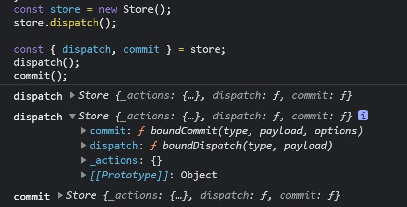

# 面对 this 指向丢失，尤雨溪在 Vuex 源码中是怎么处理的

## 1. 前言

大家好，我是[若川](https://mp.weixin.qq.com/s?__biz=MzA5MjQwMzQyNw==&mid=2650755227&idx=2&sn=1ee6c425188ceda81e1e972c32cbc457&chksm=88665317bf11da01cd320678f6da9d4395b0efb93b7074efc5e72ba65d08deeaf9be6b4037dd&token=1249549694&lang=zh_CN#rd)。好久以前我有写过[《面试官问系列》](https://mp.weixin.qq.com/mp/appmsgalbum?__biz=MzA5MjQwMzQyNw==&action=getalbum&album_id=1342989113611419648#wechat_redirect)，旨在帮助读者提升JS基础知识，包含`new、call、apply、this、继承`相关知识。其中写了 [面试官问：this 指向](https://mp.weixin.qq.com/s?__biz=MzA5MjQwMzQyNw==&mid=2650744695&idx=1&sn=63c761b9129c3c55ad7a2c21ddb4d82b&chksm=886624fbbf11aded9c57e7846c98961848cee7871f5e10bac3bdb949e9135fbc2095ae677102&token=1471663946&lang=zh_CN&scene=21#wechat_redirect) 文章。在掘金等平台收获了还算不错的反馈。

最近有小伙伴看我的 [Vuex源码](http://mp.weixin.qq.com/s?__biz=MzA5MjQwMzQyNw==&mid=2650744584&idx=1&sn=b14f8a762f132adcf0f7e3e075ee2ded&chksm=88662484bf11ad922ed27d45873af838298949eea381545e82a511cabf0c6fc6876a8370c6fb&scene=21#wechat_redirect) 文章，提到有一处`this`指向有点看不懂（好不容易终于有人看我的源码文章了，感动的要流泪了`^_^`）。于是我写篇文章答疑解惑，简单再说说 `this` 指向和`尤大在 Vuex 源码中`是怎么处理 `this` 指向丢失的。

## 2. 对象中的this指向

```js
var person = {
  name: '若川',
  say: function(text){
    console.log(this.name + ', ' + text);
  }
}
console.log(person.name);
console.log(person.say('在写文章')); // 若川, 在写文章
var say = person.say;
say('在写文章'); // 这里的this指向就丢失了，指向window了。(非严格模式)
```

## 3. 类中的this指向

### 3.1 ES5
```js
// ES5
var Person = function(){
  this.name = '若川';
}
Person.prototype.say = function(text){
  console.log(this.name + ', ' + text);
}
var person = new Person();
console.log(person.name); // 若川
console.log(person.say('在写文章'));
var say = person.say;
say('在写文章'); // 这里的this指向就丢失了，指向 window 了。
```

### 3.2 ES6
```js
// ES6
class Person{
  construcor(name = '若川'){
     this.name = name;
  }
  say(text){
    console.log(`${this.name}, ${text}`);
  }
}
const person = new Person();
person.say('在写文章')
// 解构
const { say } = person;
say('在写文章'); // 报错 this ，因为ES6 默认启用严格模式，严格模式下指向 undefined
```

## 4. 尤大在Vuex源码中是怎么处理的

先看代码

```js
class Store{
  constructor(options = {}){
     this._actions = Object.create(null);
  // bind commit and dispatch to self
      // 给自己 绑定 commit 和 dispatch
      const store = this
      const { dispatch, commit } = this
      // 为何要这样绑定 ?
      // 说明调用commit和dispach 的 this 不一定是 store 实例
      // 这是确保这两个函数里的this是store实例
      this.dispatch = function boundDispatch (type, payload) {
        return dispatch.call(store, type, payload)
      }
      this.commit = function boundCommit (type, payload, options) {
        return commit.call(store, type, payload, options)
      }
  }
  dispatch(){
     console.log('dispatch', this);
  }
  commit(){
     console.log('commit', this);
  }
}
const store = new Store();
store.dispatch(); // 输出结果 this 是什么呢？

const { dispatch, commit } = store;
dispatch(); // 输出结果 this 是什么呢？
commit();  // 输出结果 this 是什么呢？
```



**结论**：非常巧妙的用了`call`把`dispatch`和`commit`函数的`this`指向强制绑定到`store`实例对象上。如果不这么绑定就报错了。

### 4.1 actions 解构 store

其实`Vuex`源码里就有上面解构`const { dispatch, commit } = store;`的写法。想想我们平时是如何写`actions`的。`actions`中自定义函数的第一个参数其实就是 `store` 实例。

这时我们翻看下`actions文档`：`https://vuex.vuejs.org/zh/guide/actions.html`

```js
const store = new Vuex.Store({
  state: {
    count: 0
  },
  mutations: {
    increment (state) {
      state.count++
    }
  },
  actions: {
    increment (context) {
      context.commit('increment')
    }
  }
})
```

也可以用解构赋值的写法。

```js
actions: {
  increment ({ commit }) {
    commit('increment')
  }
}
```

有了`Vuex`源码构造函数里的`call`绑定，这样`this`指向就被修正啦~**不得不说祖师爷就是厉害**。这一招，大家可以免费学走~

接着我们带着问题，为啥上文中的`context`就是`store`实例，有`dispatch`、`commit`这些方法呢。继续往下看。

### 4.2 为什么 actions 对象里的自定义函数 第一个参数就是 store 实例。

以下是简单源码，有缩减，感兴趣的可以看我的文章 [Vuex 源码文章](https://ruochuan12.github.io/vuex)

```js
class Store{
 construcor(){
    // 初始化 根模块
    // 并且也递归的注册所有子模块
    // 并且收集所有模块的 getters 放在 this._wrappedGetters 里面
    installModule(this, state, [], this._modules.root)
 }
}
```

接着我们看`installModule`函数中的遍历注册 `actions` 实现

```js
function installModule (store, rootState, path, module, hot) {
    // 省略若干代码
    // 循环遍历注册 action
    module.forEachAction((action, key) => {
      const type = action.root ? key : namespace + key
      const handler = action.handler || action
      registerAction(store, type, handler, local)
    })
}
```

接着看注册 `actions` 函数实现 `registerAction`

```js
/**
* 注册 mutation
* @param {Object} store 对象
* @param {String} type 类型
* @param {Function} handler 用户自定义的函数
* @param {Object} local local 对象
*/
function registerAction (store, type, handler, local) {
  const entry = store._actions[type] || (store._actions[type] = [])
  // payload 是actions函数的第二个参数
  entry.push(function wrappedActionHandler (payload) {
    /**
     * 也就是为什么用户定义的actions中的函数第一个参数有
     *  { dispatch, commit, getters, state, rootGetters, rootState } 的原因
     * actions: {
     *    checkout ({ commit, state }, products) {
     *        console.log(commit, state);
     *    }
     * }
     */
    let res = handler.call(store, {
      dispatch: local.dispatch,
      commit: local.commit,
      getters: local.getters,
      state: local.state,
      rootGetters: store.getters,
      rootState: store.state
    }, payload)
    // 源码有删减
}
```

比较容易发现调用顺序是 `new Store() => installModule(this) => registerAction(store) => let res = handler.call(store)`。

其中`handler` 就是 用户自定义的函数，也就是对应上文的例子`increment`函数。`store`实例对象一路往下传递，到`handler`执行时，也是用了`call`函数，强制绑定了第一个参数是`store`实例对象。

```js
actions: {
  increment ({ commit }) {
    commit('increment')
  }
}
```
这也就是为什么 `actions` 对象中的自定义函数的第一个参数是 `store` 对象实例了。

好啦，文章到这里就基本写完啦~相对简短一些。应该也比较好理解。

## 5. 最后再总结下 this 指向
摘抄下[面试官问：this 指向](https://mp.weixin.qq.com/s?__biz=MzA5MjQwMzQyNw==&mid=2650744695&idx=1&sn=63c761b9129c3c55ad7a2c21ddb4d82b&chksm=886624fbbf11aded9c57e7846c98961848cee7871f5e10bac3bdb949e9135fbc2095ae677102&token=1471663946&lang=zh_CN&scene=21#wechat_redirect)文章结尾。

如果要判断一个运行中函数的 `this` 绑定， 就需要找到这个函数的直接调用位置。 找到之后
就可以顺序应用下面这四条规则来判断 `this` 的绑定对象。<br>
1. `new` 调用：绑定到新创建的对象，注意：显示`return`函数或对象，返回值不是新创建的对象，而是显式返回的函数或对象。<br>
2. `call` 或者 `apply`（ 或者 `bind`） 调用：严格模式下，绑定到指定的第一个参数。非严格模式下，`null`和`undefined`，指向全局对象（浏览器中是`window`），其余值指向被`new Object()`包装的对象。<br>
3. 对象上的函数调用：绑定到那个对象。<br>
4. 普通函数调用： 在严格模式下绑定到 `undefined`，否则绑定到全局对象。<br>

`ES6` 中的箭头函数：不会使用上文的四条标准的绑定规则， 而是根据当前的词法作用域来决定`this`， 具体来说， 箭头函数会继承外层函数，调用的 this 绑定（ 无论 this 绑定到什么），没有外层函数，则是绑定到全局对象（浏览器中是`window`）。 这其实和 `ES6` 之前代码中的 `self = this` 机制一样。

----
