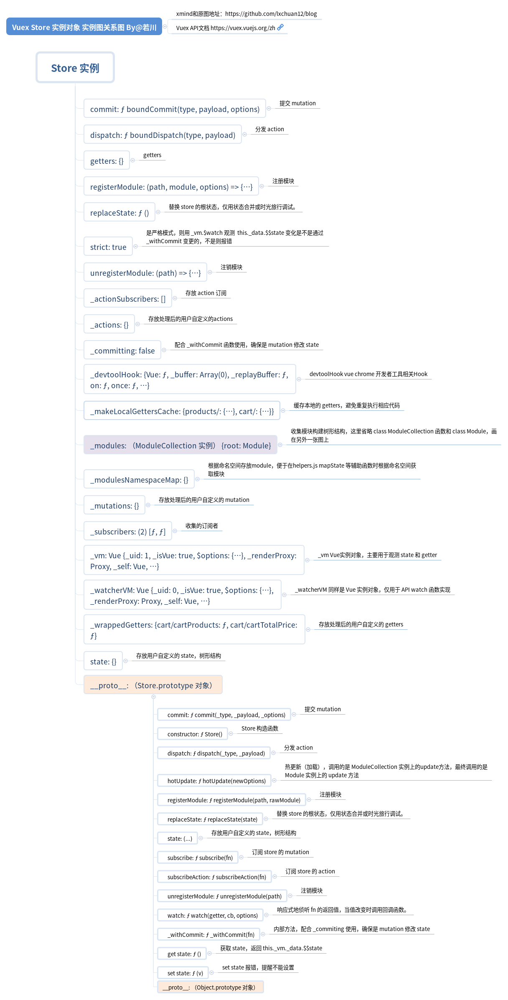
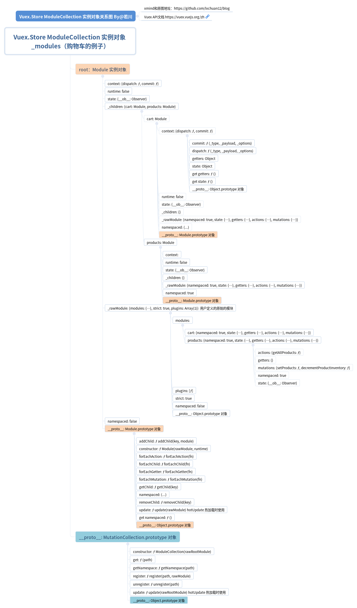

# 学习 vuex 源码整体架构，打造属于自己的状态管理库

## 前言

>你好，我是[若川](https://lxchuan12.cn)。这是`学习源码整体架构`第五篇。整体架构这词语好像有点大，姑且就算是源码整体结构吧，主要就是学习是代码整体结构，不深究其他不是主线的具体函数的实现。本篇文章学习的是实际仓库的代码。

>**要是有人说到怎么读源码，正在读文章的你能推荐我的源码系列文章，那真是太好了**。

`学习源码整体架构系列`文章如下：
>1.[学习 jQuery 源码整体架构，打造属于自己的 js 类库](https://juejin.im/post/5d39d2cbf265da1bc23fbd42)<br>
>2.[学习 underscore 源码整体架构，打造属于自己的函数式编程类库](https://juejin.im/post/5d4bf94de51d453bb13b65dc)<br>
>3.[学习 lodash 源码整体架构，打造属于自己的函数式编程类库](https://juejin.im/post/5d767e1d6fb9a06b032025ea)<br>
>4.[学习 sentry 源码整体架构，打造属于自己的前端异常监控SDK](https://juejin.im/post/5dba5a39e51d452a2378348a)<br>
>5.[学习 vuex 源码整体架构，打造属于自己的状态管理库](https://juejin.im/post/5dd4e61a6fb9a05a5c010af0)<br>
>6.[学习 axios 源码整体架构，打造属于自己的请求库](https://juejin.im/post/5df349b5518825123751ba66)<br>
>7.[学习 koa 源码的整体架构，浅析koa洋葱模型原理和co原理](https://juejin.im/post/5e69925cf265da571e262fe6)<br>
>8.[学习 redux 源码整体架构，深入理解 redux 及其中间件原理](https://juejin.im/post/5ee63b7d51882542fc6265ad)

感兴趣的读者可以点击阅读。<br>
其他源码计划中的有：[`express`](https://github.com/lxchuan12/express-analysis)、[`vue-rotuer`](https://github.com/lxchuan12/vue-router-analysis)、[`react-redux`](https://github.com/lxchuan12/react-redux-analysis) 等源码，不知何时能写完（哭泣），欢迎持续关注我（若川）。

源码类文章，一般阅读量不高。已经有能力看懂的，自己就看了。不想看，不敢看的就不会去看源码。<br>
所以我的文章，尽量写得让想看源码又不知道怎么看的读者能看懂。

**导读**<br>
文章比较详细的介绍了`vuex`、`vue`源码调试方法和 `Vuex` 原理。并且详细介绍了 `Vuex.use` 安装和 `new Vuex.Store` 初始化、`Vuex.Store` 的全部`API`（如`dispatch`、`commit`等）的实现和辅助函数 `mapState`、`mapGetters`、 `mapActions`、`mapMutations`
`createNamespacedHelpers`。

## chrome 浏览器调试 vuex 源码方法

[Vue文档：在 VS Code 中调试 Vue 项目](https://cn.vuejs.org/v2/cookbook/debugging-in-vscode.html)<br>
从上文中同理可得调试 `vuex` 方法，这里详细说下，便于帮助到可能不知道如何调试源码的读者。<br>
可以把笔者的这个 [vuex-analysis](https://github.com/lxchuan12/vuex-analysis) 源码分析仓库`fork`一份或者直接克隆下来，
`git clone https://github.com/lxchuan12/vuex-analysis.git`
>
>其中文件夹`vuex`，是克隆官方的`vuex`仓库 `dev`分支。<br>
>截至目前（2019年11月），版本是`v3.1.2`，最后一次`commit`是`ba2ff3a3`，`2019-11-11 11:51 Ben Hutton`。<br>
>包含笔者的注释，便于理解。<br>

克隆完成后， 在`vuex/examples/webpack.config.js` 中添加`devtool`配置。

```js
// 新增devtool配置，便于调试
devtool: 'source-map',
output: {}
```

```bash
git clone https://github.com/lxchuan12/vuex-analysis.git
cd vuex
npm i
npm run dev
```

>打开 http://localhost:8080/<br>
>点击你想打开的例子，例如：Shopping Cart => http://localhost:8080/shopping-cart/<br>
>打开控制面板 source 在左侧找到 webapck//  .  src 目录 store 文件 根据自己需求断点调试即可。<br>

本文主要就是通过[`Shopping Cart`](https://github.com/lxchuan12/vuex-analysis/blob/master/vuex/examples/shopping-cart/app.js)，(路径`vuex/examples/shopping-cart`)例子调试代码的。

### 顺便提一下调试 vue 源码（v2.6.10）的方法

```bash
git clone https://github.com/vuejs/vue.git
```

克隆下来后将`package.json` 文件中的`script` `dev`命令后面添加这个 `--sourcemap`。

```json
{
  "dev": "rollup -w -c scripts/config.js --environment TARGET:web-full-dev --sourcemap"
}
```

```bash
git clone https://github.com/vuejs/vue.git
cd vue
npm i
# 在 dist/vue.js 最后一行追加一行 //# sourceMappingURL=vue.js.map
npm run dev
# 新终端窗口
# 根目录下 全局安装http-server(一行命令启动服务的工具)
npm i -g http-server
hs -p 8100

# 在examples 文件夹中把引用的vuejs的index.html 文件 vue.min.js 改为 vue.js
# 或者把dist文件夹的 vue.min.js ，替换成npm run dev编译后的dist/vue.js 

# 浏览器打开 open http://localhost:8100/examples/

# 打开控制面板 source 在左侧找到  src 目录 即vue.js源码文件 根据自己需求断点调试即可。
```

本小节大篇幅介绍调试方法。是因为真的很重要。会调试代码，看源码就比较简单了。关注主线调试代码，很容易看懂。<br>
**强烈建议克隆笔者的这个仓库，自己调试代码，对着注释看，不调试代码，只看文章不容易吸收消化**。<br>
笔者也看了文章末尾笔者推荐阅读的文章，但还是需要自己看源代码，才知道这些文章哪里写到了，哪里没有细写。 <br>

正文开始～

## vuex 原理

简单说明下 `vuex` 原理

```js
<template>
<div>
  count {{$store.state.count}}
</div>
</template>
```

每个组件（也就是`Vue实例`）在`beforeCreate`的生命周期中都混入（Vue.mixin）同一个`Store实例` 作为属性 `$store`，
也就是为啥可以通过 `this.$store.dispatch` 等调用方法的原因。

最后显示在模板里的
`$store.state.count`
源码是这样的。

```js
class Store{
  get state () {
    return this._vm._data.$$state
  }
}
```

其实就是：
`vm.$store._vm._data.$$state.count`
其中`vm.$store._vm._data.$$state` 是 响应式的。
怎么实现响应式的？其实就是`new Vue()`

```js
function resetStoreVM (store, state, hot) {
  //  省略若干代码
  store._vm = new Vue({
    data: {
      $$state: state
    },
    computed
  })
  //  省略若干代码
}
```

这里的 `state` 就是 用户定义的 `state`。
这里的 `computed` 就是处理后的用户定义的 `getters`。
而 `class Store`上的一些函数（API）主要都是围绕修改`vm.$store._vm._data.$$state`和`computed(getter)`服务的。

## Vue.use 安装

笔者画了一张图表示下`Vuex`对象，是`Vue`的一个插件。


>看到这里，恭喜你已经了解了`Vuex`原理。文章比较长，如果暂时不想关注源码细节，可以克隆一下本仓库代码`git clone https://github.com/lxchuan12/vuex-analysis.git`，后续调试代码，点赞收藏到时想看了再看。

[文档 Vue.use](https://cn.vuejs.org/v2/api/#Vue-use)
`Vue.use(Vuex)`

>参数：
>{Object | Function} plugin
>用法：<br>
>安装 Vue.js 插件。如果插件是一个对象，必须提供 `install` 方法。如果插件是一个函数，它会被作为 `install` 方法。`install` 方法调用时，会将 Vue 作为参数传入。<br>
>该方法需要在调用 `new Vue()` 之前被调用。<br>
当 `install` 方法被同一个插件多次调用，插件将只会被安装一次。<br>

根据断点调试，来看下`Vue.use`的源码。

```js
function initUse (Vue) {
  Vue.use = function (plugin) {
    var installedPlugins = (this._installedPlugins || (this._installedPlugins = []));
    // 如果已经存在，则直接返回this也就是Vue
    if (installedPlugins.indexOf(plugin) > -1) {
      return this
    }

    // additional parameters
    var args = toArray(arguments, 1);
    // 把 this（也就是Vue）作为数组的第一项
    args.unshift(this);
    // 如果插件的install属性是函数,调用它
    if (typeof plugin.install === 'function') {
      plugin.install.apply(plugin, args);
    } else if (typeof plugin === 'function') {
      // 如果插件是函数,则调用它
      // apply(null) 严格模式下 plugin 插件函数的 this 就是 null
      plugin.apply(null, args);
    }
    // 添加到已安装的插件
    installedPlugins.push(plugin);
    return this
  };
}
```

### install 函数

`vuex/src/store.js`

```js
export function install (_Vue) {
  // Vue 已经存在并且相等，说明已经Vuex.use过
  if (Vue && _Vue === Vue) {
    // 省略代码：非生产环境报错，vuex已经安装
    return
  }
  Vue = _Vue
  applyMixin(Vue)
}
```

接下来看 `applyMixin` 函数

### applyMixin 函数

`vuex/src/mixin.js`

```js
export default function (Vue) {
  // Vue 版本号
  const version = Number(Vue.version.split('.')[0])
  if (version >= 2) {
    // 合并选项后 beforeCreate 是数组里函数的形式  [ƒ,  ƒ]
    // 最后调用循环遍历这个数组，调用这些函数，这是一种函数与函数合并的解决方案。
    // 假设是我们自己来设计，会是什么方案呢。
    Vue.mixin({ beforeCreate: vuexInit })
  } else {
    // 省略1.x的版本代码 ...
  }

  /**
   * Vuex init hook, injected into each instances init hooks list.
   */
  function vuexInit () {
    const options = this.$options
    // store injection
    // store 注入到每一个Vue的实例中
    if (options.store) {
      this.$store = typeof options.store === 'function'
        ? options.store()
        : options.store
    } else if (options.parent && options.parent.$store) {
      this.$store = options.parent.$store
    }
  }
}
```

最终每个`Vue`的实例对象，都有一个`$store`属性。且是同一个`Store`实例。<br>
用购物车的例子来举例就是：

```js
const vm = new Vue({
  el: '#app',
  store,
  render: h => h(App)
})
console.log('vm.$store === vm.$children[0].$store', vm.$store === vm.$children[0].$store)
// true
console.log('vm.$store === vm.$children[0].$children[0].$store', vm.$store === vm.$children[0].$children[0].$store)
// true
console.log('vm.$store === vm.$children[0].$children[1].$store', vm.$store === vm.$children[0].$children[1].$store)
// true
```

## Vuex.Store 构造函数

先看最终 `new Vuex.Store` 之后的 `Store` 实例对象关系图：先大致有个印象。


```js
export class Store {
  constructor (options = {}) {
    // 这个构造函数比较长，这里省略，后文分开细述
  }
}
```

```js
if (!Vue && typeof window !== 'undefined' && window.Vue) {
  install(window.Vue)
}
```

如果是 `cdn script` 方式引入`vuex`插件，则自动安装`vuex`插件，不需要用`Vue.use(Vuex)`来安装。

```js
// asset 函数实现
export function assert (condition, msg) {
  if (!condition) throw new Error(`[vuex] ${msg}`)
}
```

```js
if (process.env.NODE_ENV !== 'production') {
  // 可能有读者会问：为啥不用 console.assert，console.assert 函数报错不会阻止后续代码执行
  assert(Vue, `must call Vue.use(Vuex) before creating a store instance.`)
  assert(typeof Promise !== 'undefined', `vuex requires a Promise polyfill in this browser.`)
  assert(this instanceof Store, `store must be called with the new operator.`)
}
```

条件断言：不满足直接抛出错误
>1.必须使用 `Vue.use(Vuex)` 创建 `store` 实例。<br>
>2.当前环境不支持`Promise`，报错：`vuex` 需要 `Promise polyfill`。<br>
>3.`Store` 函数必须使用 `new` 操作符调用。

```js
const {
  // 插件默认是空数组
  plugins = [],
  // 严格模式默认是false
  strict = false
} = options
```

从用户定义的`new Vuex.Store(options)`
取出`plugins`和`strict`参数。

```js
// store internal state
// store 实例对象 内部的 state
this._committing = false
// 用来存放处理后的用户自定义的actoins
this._actions = Object.create(null)
// 用来存放 actions 订阅
this._actionSubscribers = []
// 用来存放处理后的用户自定义的mutations
this._mutations = Object.create(null)
// 用来存放处理后的用户自定义的 getters
this._wrappedGetters = Object.create(null)
// 模块收集器，构造模块树形结构
this._modules = new ModuleCollection(options)
// 用于存储模块命名空间的关系
this._modulesNamespaceMap = Object.create(null)
// 订阅
this._subscribers = []
// 用于使用 $watch 观测 getters
this._watcherVM = new Vue()
// 用来存放生成的本地 getters 的缓存
this._makeLocalGettersCache = Object.create(null)
```

声明`Store`实例对象一些内部变量。用于存放处理后用户自定义的`actions`、`mutations`、`getters`等变量。
>提一下 `Object.create(null)` 和 `{}` 的区别。前者没有原型链，后者有。
    即 `Object.create(null).__proto__`是 `undefined`
    `({}).__proto__` 是 `Object.prototype`

```js
// bind commit and dispatch to self
const store = this
const { dispatch, commit } = this
this.dispatch = function boundDispatch (type, payload) {
  return dispatch.call(store, type, payload)
}
this.commit = function boundCommit (type, payload, options) {
  return commit.call(store, type, payload, options)
}
```

给自己 绑定 `commit` 和 `dispatch`
>为何要这样绑定 ?<br>
>说明调用 `commit` 和 `dispach` 的 `this` 不一定是 `store` 实例<br>
>这是确保这两个函数里的 `this` 是 `store` 实例<br>

```js
// 严格模式，默认是false
this.strict = strict
// 根模块的state
const state = this._modules.root.state
// init root module.
// this also recursively registers all sub-modules
// and collects all module getters inside this._wrappedGetters
installModule(this, state, [], this._modules.root)
// initialize the store vm, which is responsible for the reactivity
// (also registers _wrappedGetters as computed properties)
resetStoreVM(this, state)
```

上述这段代码
`installModule(this, state, [], this._modules.root)`<br>
>初始化 根模块。<br>
>并且也递归的注册所有子模块。<br>
>并且收集所有模块的 `getters` 放在 `this._wrappedGetters` 里面。<br>

`resetStoreVM(this, state)`<br>
>初始化 `store._vm` 响应式的<br>
>并且注册 `_wrappedGetters` 作为 `computed` 的属性<br>

```js
plugins.forEach(plugin => plugin(this))
```

插件：把实例对象 `store` 传给插件函数，执行所有插件。

```js
const useDevtools = options.devtools !== undefined ? options.devtools : Vue.config.devtools
if (useDevtools) {
  devtoolPlugin(this)
}
```

初始化 `vue-devtool` 开发工具。<br>
参数 `devtools` 传递了取 `devtools` 否则取`Vue.config.devtools` 配置。

初读这个构造函数的全部源代码。会发现有三个地方需要重点看。分别是：<br>

```js
this._modules = new ModuleCollection(options)
installModule(this, state, [], this._modules.root)
resetStoreVM(this, state)
```

阅读时可以断点调试，赋值语句`this._modules = new ModuleCollection(options)`，如果暂时不想看，可以直接看返回结果。`installModule`，`resetStoreVM`函数则可以断点调试。

### class ModuleCollection

收集模块，构造模块树结构。
>注册根模块 参数 `rawRootModule` 也就是 `Vuex.Store` 的 `options` 参数<br>
>未加工过的模块（用户自定义的），根模块<br>

```js
export default class ModuleCollection {
  constructor (rawRootModule) {
    // register root module (Vuex.Store options)
    this.register([], rawRootModule, false)
  }
}
```

```js
/**
  * 注册模块
  * @param {Array} path 路径
  * @param {Object} rawModule 原始未加工的模块
  * @param {Boolean} runtime runtime 默认是 true
  */
register (path, rawModule, runtime = true) {
  // 非生产环境 断言判断用户自定义的模块是否符合要求
  if (process.env.NODE_ENV !== 'production') {
    assertRawModule(path, rawModule)
  }

  const newModule = new Module(rawModule, runtime)
  if (path.length === 0) {
    this.root = newModule
  } else {
    const parent = this.get(path.slice(0, -1))
    parent.addChild(path[path.length - 1], newModule)
  }

  // register nested modules
  // 递归注册子模块
  if (rawModule.modules) {
    forEachValue(rawModule.modules, (rawChildModule, key) => {
      this.register(path.concat(key), rawChildModule, runtime)
    })
  }
}
```

#### class Module

```js
// Base data struct for store's module, package with some attribute and method
// store 的模块 基础数据结构，包括一些属性和方法
export default class Module {
  constructor (rawModule, runtime) {
    // 接收参数 runtime
    this.runtime = runtime
    // Store some children item
    // 存储子模块
    this._children = Object.create(null)
    // Store the origin module object which passed by programmer
    // 存储原始未加工的模块
    this._rawModule = rawModule
    // 模块 state
    const rawState = rawModule.state

    // Store the origin module's state
    // 原始Store 可能是函数，也可能是是对象，是假值，则赋值空对象。
    this.state = (typeof rawState === 'function' ? rawState() : rawState) || {}
  }
}
```

经过一系列的注册后，最后
`this._modules = new ModuleCollection(options)`
`this._modules` 的值是这样的。
笔者画了一张图表示：



### installModule 函数

```js
function installModule (store, rootState, path, module, hot) {
  // 是根模块
  const isRoot = !path.length
  // 命名空间 字符串
  const namespace = store._modules.getNamespace(path)
  if (module.namespaced) {
    // 省略代码： 模块命名空间map对象中已经有了，开发环境报错提示重复
    // module 赋值给 _modulesNamespaceMap[namespace]
    store._modulesNamespaceMap[namespace] = module
  }
  // ... 后续代码 移出来 待读解释
}
```

#### 注册 state

```js
// set state
// 不是根模块且不是热重载
if (!isRoot && !hot) {
  // 获取父级的state
  const parentState = getNestedState(rootState, path.slice(0, -1))
  // 模块名称
  // 比如 cart
  const moduleName = path[path.length - 1]
  // state 注册
  store._withCommit(() => {
    // 省略代码：非生产环境 报错 模块 state 重复设置
    Vue.set(parentState, moduleName, module.state)
  })
}
```

最后得到的是类似这样的结构且是响应式的数据 实例 Store.state 比如：

```js
{
  // 省略若干属性和方法
  // 这里的 state 是只读属性 可搜索 get state 查看，上文写过
  state: {
    cart: {
      checkoutStatus: null,
      items: []
    }
 }
}
```

```js
const local = module.context = makeLocalContext(store, namespace, path)
```

>`module.context` 这个赋值主要是给 `helpers` 中 `mapState`、`mapGetters`、`mapMutations`、`mapActions`四个辅助函数使用的。<br>
>生成本地的dispatch、commit、getters和state。<br>
>主要作用就是抹平差异化，不需要用户再传模块参数。<br>

#### 遍历注册 mutation

```js
module.forEachMutation((mutation, key) => {
  const namespacedType = namespace + key
  registerMutation(store, namespacedType, mutation, local)
})
```

```js
/**
 * 注册 mutation
 * @param {Object} store 对象
 * @param {String} type 类型
 * @param {Function} handler 用户自定义的函数
 * @param {Object} local local 对象
 */
function registerMutation (store, type, handler, local) {
  // 收集的所有的mutations找对应的mutation函数，没有就赋值空数组
  const entry = store._mutations[type] || (store._mutations[type] = [])
  // 最后 mutation
  entry.push(function wrappedMutationHandler (payload) {
    /**
     * mutations: {
     *    pushProductToCart (state, { id }) {
     *        console.log(state);
     *    }
     * }
     * 也就是为什么用户定义的 mutation 第一个参数是state的原因，第二个参数是payload参数
     */
    handler.call(store, local.state, payload)
  })
}
```

#### 遍历注册 action

```js
module.forEachAction((action, key) => {
  const type = action.root ? key : namespace + key
  const handler = action.handler || action
  registerAction(store, type, handler, local)
})
```

```js
/**
* 注册 mutation
* @param {Object} store 对象
* @param {String} type 类型
* @param {Function} handler 用户自定义的函数
* @param {Object} local local 对象
*/
function registerAction (store, type, handler, local) {
  const entry = store._actions[type] || (store._actions[type] = [])
  // payload 是actions函数的第二个参数
  entry.push(function wrappedActionHandler (payload) {
    /**
     * 也就是为什么用户定义的actions中的函数第一个参数有
     *  { dispatch, commit, getters, state, rootGetters, rootState } 的原因
     * actions: {
     *    checkout ({ commit, state }, products) {
     *        console.log(commit, state);
     *    }
     * }
     */
    let res = handler.call(store, {
      dispatch: local.dispatch,
      commit: local.commit,
      getters: local.getters,
      state: local.state,
      rootGetters: store.getters,
      rootState: store.state
    }, payload)
    /**
     * export function isPromise (val) {
        return val && typeof val.then === 'function'
      }
     * 判断如果不是Promise Promise 化，也就是为啥 actions 中处理异步函数
        也就是为什么构造函数中断言不支持promise报错的原因
        vuex需要Promise polyfill
        assert(typeof Promise !== 'undefined', `vuex requires a Promise polyfill in this browser.`)
     */
    if (!isPromise(res)) {
      res = Promise.resolve(res)
    }
    // devtool 工具触发 vuex:error
    if (store._devtoolHook) {
      // catch 捕获错误
      return res.catch(err => {
        store._devtoolHook.emit('vuex:error', err)
        // 抛出错误
        throw err
      })
    } else {
      // 然后函数执行结果
      return res
    }
  })
}
```

#### 遍历注册 getter

```js
module.forEachGetter((getter, key) => {
  const namespacedType = namespace + key
  registerGetter(store, namespacedType, getter, local)
})
```

```js
/**
 * 注册 getter
 * @param {Object} store  Store实例
 * @param {String} type 类型
 * @param {Object} rawGetter  原始未加工的 getter 也就是用户定义的 getter 函数
 * @examples  比如 cartProducts: (state, getters, rootState, rootGetters) => {}
 * @param {Object} local 本地 local 对象
 */
function registerGetter (store, type, rawGetter, local) {
  // 类型如果已经存在，报错：已经存在
  if (store._wrappedGetters[type]) {
    if (process.env.NODE_ENV !== 'production') {
      console.error(`[vuex] duplicate getter key: ${type}`)
    }
    return
  }
  // 否则：赋值
  store._wrappedGetters[type] = function wrappedGetter (store) {
    /**
     * 这也就是为啥 getters 中能获取到  (state, getters, rootState, rootGetters)  这些值的原因
     * getters = {
     *      cartProducts: (state, getters, rootState, rootGetters) => {
     *        console.log(state, getters, rootState, rootGetters);
     *      }
     * }
     */
    return rawGetter(
      local.state, // local state
      local.getters, // local getters
      store.state, // root state
      store.getters // root getters
    )
  }
}
```

#### 遍历注册 子模块

```js
module.forEachChild((child, key) => {
  installModule(store, rootState, path.concat(key), child, hot)
})
```

### resetStoreVM 函数

`resetStoreVM(this, state, hot)`<br>
>初始化 `store._vm` 响应式的<br>
>并且注册 `_wrappedGetters` 作为 `computed` 的属性<br>

```js
function resetStoreVM (store, state, hot) {

  // 存储一份老的Vue实例对象 _vm
  const oldVm = store._vm

  // bind store public getters
  // 绑定 store.getter
  store.getters = {}
  // reset local getters cache
  // 重置 本地getters的缓存
  store._makeLocalGettersCache = Object.create(null)
  // 注册时收集的处理后的用户自定义的 wrappedGetters
  const wrappedGetters = store._wrappedGetters
  // 声明 计算属性 computed 对象
  const computed = {}
  // 遍历 wrappedGetters 赋值到 computed 上
  forEachValue(wrappedGetters, (fn, key) => {
    // use computed to leverage its lazy-caching mechanism
    // direct inline function use will lead to closure preserving oldVm.
    // using partial to return function with only arguments preserved in closure environment.
    /**
     * partial 函数
     * 执行函数 返回一个新函数
        export function partial (fn, arg) {
          return function () {
            return fn(arg)
          }
        }
     */
    computed[key] = partial(fn, store)
    // getter 赋值 keys
    Object.defineProperty(store.getters, key, {
      get: () => store._vm[key],
      // 可以枚举
      enumerable: true // for local getters
    })
  })

  // use a Vue instance to store the state tree
  // suppress warnings just in case the user has added
  // some funky global mixins
  // 使用一个 Vue 实例对象存储 state 树
  // 阻止警告 用户添加的一些全局mixins

  // 声明变量 silent 存储用户设置的静默模式配置
  const silent = Vue.config.silent
  // 静默模式开启
  Vue.config.silent = true
  store._vm = new Vue({
    data: {
      $$state: state
    },
    computed
  })
  // 把存储的静默模式配置赋值回来
  Vue.config.silent = silent

  // enable strict mode for new vm
  // 开启严格模式 执行这句
  // 用 $watch 观测 state，只能使用 mutation 修改 也就是 _withCommit 函数
  if (store.strict) {
    enableStrictMode(store)
  }

  // 如果存在老的 _vm 实例
  if (oldVm) {
    // 热加载为 true
    if (hot) {
      // dispatch changes in all subscribed watchers
      // to force getter re-evaluation for hot reloading.
      // 设置  oldVm._data.$$state = null
      store._withCommit(() => {
        oldVm._data.$$state = null
      })
    }
    // 实例销毁
    Vue.nextTick(() => oldVm.$destroy())
  }
}
```

到此，构造函数源代码看完了，接下来看 `Vuex.Store` 的 一些 `API` 实现。

## Vuex.Store 实例方法

[Vuex API 文档](https://vuex.vuejs.org/zh/api/)

### commit

提交 `mutation`。

```js
commit (_type, _payload, _options) {
  // check object-style commit
  // 统一成对象风格
  const {
    type,
    payload,
    options
  } = unifyObjectStyle(_type, _payload, _options)

  const mutation = { type, payload }
  // 取出处理后的用户定义 mutation
  const entry = this._mutations[type]
  // 省略 非生产环境的警告代码 ...
  this._withCommit(() => {
    // 遍历执行
    entry.forEach(function commitIterator (handler) {
      handler(payload)
    })
  })
  // 订阅 mutation 执行
  this._subscribers.forEach(sub => sub(mutation, this.state))

  // 省略 非生产环境的警告代码 ...
}
```

`commit` 支持多种方式。比如：<br>

```js
store.commit('increment', {
  count: 10
})
// 对象提交方式
store.commit({
  type: 'increment',
  count: 10
})
```

`unifyObjectStyle`函数将参数统一，返回 `{ type, payload, options }`。

### dispatch

分发 `action`。

```js
dispatch (_type, _payload) {
  // check object-style dispatch
  // 获取到type和payload参数
  const {
    type,
    payload
  } = unifyObjectStyle(_type, _payload)

  // 声明 action 变量 等于 type和payload参数
  const action = { type, payload }
  // 入口，也就是 _actions 集合
  const entry = this._actions[type]
  // 省略 非生产环境的警告代码 ...
  try {
    this._actionSubscribers
      .filter(sub => sub.before)
      .forEach(sub => sub.before(action, this.state))
  } catch (e) {
    if (process.env.NODE_ENV !== 'production') {
      console.warn(`[vuex] error in before action subscribers: `)
      console.error(e)
    }
  }

  const result = entry.length > 1
    ? Promise.all(entry.map(handler => handler(payload)))
    : entry[0](payload)

  return result.then(res => {
    try {
      this._actionSubscribers
        .filter(sub => sub.after)
        .forEach(sub => sub.after(action, this.state))
    } catch (e) {
      if (process.env.NODE_ENV !== 'production') {
        console.warn(`[vuex] error in after action subscribers: `)
        console.error(e)
      }
    }
    return res
  })
}
```

### replaceState

替换 `store` 的根状态，仅用状态合并或时光旅行调试。

```js
replaceState (state) {
  this._withCommit(() => {
    this._vm._data.$$state = state
  })
}
```

### watch

响应式地侦听 fn 的返回值，当值改变时调用回调函数。

```js
/**
 * 观测某个值
 * @param {Function} getter 函数
 * @param {Function} cb 回调
 * @param {Object} options 参数对象
 */
watch (getter, cb, options) {
  if (process.env.NODE_ENV !== 'production') {
    assert(typeof getter === 'function', `store.watch only accepts a function.`)
  }
  return this._watcherVM.$watch(() => getter(this.state, this.getters), cb, options)
}
```

### subscribe

订阅 `store` 的 `mutation`。

```js
subscribe (fn) {
  return genericSubscribe(fn, this._subscribers)
}
```

```js
// 收集订阅者
function genericSubscribe (fn, subs) {
  if (subs.indexOf(fn) < 0) {
    subs.push(fn)
  }
  return () => {
    const i = subs.indexOf(fn)
    if (i > -1) {
      subs.splice(i, 1)
    }
  }
}
```

### subscribeAction

订阅 `store` 的 `action`。

```js
subscribeAction (fn) {
  const subs = typeof fn === 'function' ? { before: fn } : fn
  return genericSubscribe(subs, this._actionSubscribers)
}
```

### registerModule

注册一个动态模块。

```js
/**
 * 动态注册模块
 * @param {Array|String} path 路径
 * @param {Object} rawModule 原始未加工的模块
 * @param {Object} options 参数选项
 */
registerModule (path, rawModule, options = {}) {
  // 如果 path 是字符串，转成数组
  if (typeof path === 'string') path = [path]

  // 省略 非生产环境 报错代码

  // 手动调用 模块注册的方法
  this._modules.register(path, rawModule)
  // 安装模块
  installModule(this, this.state, path, this._modules.get(path), options.preserveState)
  // reset store to update getters...
  // 设置 resetStoreVM
  resetStoreVM(this, this.state)
}
```

### unregisterModule

卸载一个动态模块。

```js
/**
 * 注销模块
 * @param {Array|String} path 路径
 */
unregisterModule (path) {
  // 如果 path 是字符串，转成数组
  if (typeof path === 'string') path = [path]

  // 省略 非生产环境 报错代码 ...

  // 手动调用模块注销
  this._modules.unregister(path)
  this._withCommit(() => {
    // 注销这个模块
    const parentState = getNestedState(this.state, path.slice(0, -1))
    Vue.delete(parentState, path[path.length - 1])
  })
  // 重置 Store
  resetStore(this)
}
```

### hotUpdate

热替换新的 `action` 和 `mutation`。

```js
// 热加载
hotUpdate (newOptions) {
  // 调用的是 ModuleCollection 的 update 方法，最终调用对应的是每个 Module 的 update
  this._modules.update(newOptions)
  // 重置 Store
  resetStore(this, true)
}
```

## 组件绑定的辅助函数

文件路径：[`vuex/src/helpers.js`](https://github.com/lxchuan12/vuex-analysis/blob/master/vuex/src/helpers.js)

### mapState

为组件创建计算属性以返回 `Vuex store` 中的状态。

```js
export const mapState = normalizeNamespace((namespace, states) => {
  const res = {}
  // 非生产环境 判断参数 states  必须是数组或者是对象
  if (process.env.NODE_ENV !== 'production' && !isValidMap(states)) {
    console.error('[vuex] mapState: mapper parameter must be either an Array or an Object')
  }
  normalizeMap(states).forEach(({ key, val }) => {
    res[key] = function mappedState () {
      let state = this.$store.state
      let getters = this.$store.getters
      // 传了参数 namespace
      if (namespace) {
        // 用 namespace 从 store 中找一个模块。
        const module = getModuleByNamespace(this.$store, 'mapState', namespace)
        if (!module) {
          return
        }
        state = module.context.state
        getters = module.context.getters
      }
      return typeof val === 'function'
        ? val.call(this, state, getters)
        : state[val]
    }
    // 标记为 vuex 方便在 devtools 显示
    // mark vuex getter for devtools
    res[key].vuex = true
  })
  return res
})
```

normalizeNamespace 标准化统一命名空间

```js
function normalizeNamespace (fn) {
  return (namespace, map) => {
    // 命名空间没传，交换参数，namespace 为空字符串
    if (typeof namespace !== 'string') {
      map = namespace
      namespace = ''
    } else if (namespace.charAt(namespace.length - 1) !== '/') {
      // 如果是字符串，最后一个字符不是 / 添加 /
      // 因为 _modulesNamespaceMap 存储的是这样的结构。
      /**
       * _modulesNamespaceMap:
          cart/: {}
          products/: {}
        }
       * */
      namespace += '/'
    }
    return fn(namespace, map)
  }
}
```

```js
// 校验是否是map 是数组或者是对象。
function isValidMap (map) {
  return Array.isArray(map) || isObject(map)
}
```

```js
/**
 * Normalize the map
 * 标准化统一 map，最终返回的是数组
 * normalizeMap([1, 2, 3]) => [ { key: 1, val: 1 }, { key: 2, val: 2 }, { key: 3, val: 3 } ]
 * normalizeMap({a: 1, b: 2, c: 3}) => [ { key: 'a', val: 1 }, { key: 'b', val: 2 }, { key: 'c', val: 3 } ]
 * @param {Array|Object} map
 * @return {Object}
 */
function normalizeMap (map) {
  if (!isValidMap(map)) {
    return []
  }
  return Array.isArray(map)
    ? map.map(key => ({ key, val: key }))
    : Object.keys(map).map(key => ({ key, val: map[key] }))
}
```

`module.context`  这个赋值主要是给 `helpers` 中 `mapState`、`mapGetters`、`mapMutations`、`mapActions`四个辅助函数使用的。

```js
// 在构造函数中 installModule 中
const local = module.context = makeLocalContext(store, namespace, path)
```

这里就是抹平差异，不用用户传递命名空间，获取到对应的 commit、dispatch、state、和 getters

getModuleByNamespace

```js
function getModuleByNamespace (store, helper, namespace) {
  // _modulesNamespaceMap 这个变量在 class Store installModule 函数中赋值的
  const module = store._modulesNamespaceMap[namespace]
  if (process.env.NODE_ENV !== 'production' && !module) {
    console.error(`[vuex] module namespace not found in ${helper}(): ${namespace}`)
  }
  return module
}
```

看完这些，最后举个例子：
`vuex/examples/shopping-cart/components/ShoppingCart.vue`

```js
computed: {
    ...mapState({
      checkoutStatus: state => state.cart.checkoutStatus
    }),
}
```

没有命名空间的情况下，最终会转换成这样

```js
computed: {
    checkoutStatus: this.$store.state.checkoutStatus
}
```

假设有命名空间'ruochuan'，

```js
computed: {
    ...mapState('ruochuan', {
      checkoutStatus: state => state.cart.checkoutStatus
    }),
}
```

则会转换成：

```js
computed: {
    checkoutStatus: this.$store._modulesNamespaceMap.['ruochuan/'].context.checkoutStatus
}
```

### mapGetters

为组件创建计算属性以返回 `getter` 的返回值。

```js
export const mapGetters = normalizeNamespace((namespace, getters) => {
  const res = {}
  // 省略代码：非生产环境 判断参数 getters 必须是数组或者是对象
  normalizeMap(getters).forEach(({ key, val }) => {
    // The namespace has been mutated by normalizeNamespace
    val = namespace + val
    res[key] = function mappedGetter () {
      if (namespace && !getModuleByNamespace(this.$store, 'mapGetters', namespace)) {
        return
      }
      // 省略代码：匹配不到 getter
      return this.$store.getters[val]
    }
    // mark vuex getter for devtools
    res[key].vuex = true
  })
  return res
})
```

举例：

```js
computed: {
  ...mapGetters('cart', {
    products: 'cartProducts',
    total: 'cartTotalPrice'
  })
},
```

最终转换成：

```js
computed: {
  products: this.$store.getters['cart/cartProducts'],
  total: this.$store.getters['cart/cartTotalPrice'],
}
```

### mapActions

创建组件方法分发 `action`。

```js
export const mapActions = normalizeNamespace((namespace, actions) => {
  const res = {}
  // 省略代码： 非生产环境 判断参数 actions  必须是数组或者是对象
  normalizeMap(actions).forEach(({ key, val }) => {
    res[key] = function mappedAction (...args) {
      // get dispatch function from store
      let dispatch = this.$store.dispatch
      if (namespace) {
        const module = getModuleByNamespace(this.$store, 'mapActions', namespace)
        if (!module) {
          return
        }
        dispatch = module.context.dispatch
      }
      return typeof val === 'function'
        ? val.apply(this, [dispatch].concat(args))
        : dispatch.apply(this.$store, [val].concat(args))
    }
  })
  return res
})
```

### mapMutations

创建组件方法提交 `mutation`。
mapMutations 和 mapActions 类似，只是 dispatch 换成了 commit。

```js
let commit = this.$store.commit
commit = module.context.commit
return typeof val === 'function'
        ? val.apply(this, [commit].concat(args))
        : commit.apply(this.$store, [val].concat(args))
```

[vuex/src/helpers](https://github.com/lxchuan12/vuex-analysis/blob/master/vuex/src/helpers.js)

`mapMutations`、`mapActions` 举例：

```js
{
  methods: {
    ...mapMutations(['inc']),
    ...mapMutations('ruochuan', ['dec']),
    ...mapActions(['actionA'])
    ...mapActions('ruochuan', ['actionB'])
  }
}
```

最终转换成

```js
{
  methods: {
    inc(...args){
      return this.$store.dispatch.apply(this.$store, ['inc'].concat(args))
    },
    dec(...args){
      return this.$store._modulesNamespaceMap.['ruochuan/'].context.dispatch.apply(this.$store, ['dec'].concat(args))
    },
    actionA(...args){
      return this.$store.commit.apply(this.$store, ['actionA'].concat(args))
    }
    actionB(...args){
      return this.$store._modulesNamespaceMap.['ruochuan/'].context.commit.apply(this.$store, ['actionB'].concat(args))
    }
  }
}
```

由此可见：这些辅助函数极大地方便了开发者。

### createNamespacedHelpers

创建基于命名空间的组件绑定辅助函数。

```js
export const createNamespacedHelpers = (namespace) => ({
  // bind(null) 严格模式下，napState等的函数 this 指向就是 null
  mapState: mapState.bind(null, namespace),
  mapGetters: mapGetters.bind(null, namespace),
  mapMutations: mapMutations.bind(null, namespace),
  mapActions: mapActions.bind(null, namespace)
})
```

就是把这些辅助函数放在一个对象中。

## 插件

插件部分文件路径是：<br>
`vuex/src/plugins/devtool`<br>
`vuex/src/plugins/logger`<br>

文章比较长了，这部分就不再叙述。具体可以看笔者的仓库 [vuex-analysis `vuex/src/plugins/`](https://github.com/lxchuan12/vuex-analysis/blob/master/vuex/src/plugins/logger.js) 的源码注释。

## 总结

文章比较详细的介绍了`vuex`、`vue`源码调试方法和 `Vuex` 原理。并且详细介绍了 `Vuex.use` 安装和 `new Vuex.Store` 初始化、`Vuex.Store` 的全部`API`（如`dispatch`、`commit`等）的实现和辅助函数 `mapState`、`mapGetters`、 `mapActions`、`mapMutations`
`createNamespacedHelpers`。

文章注释，在[vuex-analysis](https://github.com/lxchuan12/vuex-analysis)源码仓库里基本都有注释分析，求个`star`。再次强烈建议要克隆代码下来。

```bash
git clone https://github.com/lxchuan12/vuex-analysis.git
```

先把 `Store` 实例打印出来，看具体结构，再结合实例断点调试，事半功倍。

`Vuex` 源码相对不多，打包后一千多行，非常值得学习，也比较容易看完。

如果读者发现有不妥或可改善之处，再或者哪里没写明白的地方，欢迎评论指出。另外觉得写得不错，对您有些许帮助，可以点赞、评论、转发分享，也是对笔者的一种支持，万分感谢。

## 推荐阅读

[vuex 官方文档](https://vuex.vuejs.org/zh/)<br>
[vuex github 仓库](https://github.com/vuejs/vuex)<br>
[美团明裔：Vuex框架原理与源码分析](https://tech.meituan.com/2017/04/27/vuex-code-analysis.html)**这篇文章强烈推荐，流程图画的很好**<br>
[知乎黄轶：Vuex 2.0 源码分析](https://zhuanlan.zhihu.com/p/23921964)**这篇文章也强烈推荐，讲述的比较全面**<br>
[小虫巨蟹：Vuex 源码解析（如何阅读源代码实践篇）](https://juejin.im/post/5962c13c6fb9a06b9e11a6a9)**这篇文章也强烈推荐，主要讲如何阅读源代码**<br>
[染陌：Vuex 源码解析](https://juejin.im/post/59f66bd7f265da432d275d30)<br>
[网易考拉前端团队：Vuex 源码分析](https://juejin.im/post/59b88e2e6fb9a00a4f1b0a0b#heading-8)<br>
[yck：Vuex 源码深度解析](https://juejin.im/post/5b8e3182e51d4538ae4dce87)<br>
[小生方勤：【前端词典】从源码解读 Vuex 注入 Vue 生命周期的过程](https://juejin.im/post/5cb30243e51d456e431ada29)<br>

## 笔者另一个系列

[面试官问：JS的继承](https://juejin.im/post/5c433e216fb9a049c15f841b)<br>
[面试官问：JS的this指向](https://juejin.im/post/5c0c87b35188252e8966c78a)<br>
[面试官问：能否模拟实现JS的call和apply方法](https://juejin.im/post/5bf6c79bf265da6142738b29)<br>
[面试官问：能否模拟实现JS的bind方法](https://juejin.im/post/5bec4183f265da616b1044d7)<br>
[面试官问：能否模拟实现JS的new操作符](https://juejin.im/post/5bde7c926fb9a049f66b8b52)<br>

## 关于

作者：常以**若川**为名混迹于江湖。前端路上 | PPT爱好者 | 所知甚少，唯善学。<br>
[个人博客-若川](https://lxchuan12.cn)，使用`vuepress`重构了，阅读体验可能更好些<br>
[掘金专栏](https://juejin.im/user/57974dc55bbb500063f522fd/posts)，欢迎关注~<br>
[`segmentfault`前端视野专栏](https://segmentfault.com/blog/lxchuan12)，欢迎关注~<br>
[知乎前端视野专栏](https://zhuanlan.zhihu.com/lxchuan12)，欢迎关注~<br>
[语雀前端视野专栏](https://www.yuque.com/lxchuan12/blog)，新增语雀专栏，欢迎关注~<br>
[github blog](https://github.com/lxchuan12/blog)，相关源码和资源都放在这里，求个`star`^_^~

## 欢迎加微信交流 微信公众号

可能比较有趣的微信公众号，长按扫码关注（**回复pdf获取前端优质书籍pdf**）。也可以加微信 `ruochuan12`，注明来源，拉您进【前端视野交流群】。


