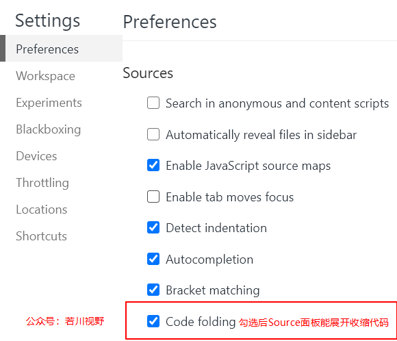
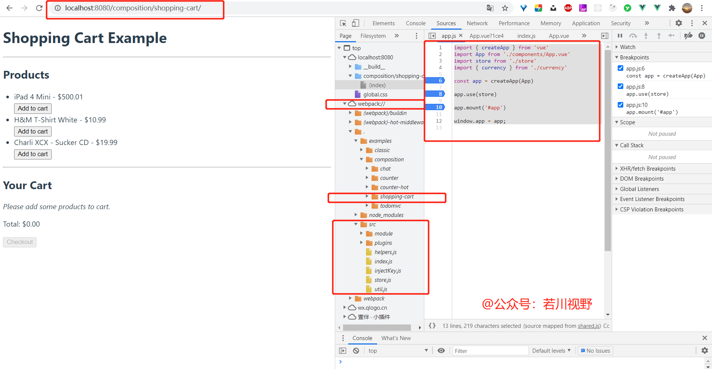
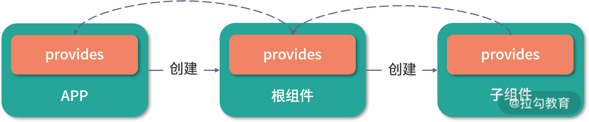
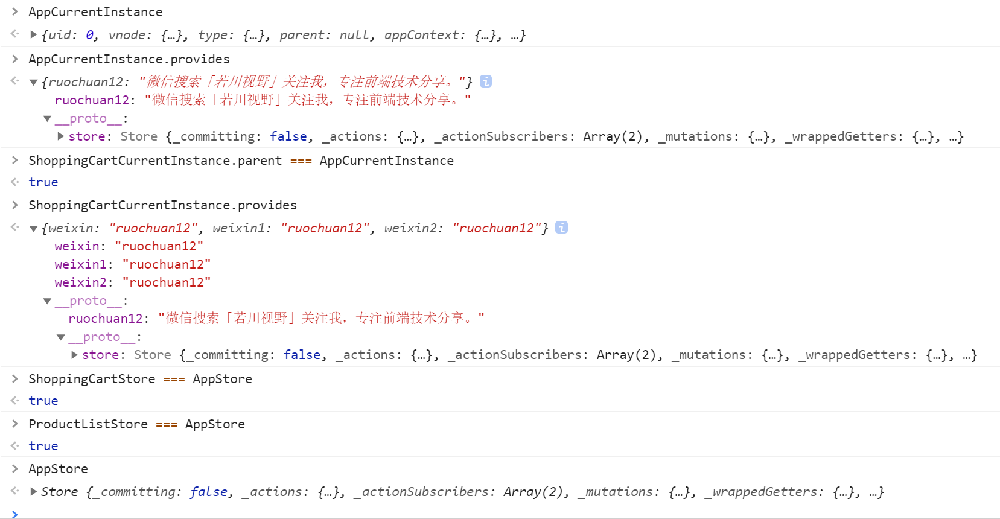

# 一文读懂vuex4源码，原来provide/inject就是妙用了原型链？

## 1. 前言

>你好，我是[若川](https://lxchuan12.gitee.io)，微信搜索[「若川视野」](https://mp.weixin.qq.com/s/c3hFML3XN9KCUetDOZd-DQ)关注我，专注前端技术分享，一个愿景是帮助5年内前端开阔视野走向前列的公众号。欢迎加我微信`ruochuan12`，长期交流学习。

>这是`学习源码整体架构系列` 之 vuex4 源码（第十篇）。学习源码整体架构系列文章([有哪些必看的JS库](https://mp.weixin.qq.com/s?__biz=MzA5MjQwMzQyNw==&mid=2650746362&idx=1&sn=afe3a26cdbde1d423aae4fa99355f369&chksm=88662e76bf11a760a7f0a8565b9e8d52f5e4f056dc2682f213eec6475127d71f6f1d203d6c3a&scene=21#wechat_redirect))：[jQuery](http://mp.weixin.qq.com/s?__biz=MzA5MjQwMzQyNw==&mid=2650744496&idx=1&sn=0f149e9436cb77bf9fc1bfb47aedd334&chksm=8866253cbf11ac2a53b385153cd8e9a0c4018b6b566750cf0b5d61d17afa2e90b52d36db8054&scene=21#wechat_redirect)、[underscore](http://mp.weixin.qq.com/s?__biz=MzA5MjQwMzQyNw==&mid=2650744505&idx=1&sn=26801ad6c2a5eb9cf64e7556b6478d39&chksm=88662535bf11ac23eea3f76335f6777e2acbf4ee660b5616148e14ffbefc0e8520806db21056&scene=21#wechat_redirect)、[lodash](http://mp.weixin.qq.com/s?__biz=MzA5MjQwMzQyNw==&mid=2650744514&idx=1&sn=776336d888d06bfe72cb4d5b07a4b90c&chksm=8866254ebf11ac5822fc078082603f77a4b4d9b487c9f4d7069acb12c727c46c75946fa9b0cd&scene=21#wechat_redirect)、[sentry](http://mp.weixin.qq.com/s?__biz=MzA5MjQwMzQyNw==&mid=2650744551&idx=1&sn=4d79c2fa97d7c737aab70055c7ec7fa3&chksm=8866256bbf11ac7d9e2269f3638a705d5e5f45056d53ad2faf17b814e4c46ec6b0ba52571bde&scene=21#wechat_redirect)、[vuex](http://mp.weixin.qq.com/s?__biz=MzA5MjQwMzQyNw==&mid=2650744584&idx=1&sn=b14f8a762f132adcf0f7e3e075ee2ded&chksm=88662484bf11ad922ed27d45873af838298949eea381545e82a511cabf0c6fc6876a8370c6fb&scene=21#wechat_redirect)、[axios](http://mp.weixin.qq.com/s?__biz=MzA5MjQwMzQyNw==&mid=2650744604&idx=1&sn=51d8d865c9848fd59f7763f5fb9ce789&chksm=88662490bf11ad86061ae76ff71a1177eeddab02c38d046eecd0e1ad25dc16f7591f91e9e3b2&scene=21#wechat_redirect)、[koa](https://mp.weixin.qq.com/s?__biz=MzA5MjQwMzQyNw==&mid=2650744703&idx=1&sn=cfb9580241228993e4d376017234ff79&chksm=886624f3bf11ade5f5e37520f6b1291417bcea95f222906548b863f4b61d20e7508eb419eb85&token=192125900&lang=zh_CN&scene=21#wechat_redirect)、[redux](http://mp.weixin.qq.com/s?__biz=MzA5MjQwMzQyNw==&mid=2650745007&idx=1&sn=1fd6f3caeff6ab61b8d5f644a1dbb7df&chksm=88662b23bf11a23573509a01f941d463b0c61e890b2069427c78c26296197077da359c522fe8&scene=21#wechat_redirect)、[vue-devtools 直接打开文件功能揭秘](http://mp.weixin.qq.com/s?__biz=MzA5MjQwMzQyNw==&mid=2650751278&idx=1&sn=3ac07b110e84e3ded5fa4ec4407ce13b&chksm=886642a2bf11cbb4cea35f0d208815c39c9cd13a0522e7cdc4a466bc55cb5b3071143a38bb04&token=1828368955&lang=zh_CN#rd)。

>**10篇源码系列文章小成就达成**，从19年7月开始写，19年写了6篇，20年写了2篇，今年写了2篇。算是一个完结吧。短时间内应该暂时不更新这个系列了。主要是投入的时间和精力比较多，看的人很少，得到的反馈也比较少。之后先写其他文章吧。欢迎持续关注我（[若川](https://lxchuan12.gitee.io)）。

>[本文仓库地址](https://github.com/lxchuan12/vuex4-analysis.git)：`git clone https://github.com/lxchuan12/vuex4-analysis.git`，本文最佳阅读方式，克隆仓库自己动手调试，容易吸收消化。

>**要是有人说到怎么读源码，正在读文章的你能推荐我的源码系列文章，那真是无以为报啊**。

我的文章，尽量写得让想看源码又不知道怎么看的读者能看懂。我都是推荐使用**搭建环境断点调试源码学习**，**哪里不会点哪里**，**边调试边看，而不是硬看**。正所谓：**授人与鱼不如授人予渔**。

阅读本文后你将学到：

- 1. `git subtree` 管理子仓库
- 2. 如何学习`Vuex 4`源码、理解`Vuex`原理
- 3. `Vuex 4` 和 `Vuex 3` 的异同
- 4. `Vuex 4` `composition API` 如何使用
- 5. `Vue.provide / Vue.inject` API 使用和原理
- 6. 如何写一个 `Vue3` 插件
- 等等

如果对于谷歌浏览器调试还不是很熟悉的读者，可以看这篇文章[chrome devtools source面板](https://mp.weixin.qq.com/s/lMlq4IKtHj2V3Hv2iB723w)，写的很详细。顺带提一下，我打开的设置，source面板中支持展开搜索代码块（默认不支持），一图胜千言。谷歌浏览器是我们前端常用的工具，所以建议大家深入学习，毕竟**工欲善其事，必先利其器**。

之前写过`Vuex 3`的源码文章[学习 vuex 源码整体架构，打造属于自己的状态管理库](http://mp.weixin.qq.com/s?__biz=MzA5MjQwMzQyNw==&mid=2650744584&idx=1&sn=b14f8a762f132adcf0f7e3e075ee2ded&chksm=88662484bf11ad922ed27d45873af838298949eea381545e82a511cabf0c6fc6876a8370c6fb&scene=21#wechat_redirect)、[若川的博客Vuex源码](http://lxchuan12.gitee.io/vuex)，仓库有很详细的注释和看源码方法，所以本文不会过多赘述与`Vuex 3`源码相同的地方。

### 1.1 本文阅读最佳方式

把我的`vuex4`源码仓库 `git clone https://github.com/lxchuan12/vuex4-analysis.git`克隆下来，顺便star一下我的[vuex4源码学习仓库](https://github.com/lxchuan12/vuex4-analysis.git)^_^。**跟着文章节奏调试和示例代码调试，用chrome动手调试印象更加深刻**。文章长段代码不用细看，可以调试时再细看。看这类源码文章百遍，可能不如自己多调试几遍，大胆猜测，小心求证。也欢迎加我微信交流`ruochuan12`。

## 2. Vuex 原理简述

**结论先行**：`Vuex`原理可以拆解为三个关键点。
第一点、其实就是每个组件实例里都注入了`Store`实例。
第二点、`Store`实例中的各种方法都是为`Store`中的属性服务的。
第三点、`Store`中的属性变更触发视图更新。

本文主要讲解第一点。第二点在我的上一篇文章[学习 vuex 源码整体架构，打造属于自己的状态管理库](http://mp.weixin.qq.com/s?__biz=MzA5MjQwMzQyNw==&mid=2650744584&idx=1&sn=b14f8a762f132adcf0f7e3e075ee2ded&chksm=88662484bf11ad922ed27d45873af838298949eea381545e82a511cabf0c6fc6876a8370c6fb&scene=21#wechat_redirect)详细讲了，本文就不赘述了。第三点两篇文章都没有详细讲述。

以下是一段简短的代码说明`Vuex`原理的。

```js
// 简版
class Store{
  constructor(){
    this._state = 'Store 实例';
  }
  dispatch(val){
    this.__state = val;
  }
  commit(){}
  // 省略
}


const store = new Store();
var rootInstance = {
  parent: null,
  provides: {
    store: store,
  },
};
var parentInstance = {
  parent: rootInstance,
  provides: {
    store: store,
  }
};
var childInstance1 = {
  parent: parentInstance,
  provides: {
    store: store,
  }
};
var childInstance2 = {
  parent: parentInstance,
  provides: {
    store: store,
  }
};

store.dispatch('我被修改了');
// store Store {_state: "我被修改了"}

// rootInstance、parentInstance、childInstance1、childInstance2 这些对象中的provides.store都改了。
// 因为共享着同一个store对象。
```


看了上面的官方文档中的图，大概知道是用`provide`父级组件中提供`Store`实例，用`inject`来获取到`Store`实例。

那么接下来，带着问题：

1、为什么修改了实例`store`里的属性，变更后会触发视图更新。

2、`Vuex4`作为`Vue`的插件如何实现和`Vue`结合的。

3、`provide`、`inject`的如何实现的，每个组件如何获取到组件实例中的`Store`的。

4、为什么每个组件对象里都有`Store`实例对象了(渲染组件对象过程)。

5、为什么在组件中写的`provide`提供的数据，能被子级组件获取到。

## 3. Vuex 4 重大改变

在看源码之前，先来看下`Vuex 4`发布的`release`和官方文档迁移提到的重大改变，[Vuex 4 release](https://github.com/vuejs/vuex/releases/tag/v4.0.0)。

[从 3.x 迁移到 4.0](https://next.vuex.vuejs.org/zh/guide/migrating-to-4-0-from-3-x.html)

`Vuex 4`的重点是兼容性。`Vuex 4`支持使用`Vue 3`开发，并且直接提供了和`Vuex 3`完全相同的`API`，因此用户可以在`Vue 3`项目中复用现有的`Vuex`代码。

相比`Vuex 3`版本。主要有如下重大改变（其他的在上方链接中）：

### 3.1 安装过程

`Vuex 3`是`Vue.use(Vuex)`

`Vuex 4`则是`app.use(store)`

```js
import { createStore } from 'vuex'

export const store = createStore({
  state() {
    return {
      count: 1
    }
  }
})
```

```js
import { createApp } from 'vue'
import { store } from './store'
import App from './App.vue'

const app = createApp(App)

app.use(store)

app.mount('#app')
```

### 3.2 核心模块导出了 `createLogger` 函数

```js
import { createLogger } from 'vuex'
```

**接下来我们从源码的角度来看这些重大改变**。

## 4. 从源码角度看 Vuex 4 重大变化

### 4.1 chrome 调试 Vuex 4 源码准备工作

```sh
git subtree add --prefix=vuex https://github.com/vuejs/vuex.git 4.0
```

这种方式保留了`vuex4`仓库的`git`记录信息。更多`git subtree`使用方式可以查看这篇文章[用 Git Subtree 在多个 Git 项目间双向同步子项目，附简明使用手册](https://segmentfault.com/a/1190000003969060)。

作为读者朋友的你，只需克隆[我的`Vuex 4`源码仓库](https://github.com/lxchuan12/vuex4-analysis.git) `https://github.com/lxchuan12/vuex4-analysis.git` 即可，也欢迎`star`一下。

把`vuex/examples/webpack.config.js`，加个`devtool: 'source-map'`，这样就能开启`sourcemap`调试源码了。

我们使用项目中的购物车的例子调试，贯穿全文。

```sh
git clone https://github.com/lxchuan12/vuex4-analysis.git
cd vuex
npm i
npm run dev
# 打开 http://localhost:8080/
# 选择 composition  购物车的例子 shopping-cart
# 打开 http://localhost:8080/composition/shopping-cart/
# 按 F12 打开调试工具，source面板 => page => webpack:// => .
```

据说一图胜千言，这时简单截个调试的图。



找到 `createStore`函数打上断点。

```js
// webpack:///./examples/composition/shopping-cart/store/index.js
import { createStore, createLogger } from 'vuex'
import cart from './modules/cart'
import products from './modules/products'

const debug = process.env.NODE_ENV !== 'production'

export default createStore({
  modules: {
    cart,
    products
  },
  strict: debug,
  plugins: debug ? [createLogger()] : []
})
```

找到`app.js`入口，在`app.use(store)`、`app.mount('#app')`等打上断点。

```js
// webpack:///./examples/composition/shopping-cart/app.js
import { createApp } from 'vue'
import App from './components/App.vue'
import store from './store'
import { currency } from './currency'

const app = createApp(App)

app.use(store)

app.mount('#app')
```

接下来，我们从`createApp({})`、`app.use(Store)`两个方面发散开来讲解。

### 4.2 Vuex.createStore 函数

相比 `Vuex 3` 中，`new Vuex.Store`，其实是一样的。只不过为了和`Vue 3` 统一，`Vuex 4` 额外多了一个 `createStore` 函数。

```js
export function createStore (options) {
  return new Store(options)
}
class Store{
  constructor (options = {}){
    // 省略若干代码...
    this._modules = new ModuleCollection(options)
    const state = this._modules.root.state
    resetStoreState(this, state)
    // 省略若干代码...
  }
}
function resetStoreState (store, state, hot) {
  // 省略若干代码...
  store._state = reactive({
    data: state
  })
  // 省略若干代码...
}
```

**监测数据**

和`Vuex 3`不同的是，监听数据不再是用`new Vue()`，而是`Vue 3`提供的`reactive`方法。

`Vue.reactive` 函数方法，本文就不展开讲解了。因为展开来讲，又可以写篇新的文章了。只需要知道主要功能是监测数据改变，变更视图即可。

这也就算解答了开头提出的第一个问题。

跟着断点我们继续看`app.use()`方法，`Vue`提供的插件机制。

### 4.3 app.use() 方法

`use`做的事情说起来也算简单，把传递过来的插件添加插件集合中，到防止重复。

执行插件，如果是对象，`install`是函数，则把参数app和其他参数传递给install函数执行。如果是函数直接执行。

```js
// webpack:///./node_modules/@vue/runtime-core/dist/runtime-core.esm-bundler.js
function createAppAPI(render, hydrate) {
    return function createApp(rootComponent, rootProps = null) {
      // 代码有删减
      const installedPlugins = new Set();
      const app = (context.app = {
        use(plugin, ...options) {
          // 已经有插件，并且 不是生产环境，报警告。
            if (installedPlugins.has(plugin)) {
                (process.env.NODE_ENV !== 'production') && warn(`Plugin has already been applied to target app.`);
            }
            // 插件的install 是函数，则添加插件，并执行 install 函数
            else if (plugin && isFunction(plugin.install)) {
                installedPlugins.add(plugin);
                // 断点
                plugin.install(app, ...options);
            }
            // 插件本身 是函数，则添加插件，并执行 插件本身函数
            else if (isFunction(plugin)) {
                installedPlugins.add(plugin);
                plugin(app, ...options);
            }
            // 如果都不是报警告
            else if ((process.env.NODE_ENV !== 'production')) {
                warn(`A plugin must either be a function or an object with an "install" ` +
                    `function.`);
            }
            // 支持链式调用
            return app;
        },
        provide(){ 
          // 省略... 后文再讲
        }
      });
    }
}

```

上面代码中，断点这行`plugin.install(app, ...options);`

跟着断点走到下一步，`install`函数。

### 4.4 install 函数

```js
export class Store{
    // 省略若干代码...
    install (app, injectKey) {
        // 为 composition API 中使用
        //  可以传入 injectKey  如果没传取默认的 storeKey 也就是 store
        app.provide(injectKey || storeKey, this)
        // 为 option API 中使用
        app.config.globalProperties.$store = this
    }
    // 省略若干代码...
}
```

`Vuex4`中的`install`函数相对比`Vuex3`中简单了许多。
第一句是给`Composition API`提供的。注入到根实例对象中。
第二句则是为`option API`提供的。

接着断点这两句，按`F11`来看`app.provide`实现。

#### 4.4.1 app.provide

简单来说就是给`context`的`provides`属性中加了`store` = **Store实例对象**。

```js
provide(key, value) {
    // 如果已经有值了警告
    if ((process.env.NODE_ENV !== 'production') && key in context.provides) {
        warn(`App already provides property with key "${String(key)}". ` +
            `It will be overwritten with the new value.`);
    }
    // TypeScript doesn't allow symbols as index type
    // https://github.com/Microsoft/TypeScript/issues/24587
    context.provides[key] = value;
    return app;
}
```

接着从上方代码中搜索`context`，可以发现这一句代码：

```js
const context = createAppContext();
```

接着我们来看函数 `createAppContext`。
`context` 为上下文

```js
// webpack:///./node_modules/@vue/runtime-core/dist/runtime-core.esm-bundler.js
function createAppContext() {
    return {
        app: null,
        config: {
            isNativeTag: NO,
            performance: false,
            globalProperties: {},
            optionMergeStrategies: {},
            isCustomElement: NO,
            errorHandler: undefined,
            warnHandler: undefined
        },
        mixins: [],
        components: {},
        directives: {},
        provides: Object.create(null)
    };
}
```

[Vue3 文档应用配置(app.config)](https://v3.cn.vuejs.org/api/application-config.html)

#### 4.4.2 app.config.globalProperties

[app.config.globalProperties 官方文档](https://v3.cn.vuejs.org/api/application-config.html#globalproperties)

用法：

```js
app.config.globalProperties.$store = {}

app.component('child-component', {
  mounted() {
    console.log(this.$store) // '{}'
  }
})
```

也就能解释为什么每个组件都可以使用 `this.$store.xxx` 访问 `vuex`中的方法和属性了。

也就是说在`appContext.provides`中注入了一个**Store实例对象**。这时也就是相当于根组件实例和`config`全局配置`globalProperties`中有了**Store实例对象**。

至此我们就看完，`createStore(store)`，`app.use(store)`两个`API`。

`app.provide` 其实是用于`composition API`使用的。

但这只是文档中这样说的，为什么就每个组件实例都能访问的呢，我们继续深入探究下原理。

接下来，我们看下源码具体实现，为什么每个组件实例中都能获取到的。

这之前先来看下组合式`API`中，我们如何使用`Vuex4`，这是线索。

### 4.5 composition API 中如何使用Vuex 4

接着我们找到如下文件，`useStore`是我们断点的对象。

```js
// webpack:///./examples/composition/shopping-cart/components/ShoppingCart.vue
import { computed } from 'vue'
import { useStore } from 'vuex'
import { currency } from '../currency'

export default {
  setup () {
    const store = useStore()

    // 我加的这行代码
    window.ShoppingCartStore = store;
    // 省略了若干代码
  }
}
```

接着断点按`F11`，单步调试，会发现最终是使用了`Vue.inject`方法。

#### 4.5.1 Vuex.useStore 源码实现

```js
// vuex/src/injectKey.js
import { inject } from 'vue'

export const storeKey = 'store'

export function useStore (key = null) {
  return inject(key !== null ? key : storeKey)
}
```

#### 4.5.2 Vue.inject 源码实现

接着看`inject`函数，看着代码很多，其实原理很简单，就是要找到我们用`provide`提供的值。

如果没有父级，也就是根实例，就取实例对象中的`vnode.appContext.provides`。
否则就取父级中的`instance.parent.provides`的值。

在`Vuex4`源码里则是：`Store`实例对象。

```js
// webpack:///./node_modules/@vue/runtime-core/dist/runtime-core.esm-bundler.js
function inject(key, defaultValue, treatDefaultAsFactory = false) {
    // fallback to `currentRenderingInstance` so that this can be called in
    // a functional component
    // 如果是被一个函数式组件调用则取 currentRenderingInstance
    const instance = currentInstance || currentRenderingInstance;
    if (instance) {
        // #2400
        // to support `app.use` plugins,
        // fallback to appContext's `provides` if the intance is at root
        const provides = instance.parent == null
            ? instance.vnode.appContext && instance.vnode.appContext.provides
            : instance.parent.provides;
        if (provides && key in provides) {
            // TS doesn't allow symbol as index type
            return provides[key];
        }
        // 如果参数大于1个 第二个则是默认值 ，第三个参数是 true，并且第二个值是函数则执行函数。
        else if (arguments.length > 1) {
            return treatDefaultAsFactory && isFunction(defaultValue)
                ? defaultValue()
                : defaultValue;
        }
        // 警告没找到
        else if ((process.env.NODE_ENV !== 'production')) {
            warn(`injection "${String(key)}" not found.`);
        }
    }
    // 如果没有当前实例则说明则报警告。
    // 也就是是说inject必须在setup中调用或者在函数式组件中使用
    else if ((process.env.NODE_ENV !== 'production')) {
        warn(`inject() can only be used inside setup() or functional components.`);
    }
}
```

接着我们继续来看`inject`的相对应的`provide`。

#### 4.5.3  Vue.provide 源码实现

`provide`函数作用其实也算简单，1、也就是给当前组件实例上的`provides`对象属性，添加键值对`key/value`。

2、还有一个作用是当当前组件和父级组件的`provides`相同时，在当前组件实例中的`provides`对象和父级，则建立链接，也就是原型`[[prototype]]`，(`__proto__`)。

```js
// webpack:///./node_modules/@vue/runtime-core/dist/runtime-core.esm-bundler.js
function provide(key, value) {
    if (!currentInstance) {
        if ((process.env.NODE_ENV !== 'production')) {
            warn(`provide() can only be used inside setup().`);
        }
    }
    else {
        let provides = currentInstance.provides;
        // by default an instance inherits its parent's provides object
        // but when it needs to provide values of its own, it creates its
        // own provides object using parent provides object as prototype.
        // this way in `inject` we can simply look up injections from direct
        // parent and let the prototype chain do the work.
        const parentProvides = currentInstance.parent && currentInstance.parent.provides;
        if (parentProvides === provides) {
            provides = currentInstance.provides = Object.create(parentProvides);
        }
        // TS doesn't allow symbol as index type
        provides[key] = value;
    }
}
```

`provide`函数中的这段，可能不是那么好理解。

```js
if (parentProvides === provides) {
    provides = currentInstance.provides = Object.create(parentProvides);
}
```

我们来举个例子消化一下。

```js
var currentInstance = { provides: { store: { __state: 'Store实例' }  } };
var provides = currentInstance.provides;
// 这句是我手动加的，在后文中则是创建实例时就是写的同一个对象，当然就会相等了。
var parentProvides = provides;
if(parentProvides === provides){
    provides =  currentInstance.provides = Object.create(parentProvides);
}
```

经过一次执行这个后，`currentInstance` 就变成了这样。

```js
{
  provides: {
    // 可以容纳其他属性，比如用户自己写的
    __proto__ : { store: { __state: 'Store实例' }  }
  }
}
```

执行第二次时，`currentInstance` 则是：

```js
{
  provides: {
    // 可以容纳其他属性，比如用户自己写的
    __proto__: {
        // 可以容纳其他属性，比如用户自己写的
        __proto__ : { store: { __state: 'Store实例' }  }
    }
  }
}
```

以此类推，多执行`provide`几次，原型链就越长。

上文`inject`、`provide`函数中都有个变量`currentInstance`当前实例，那么当前实例对象是怎么来的呢。

为什么每个组件就能访问到，依赖注入的思想。
有一个讨巧的方法，就是在文件`runtime-core.esm-bundler.js`中搜索`provides`，则能搜索到`createComponentInstance`函数

接下来我们`createComponentInstance`函数如何创建组件实例。

### 4.6 createComponentInstance 创建组件实例

可以禁用其他断点，单独断点这里，
比如：`const appContext = (parent ? parent.appContext : vnode.appContext) || emptyAppContext;`
来看具体实现。

```js
// webpack:///./node_modules/@vue/runtime-core/dist/runtime-core.esm-bundler.js
const emptyAppContext = createAppContext();
let uid$1 = 0;
function createComponentInstance(vnode, parent, suspense) {
    const type = vnode.type;
    const appContext = (parent ? parent.appContext : vnode.appContext) || emptyAppContext;
    const instance = {
        uid: uid$1++,
        vnode,
        type,
        parent,
        appContext,
        root: null,
        next: null,
        subTree: null,
        // ...
        provides: parent ? parent.provides : Object.create(appContext.provides),
        // ...
    }
    instance.root = parent ? parent.root : instance;
    // ...
    return instance;
}
```

断点时会发现，根组件实例时`vnode`已经生成，至于是什么时候生成的，我整理了下简化版。

```js
// 把上文中的 appContext 赋值给了 `appContext`
mount(rootContainer, isHydrate) {
    if (!isMounted) {
        const vnode = createVNode(rootComponent, rootProps);
        // store app context on the root VNode.
        // this will be set on the root instance on initial mount.
        vnode.appContext = context;
    }
},
```

其中 `Object.create` 其实就是建立原型关系。这时放一张图，一图胜千言。

，出自黄轶老师拉勾专栏，本想自己画一张图，但觉得这张挺好的。

#### 4.6.1 组件实例生成了，那怎么把它们结合呢

这时，也有一个讨巧的方法，在`runtime-core.esm-bundler.js`文件中，搜索 `provide(`可以搜到如下代码：

这段代码其实看起来很复杂的样子，实际上主要就是把用户在组件中写的`provides`对象或者函数返回值遍历, 生成类似这样的实例对象：

```js
// 当前组件实例
{
  parent: '父级的实例',
  provides: {
    // 可以容纳其他属性，比如用户自己写的
    __proto__: {
        // 可以容纳其他属性，比如用户自己写的
        __proto__ : { store: { __state: 'Store实例' }  }
    }
  }
}
```

```js
// webpack:///./node_modules/@vue/runtime-core/dist/runtime-core.esm-bundler.js
function applyOptions(instance, options, deferredData = [], deferredWatch = [], deferredProvide = [], asMixin = false) {
  // ...
  if (provideOptions) {
      deferredProvide.push(provideOptions);
  }
  if (!asMixin && deferredProvide.length) {
      deferredProvide.forEach(provideOptions => {
          // 组件中写 provides 可以是对象或者是函数
          const provides = isFunction(provideOptions)
              ? provideOptions.call(publicThis)
              : provideOptions;
          Reflect.ownKeys(provides).forEach(key => {
              provide(key, provides[key]);
          });
      });
  }
  // ...
}
```

这样一来就从上到下`app.provide`提供的对象，被注入到每一个组件实例中了。同时组件本身提供的`provides`也被注入到实例中了。

接着我们跟着项目来验证下，上文中的表述。翻看`Vue3`文档可以发现有一个`API`可以获取当前组件实例。

### 4.7 getCurrentInstance 获取当前实例对象

`getCurrentInstance` 支持访问内部组件实例，用于高阶用法或库的开发。

```js
import { getCurrentInstance } from 'vue'

const MyComponent = {
  setup() {
    const internalInstance = getCurrentInstance()

    internalInstance.appContext.config.globalProperties // 访问 globalProperties
  }
}
```

知道这个API后，我们可以在购物车例子的代码中添加一些代码。便于我们理解。

```js
// vuex/examples/composition/shopping-cart/components/App.vue
import { getCurrentInstance, provide } from 'vue'
import { useStore } from 'vuex';
setup () {
  const store = useStore()
  provide('ruochuan12', '微信搜索「若川视野」关注我，专注前端技术分享。')

  window.AppStore = store;
  window.AppCurrentInstance = getCurrentInstance();
},
```

```js
// vuex/examples/composition/shopping-cart/components/ProductList.vue
setup(){
  const store = useStore()

  // 若川加入的调试代码--start
  window.ProductListStore = store;
  window.ProductListCurrentInstance = getCurrentInstance();
  provide('weixin-2', 'ruochuan12');
  provide('weixin-3', 'ruochuan12');
  provide('weixin-4', 'ruochuan12');
  const mp = inject('ruochuan12');
  console.log(mp, '介绍-ProductList'); // 微信搜索「若川视野」关注我，专注前端技术分享。
  // 若川加入的调试代码---end
}
```

```js
// vuex/examples/composition/shopping-cart/components/ShoppingCart.vue
setup () {
    const store = useStore()

    // 若川加入的调试代码--start
    window.ShoppingCartStore = store;
    window.ShoppingCartCurrentInstance = getCurrentInstance();
    provide('weixin', 'ruochuan12');
    provide('weixin1', 'ruochuan12');
    provide('weixin2', 'ruochuan12');
    const mp = inject('ruochuan12');
    console.log(mp, '介绍-ShoppingList'); // 微信搜索「若川视野」关注我，专注前端技术分享。
    // 若川加入的调试代码--start
}
```

在控制台输出这些值

```js
AppCurrentInstance
AppCurrentInstance.provides
ShoppingCartCurrentInstance.parent === AppCurrentInstance // true
ShoppingCartCurrentInstance.provides
ShoppingCartStore === AppStore // true
ProductListStore === AppStore // true
AppStore // store实例对象
```



看控制台截图输出的例子，其实跟上文写的类似。这时如果写了顺手自己注入了一个provide('store': '空字符串')，那么顺着原型链，肯定是先找到用户写的`store`，这时Vuex无法正常使用，就报错了。

当然`vuex4`提供了注入的`key`可以不是`store`的写法，这时就不和用户的冲突了。

```js
export class Store{
    // 省略若干代码...
    install (app, injectKey) {
        // 为 composition API 中使用
        //  可以传入 injectKey  如果没传取默认的 storeKey 也就是 store
        app.provide(injectKey || storeKey, this)
        // 为 option API 中使用
        app.config.globalProperties.$store = this
    }
    // 省略若干代码...
}
```

```js
export function useStore (key = null) {
  return inject(key !== null ? key : storeKey)
}
```

## 5. 解答下开头提出的5个问题

统一解答下开头提出的5个问题：

1、为什么修改了实例`store`里的属性，变更后会触发视图更新。

答：使用`Vue` 中的 `reactive` 方法监测数据变化的。

```js
class Store{
  constructor (options = {}){
    // 省略若干代码...
    this._modules = new ModuleCollection(options)
    const state = this._modules.root.state
    resetStoreState(this, state)
    // 省略若干代码...
  }
}
function resetStoreState (store, state, hot) {
  // 省略若干代码...
  store._state = reactive({
    data: state
  })
  // 省略若干代码...
}
```

2、`Vuex4`作为`Vue`的插件如何实现和`Vue`结合的。

答：`app.use(store)` 时会执行`Store`中的`install`方法，一句是为 `composition API` 中使用，提供`Store`实例对象到根实例中。一句则是注入到根实例的全局属性中，为 `option API` 中使用。它们都会在组件生成时，注入到每个组件实例中。

```js
export class Store{
    // 省略若干代码...
    install (app, injectKey) {
        // 为 composition API 中使用
        //  可以传入 injectKey  如果没传取默认的 storeKey 也就是 store
        app.provide(injectKey || storeKey, this)
        // 为 option API 中使用
        app.config.globalProperties.$store = this
    }
    // 省略若干代码...
}
```

3、`provide`、`inject`的如何实现的，每个组件如何获取到组件实例中的`Store`的。

5、为什么在组件中写的`provide`提供的数据，能被子级组件获取到。

答：`provide`函数建立原型链区分出组件实例用户自己写的属性和系统注入的属性。`inject`函数则是通过原型链找父级实例中的`provides`对象中的属性。

```js
// 有删减
function provide(){
    let provides = currentInstance.provides;
    const parentProvides = currentInstance.parent && currentInstance.parent.provides;
    if (parentProvides === provides) {
        provides = currentInstance.provides = Object.create(parentProvides);
    }
    provides[key] = value;
}
```

```js
// 有删减
function inject(){
    const provides = instance.parent == null
        ? instance.vnode.appContext && instance.vnode.appContext.provides
        : instance.parent.provides;
    if (provides && key in provides) {
        return provides[key];
    }
}
```

也就是类似这样的实例：

```js
// 当前组件实例
{
  parent: '父级的实例',
  provides: {
    // 可以容纳其他属性，比如用户自己写的
    __proto__: {
        // 可以容纳其他属性，比如用户自己写的
        __proto__ : { store: { __state: 'Store实例' }  }
    }
  }
}
```

4、为什么每个组件对象里都有`Store`实例对象了(渲染组件对象过程)。

答：渲染生成组件实例时，调用`createComponentInstance`，注入到组件实例的`provides`中。

```js
function createComponentInstance(vnode, parent, suspense) {
    const type = vnode.type;
    const appContext = (parent ? parent.appContext : vnode.appContext) || emptyAppContext;
    const instance = {
        parent,
        appContext,
        // ...
        provides: parent ? parent.provides : Object.create(appContext.provides),
        // ...
    }
    // ...
    return instance;
}
```

6. 你怎么知道那么多的

答：因为社区有人写了[`Vue4`源码文章](https://lxchuan12.gitee.io/vuex4)。

## 6. 总结

本文主要讲述了`Vuex4`把`Store`实例注入到各个组件中的原理，展开讲述了`Vuex4`相对与`Vuex3`安装方式的改变`Vuex.createStore`、`app.use(store)` ，深入源码分析`Vue.inject`、`Vue.provide`实现原理。

`Vuex4` 除了安装方式和监测数据变化方式使用了`Vue.reactive`，其他基本和`Vuex3.x`版本没什么区别。

最后回顾下文章开头的图，可以说就是原型链的妙用。


是不是觉得豁然开朗。

`Vuex`其实也是`Vue`的一个插件，知晓了`Vuex`原理，对于自己给`Vue`写插件也是会游刃有余。

>如果读者朋友发现有不妥或可改善之处，再或者哪里没写明白的地方，欢迎评论指出，也欢迎加我微信 `ruochuan12` 交流。另外觉得写得不错，对您有些许帮助，可以点赞、评论、转发分享，也是对我的一种支持，万分感谢。如果能关注我的前端公众号：[「若川视野」](https://mp.weixin.qq.com/s/c3hFML3XN9KCUetDOZd-DQ)，就更好啦。

## 关于

>你好，我是[若川](https://lxchuan12.gitee.io)，微信搜索[「若川视野」](https://mp.weixin.qq.com/s/c3hFML3XN9KCUetDOZd-DQ)关注我，专注前端技术分享，一个愿景是帮助5年内前端开阔视野走向前列的公众号。欢迎加我微信`ruochuan12`，长期交流学习。
主要有以下系列文章：[学习源码整体架构系列](https://mp.weixin.qq.com/mp/appmsgalbum?__biz=MzA5MjQwMzQyNw==&action=getalbum&album_id=1342211915371675650#wechat_redirect)、[年度总结](https://mp.weixin.qq.com/mp/appmsgalbum?__biz=MzA5MjQwMzQyNw==&action=getalbum&album_id=1668518390266724360#wechat_redirect)、[JS基础系列](https://mp.weixin.qq.com/mp/appmsgalbum?__biz=MzA5MjQwMzQyNw==&action=getalbum&album_id=1342989113611419648#wechat_redirect)

## 参考链接

[官网文档 Provide / Inject](https://v3.cn.vuejs.org/guide/composition-api-provide-inject.html)<br>
[github 仓库 provide/inject 源码](https://github.com/vuejs/vue-next/blob/HEAD/packages/runtime-core/src/apiInject.ts)<br>
[github 仓库 provide/inject 测试](https://github.com/vuejs/vue-next/blob/HEAD/packages/runtime-core/__tests__/apiInject.spec.ts)<br>
[Vuex 4 官方中文文档](https://next.vuex.vuejs.org/zh/)<br>